# Rudrayani CRM — Technical Documentation

*Architecture, data model, and the complete record of design decisions behind the
Rudrayani Fintech collection-agency CRM.*

**Document version:** 1.0 · **Covers:** the system as of the Phase 9 verification
audit (commit `d3987c2`) · **Audience:** engineers, architects, and technical
reviewers.

---

## Table of Contents

**Part A — The system**
1. [Purpose and scope of this document](#1-purpose-and-scope-of-this-document)
2. [System context](#2-system-context)
3. [Container architecture](#3-container-architecture)
4. [Technology choices and why](#4-technology-choices-and-why)
5. [Tenancy model](#5-tenancy-model)

**Part B — Data**
6. [Data model](#6-data-model)

**Part C — Access**
7. [Identity, authentication, and sessions](#7-identity-authentication-and-sessions)
8. [Authorization: capabilities, permissions, and scope](#8-authorization-capabilities-permissions-and-scope)

**Part D — The backend**
9. [Backend architecture](#9-backend-architecture)
10. [API surface](#10-api-surface)
11. [The import engine](#11-the-import-engine)
12. [The collections domain](#12-the-collections-domain)
13. [Money, time, and precision](#13-money-time-and-precision)

**Part E — The clients**
14. [Mobile architecture](#14-mobile-architecture)
15. [Web frontend architecture](#15-web-frontend-architecture)

**Part F — Cross-cutting**
16. [The reporting engine](#16-the-reporting-engine)
17. [Background jobs](#17-background-jobs)
18. [Observability, audit, and security posture](#18-observability-audit-and-security-posture)
19. [Performance and scale](#19-performance-and-scale)
20. [Testing strategy](#20-testing-strategy)
21. [Deployment and environments](#21-deployment-and-environments)

**Part G — The record**
22. [Decision register](#22-decision-register)
23. [Known gaps and open decisions](#23-known-gaps-and-open-decisions)
24. [Evolution timeline](#24-evolution-timeline)

---
---

# Part A — The system

## 1. Purpose and scope of this document

This document exists because the design rationale for this system was, until now,
scattered across three places that nobody reads together: 49 SQL migrations, a
1,261-line development log, and — most valuably — dense explanatory comments in
the source itself. Files like `backend/src/services/scope.ts`,
`mobile/lib/core/offline/offline_queue.dart`, `backend/src/jobs/scheduler.ts`, and
`backend/migrations/1788000000000_remove-team-leader.sql` each carry a genuine
decision record in prose. This document collects them.

**What is here:** the architecture as built, the data model, the security and
scoping model, the domain state machines, and [§22 Decision register](#22-decision-register)
— a numbered, evidence-cited record of every significant choice made, including
the ones that were later reversed.

**What is deliberately not here:**
- *User-facing instructions.* See `docs/USAGE_GUIDE_EN.md`.
- *Metric formulas.* See `docs/metrics-formulas.md`, which is authoritative for
  how every dashboard number is computed.
- *Manual test scenarios.* See `docs/TESTING_GUIDE.md`.
- *An exhaustive API reference.* [§10](#10-api-surface) maps the route modules
  and their responsibilities; individual request and response shapes live with
  the code and its tests.

**How to read it.** [§2](#2-system-context)–[§5](#5-tenancy-model) give the shape
of the system in about ten minutes. [§6](#6-data-model)–[§8](#8-authorization-capabilities-permissions-and-scope)
are the parts you must understand before changing anything that touches customer
data — the scoping model in particular is where this system's hardest-won bug
fixes live. [§22](#22-decision-register) is a reference, not a narrative; read it
when you want to know *why* something is the way it is before changing it.

**A note on candour.** [§23](#23-known-gaps-and-open-decisions) states known gaps
plainly, including that password reset does not function in production and that
no test suite has ever been run against a live database in this environment. A
technical document that only records successes is not useful to the next engineer.

---

## 2. System context

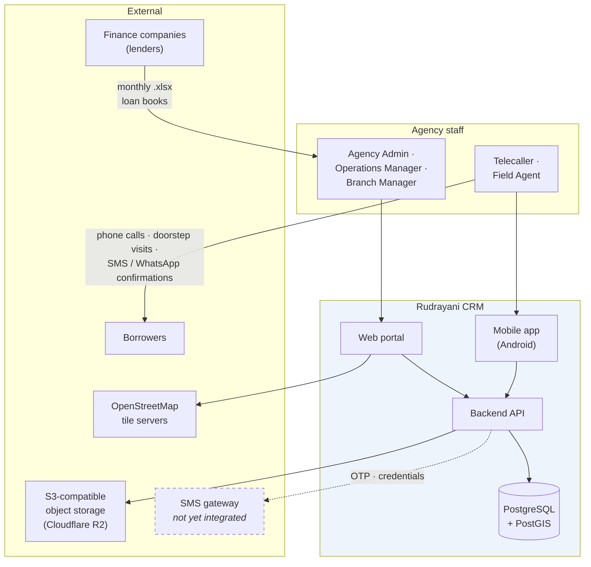
```mermaid
flowchart TB
    subgraph People["Agency staff"]
        M["Agency Admin ·<br/>Operations Manager ·<br/>Branch Manager"]
        A["Telecaller ·<br/>Field Agent"]
    end

    subgraph Sys["Rudrayani CRM"]
        W["Web portal"]
        MO["Mobile app<br/>(Android)"]
        API["Backend API"]
        DB[("PostgreSQL<br/>+ PostGIS")]
    end

    subgraph Ext["External"]
        L["Finance companies<br/>(lenders)"]
        S3["S3-compatible<br/>object storage<br/>(Cloudflare R2)"]
        SMS["SMS gateway<br/><i>not yet integrated</i>"]
        OSM["OpenStreetMap<br/>tile servers"]
        C["Borrowers"]
    end

    M --> W
    A --> MO
    W --> API
    MO --> API
    API --> DB
    API --> S3
    API -.->|"OTP · credentials"| SMS
    W --> OSM
    L -->|"monthly .xlsx<br/>loan books"| M
    A -->|"phone calls · doorstep visits ·<br/>SMS / WhatsApp confirmations"| C

    style SMS stroke-dasharray: 5 5
    style Sys fill:#eef4fb
```

The system sits between a set of lenders who supply loan books as Excel files and
a field force who work those accounts. It has no direct integration with any
lender — data arrives as spreadsheets, by design ([DEC-021](#dec-021)). Customer
contact happens outside the system entirely: the app hands off to the phone's own
dialer, SMS, and WhatsApp rather than embedding telephony ([DEC-022](#dec-022)).

---

## 3. Container architecture

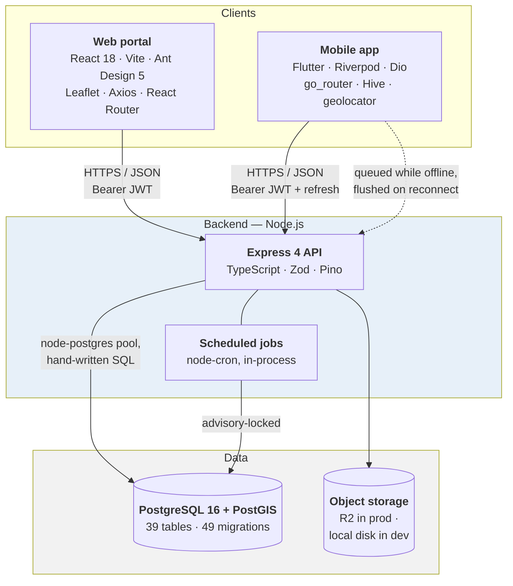
```mermaid
flowchart TB
    subgraph Clients
        direction LR
        W["<b>Web portal</b><br/>React 18 · Vite · Ant Design 5<br/>Leaflet · Axios · React Router"]
        MO["<b>Mobile app</b><br/>Flutter · Riverpod · Dio<br/>go_router · Hive · geolocator"]
    end

    subgraph Server["Backend — Node.js"]
        API["<b>Express 4 API</b><br/>TypeScript · Zod · Pino"]
        JOBS["<b>Scheduled jobs</b><br/>node-cron, in-process"]
    end

    subgraph Data
        PG[("<b>PostgreSQL 16 + PostGIS</b><br/>39 tables · 49 migrations")]
        OBJ[("<b>Object storage</b><br/>R2 in prod ·<br/>local disk in dev")]
    end

    W -->|"HTTPS / JSON<br/>Bearer JWT"| API
    MO -->|"HTTPS / JSON<br/>Bearer JWT + refresh"| API
    MO -.->|"queued while offline,<br/>flushed on reconnect"| API
    API -->|"node-postgres pool,<br/>hand-written SQL"| PG
    API --> OBJ
    JOBS -->|"advisory-locked"| PG
    API --- JOBS

    style Server fill:#e7f0f9
    style Data fill:#f2f2f2
```

Three deployable units: a static web bundle, an Android APK, and one Node process
that serves both clients' API **and** runs the scheduled jobs in-process. There is
no separate worker tier, no message queue, and no cache server — a deliberate
simplicity choice for an agency of this size ([DEC-005](#dec-005)), with the
consequence that multi-replica job safety had to be solved with Postgres advisory
locks instead ([DEC-062](#dec-062)).

---

## 4. Technology choices and why

| Layer | Choice | Why |
|---|---|---|
| Web frontend | React 18 + Vite | Mainstream, fast dev loop, large hiring pool |
| Component library | Ant Design 5 | Dense, data-table-heavy admin UI out of the box |
| Maps | Leaflet + OpenStreetMap | No per-load API cost, unlike Google Maps or Mapbox at scale |
| Backend | Node.js + Express 4 + TypeScript | One language across API and web; mature ecosystem |
| Database access | `pg` (node-postgres), **no ORM** | Hand-written SQL is what makes the scope-clamp helpers possible |
| Database | PostgreSQL 16 + PostGIS | PostGIS for route tracking, `jsonb` for flexible import columns, zero licensing |
| Validation | Zod | Schema-first request validation, types inferred |
| Logging | Pino + pino-http | Structured JSON logs, cheap, with field redaction |
| Scheduling | node-cron in-process | No extra infrastructure for three daily jobs |
| Mobile | Flutter | One codebase; strong background-service and offline story |
| Mobile state | Riverpod | Testable providers, no BuildContext coupling |
| Mobile local store | Hive | Lightweight durable box for the offline queue |
| Object storage | S3 API via `@aws-sdk/client-s3` | Cloudflare R2 in production, local disk in dev, one interface |
| Auth | JWT access + rotating refresh tokens | Offline-tolerant; field staff work through connectivity gaps |

Four of these deserve their reasoning stated in full.

**PostgreSQL over SQL Server** ([DEC-004](#dec-004)). The predecessor stack was
ASP.NET Core + SQL Server + Azure. Postgres removed per-core licensing, but the
decisive technical argument was **PostGIS**: continuous location tracking with
route replay and "was this agent near the customer's address" queries comes free
with the database rather than needing a separate geospatial service. `jsonb`
support was the second argument — every lender's Excel layout differs, and
unmapped columns land in a `custom_fields` JSON column so no data is ever lost.

**No ORM** ([DEC-006](#dec-006)). Every query is hand-written SQL against a
connection pool. This looked like a cost early and became the single most
important enabling decision later: the branch-scoping model in
[§8](#8-authorization-capabilities-permissions-and-scope) works by composing SQL
fragments (`customerBranchClamp`, `agentBranchClamp`, `customerWriteScopeClamp`)
onto queries that already exist. That composition is natural with raw SQL and
awkward-to-impossible to express uniformly through an ORM's query builder,
particularly the clause that matches *either* a structured `branch_id` *or* a
free-text branch name out of a JSON column.

**Flutter over native or React Native** ([DEC-007](#dec-007)). The mobile app
needs a reliable Android foreground service for GPS, durable offline storage, and
local notifications that fire without network. Flutter's plugin ecosystem covered
all three with maintained, free packages.

**Leaflet + OSM over Google Maps** ([DEC-003](#dec-003)). Live tracking
auto-refreshes every 30 seconds per manager, and route replay renders a full day
of pings. Per-load pricing would scale badly against that access pattern.

---

## 5. Tenancy model

The system is multi-tenant from the first migration, even though exactly one
agency is live ([DEC-001](#dec-001)).

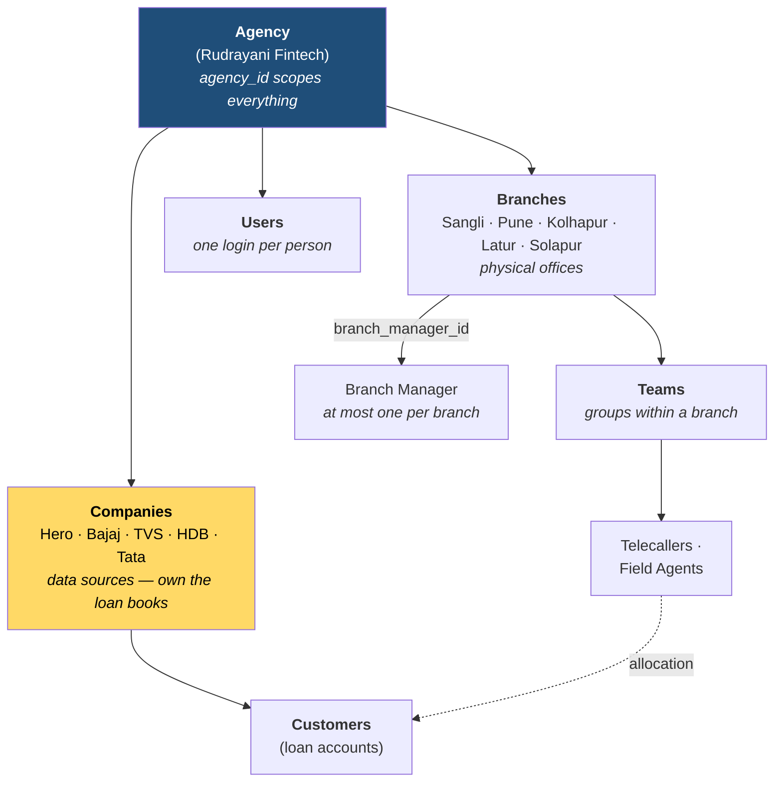
```mermaid
flowchart TD
    AG["<b>Agency</b><br/>(Rudrayani Fintech)<br/><i>agency_id scopes everything</i>"]

    AG --> CO["<b>Companies</b><br/>Hero · Bajaj · TVS · HDB · Tata<br/><i>data sources — own the loan books</i>"]
    AG --> BR["<b>Branches</b><br/>Sangli · Pune · Kolhapur · Latur · Solapur<br/><i>physical offices</i>"]
    AG --> US["<b>Users</b><br/><i>one login per person</i>"]

    BR --> TM["<b>Teams</b><br/><i>groups within a branch</i>"]
    BR -->|"branch_manager_id"| BM["Branch Manager<br/><i>at most one per branch</i>"]
    TM --> AGT["Telecallers ·<br/>Field Agents"]
    CO --> CU["<b>Customers</b><br/>(loan accounts)"]
    AGT -.->|"allocation"| CU

    style AG fill:#1f4e79,color:#fff
    style CO fill:#ffd966,color:#000
```

The critical distinction: **a Company is a data source, not an org unit.** Agency
staff do not belong to a company. A single team works accounts originating from
many lenders simultaneously. This is why allocation is a relationship between a
*user* and a *customer*, with no company dimension in between.

`agency_id` is present on every tenant-owned table from the baseline migration
onward. With one agency live this costs a column and an index; it is what makes
onboarding a second agency a configuration exercise rather than a rewrite.

---
---

# Part B — Data

## 6. Data model

39 tables, built up across 49 migrations. Two of them (`team_leaders`,
`team_leaders_archive`) are historical residue from the removed Team Leader rank
and are documented as dead in [§23](#23-known-gaps-and-open-decisions).

### 6.1 Identity and organisation

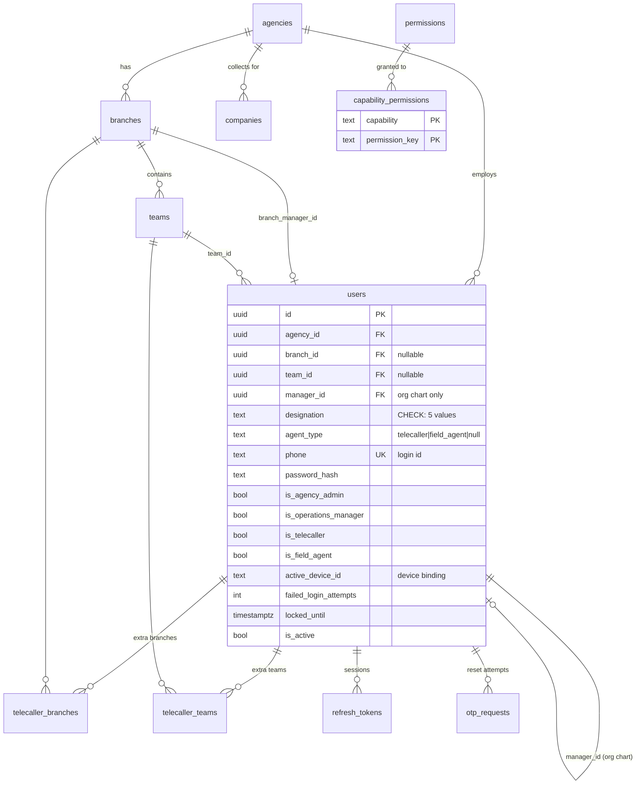
```mermaid
erDiagram
    agencies ||--o{ users : "employs"
    agencies ||--o{ branches : "has"
    agencies ||--o{ companies : "collects for"
    branches ||--o{ teams : "contains"
    branches ||--o| users : "branch_manager_id"
    teams ||--o{ users : "team_id"
    users ||--o| users : "manager_id (org chart)"
    users ||--o{ telecaller_branches : "extra branches"
    users ||--o{ telecaller_teams : "extra teams"
    branches ||--o{ telecaller_branches : ""
    teams ||--o{ telecaller_teams : ""
    users ||--o{ refresh_tokens : "sessions"
    users ||--o{ otp_requests : "reset attempts"
    permissions ||--o{ capability_permissions : "granted to"

    users {
        uuid id PK
        uuid agency_id FK
        uuid branch_id FK "nullable"
        uuid team_id FK "nullable"
        uuid manager_id FK "org chart only"
        text designation "CHECK: 5 values"
        text agent_type "telecaller|field_agent|null"
        text phone UK "login id"
        text password_hash
        bool is_agency_admin
        bool is_operations_manager
        bool is_telecaller
        bool is_field_agent
        text active_device_id "device binding"
        int failed_login_attempts
        timestamptz locked_until
        bool is_active
    }
    capability_permissions {
        text capability PK
        text permission_key PK
    }
```

Two structural points:

- **`designation` is the single source of truth**; the four `is_*` booleans are
  derived from it and kept in sync by `booleansForDesignation()`. `branch_manager`
  has **no** boolean column at all — `capabilitiesOf()` derives it straight from
  `designation`, deliberately, to avoid re-introducing boolean sprawl for a rank
  that only ever needs one source of truth ([DEC-041](#dec-041)).
- **Three parallel org relationships exist and mean different things.**
  `branch_id`/`team_id` is where you work. `telecaller_branches`/`telecaller_teams`
  are *additional* assignments for staff who span more than one
  ([DEC-039](#dec-039)). `manager_id` is a pure reporting line for the Org Chart
  and has no effect on permissions or visibility whatsoever ([DEC-040](#dec-040)).

### 6.2 Customers and allocation

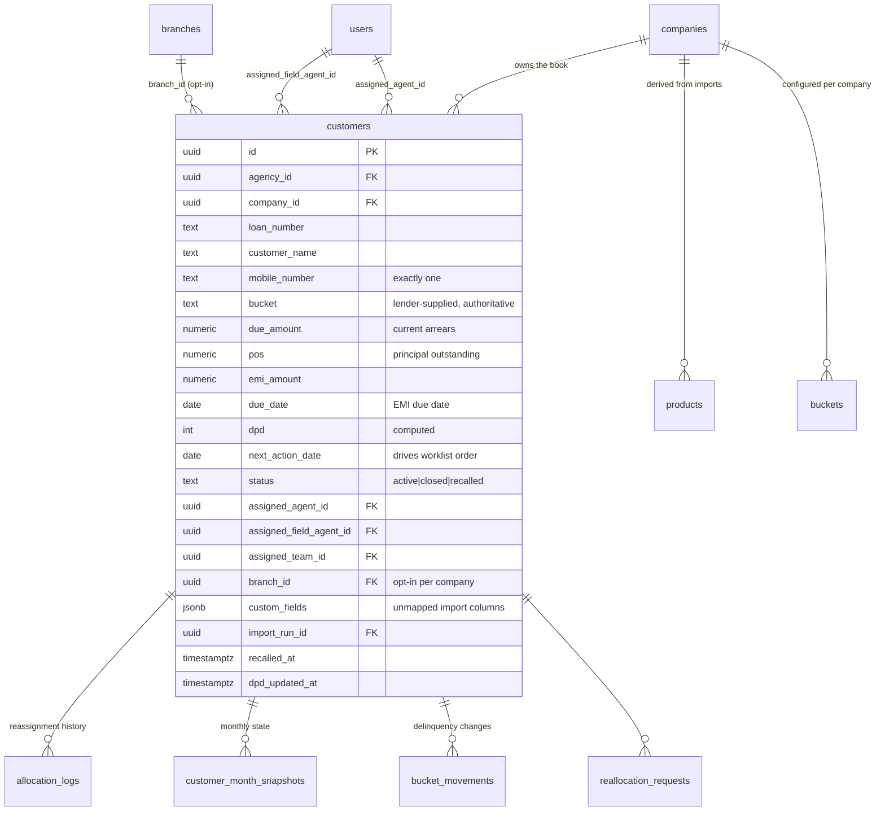
```mermaid
erDiagram
    companies ||--o{ customers : "owns the book"
    companies ||--o{ products : "derived from imports"
    companies ||--o{ buckets : "configured per company"
    customers ||--o{ allocation_logs : "reassignment history"
    customers ||--o{ customer_month_snapshots : "monthly state"
    customers ||--o{ bucket_movements : "delinquency changes"
    customers ||--o{ reallocation_requests : ""
    users ||--o{ customers : "assigned_agent_id"
    users ||--o{ customers : "assigned_field_agent_id"
    branches ||--o{ customers : "branch_id (opt-in)"

    customers {
        uuid id PK
        uuid agency_id FK
        uuid company_id FK
        text loan_number
        text customer_name
        text mobile_number "exactly one"
        text bucket "lender-supplied, authoritative"
        numeric due_amount "current arrears"
        numeric pos "principal outstanding"
        numeric emi_amount
        date due_date "EMI due date"
        int dpd "computed"
        date next_action_date "drives worklist order"
        text status "active|closed|recalled"
        uuid assigned_agent_id FK
        uuid assigned_field_agent_id FK
        uuid assigned_team_id FK
        uuid branch_id FK "opt-in per company"
        jsonb custom_fields "unmapped import columns"
        uuid import_run_id FK
        timestamptz recalled_at
        timestamptz dpd_updated_at
    }
```

`custom_fields` is what makes company-agnostic import possible: any column the
mapping step doesn't recognise is preserved verbatim as JSON rather than dropped
([DEC-023](#dec-023)). The branch-clamp logic in
[§8](#8-authorization-capabilities-permissions-and-scope) reads
`custom_fields->>'branch'` as a fallback precisely because most lenders never
populate the structured `branch_id`.

### 6.3 Collections activity

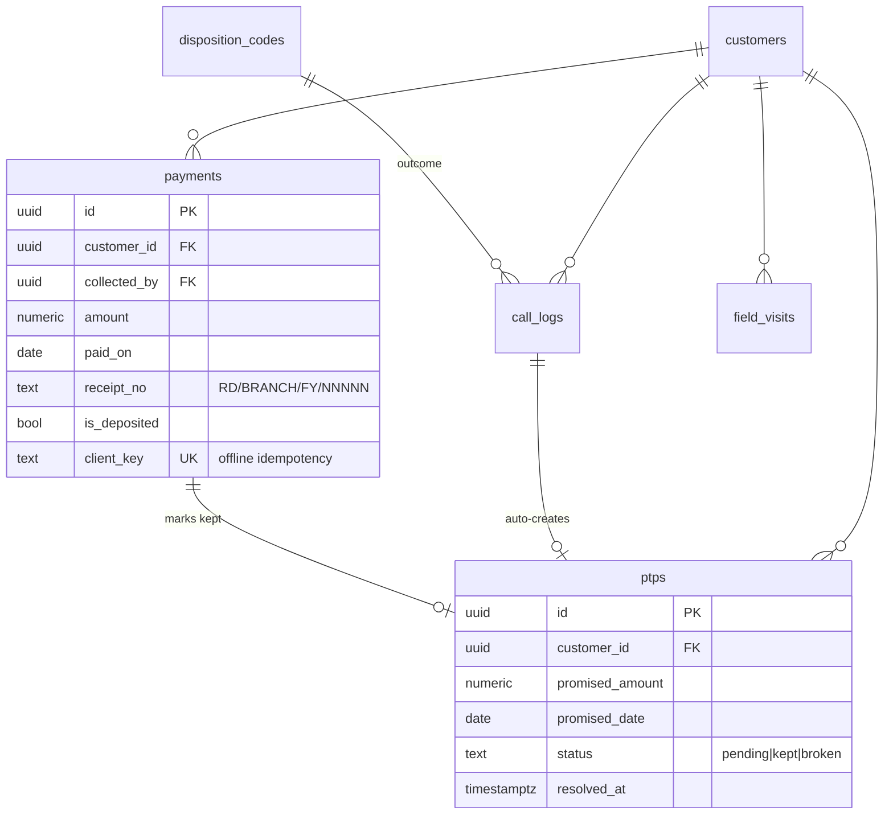
```mermaid
erDiagram
    customers ||--o{ call_logs : ""
    customers ||--o{ ptps : ""
    customers ||--o{ payments : ""
    customers ||--o{ field_visits : ""
    disposition_codes ||--o{ call_logs : "outcome"
    call_logs ||--o| ptps : "auto-creates"
    payments ||--o| ptps : "marks kept"

    ptps {
        uuid id PK
        uuid customer_id FK
        numeric promised_amount
        date promised_date
        text status "pending|kept|broken"
        timestamptz resolved_at
    }
    payments {
        uuid id PK
        uuid customer_id FK
        uuid collected_by FK
        numeric amount
        date paid_on
        text receipt_no "RD/BRANCH/FY/NNNNN"
        bool is_deposited
        text client_key UK "offline idempotency"
    }
```

Also hanging off `customers`, with the same shape: **`field_visits`** and
**`attachments`** (both keyed by `client_key` for offline safety), and
**`reminders`** (customer link optional — a reminder can be standalone).
**`receipt_sequences`** supplies payment numbering; **`correction_requests`**
references the record being corrected and the user who raised it.

**`disposition_codes`** is a configurable master table rather than a hardcoded
enum ([DEC-024](#dec-024)):

| Column | Purpose |
|---|---|
| `action_code` | Where the code applies — `OC` (outbound call), `FV` (field visit), `LG` (legal), `PIOC` / `PIFV` (penal collected) |
| `result_code` | The short code selected in the UI — `PTP`, `RNR`, `RTP`, `BP`, `SKIP` |
| `category` | Grouping used for reporting rollups |
| `description` | Human-readable label |
| `remark_template` | Template text with placeholders |
| `needs_amount`, `needs_date`, `needs_time`, `needs_mode`, `needs_reason`, `needs_name_relation` | Which structured inputs this code requires |

The `needs_*` flags are the key design move: rather than parsing
`remark_template` placeholders with a regex at runtime, each code declares which
structured fields it requires, the client renders exactly those inputs, and the
final remark is composed by substitution ([DEC-025](#dec-025)).

`client_key` on every offline-capable write table is the idempotency mechanism
described in [§14.2](#142-the-offline-queue).

### 6.4 The import engine

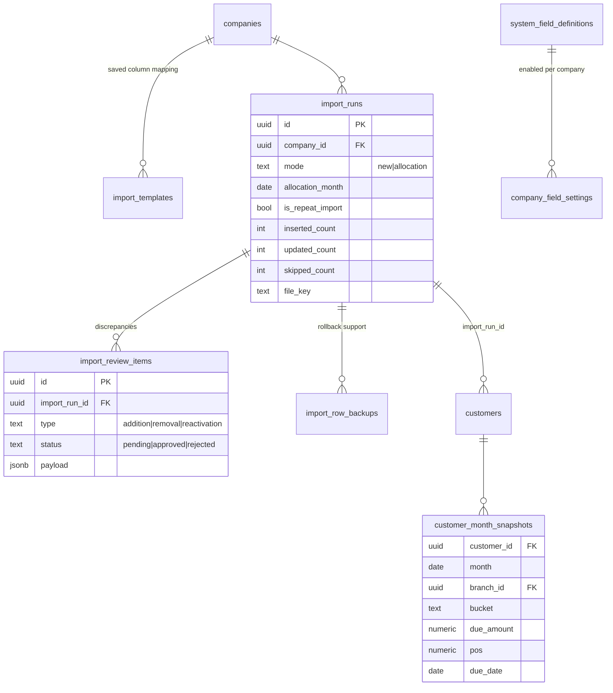
```mermaid
erDiagram
    companies ||--o{ import_templates : "saved column mapping"
    companies ||--o{ import_runs : ""
    import_runs ||--o{ import_review_items : "discrepancies"
    import_runs ||--o{ import_row_backups : "rollback support"
    import_runs ||--o{ customers : "import_run_id"
    system_field_definitions ||--o{ company_field_settings : "enabled per company"
    customers ||--o{ customer_month_snapshots : ""

    import_runs {
        uuid id PK
        uuid company_id FK
        text mode "new|allocation"
        date allocation_month
        bool is_repeat_import
        int inserted_count
        int updated_count
        int skipped_count
        text file_key
    }
    import_review_items {
        uuid id PK
        uuid import_run_id FK
        text type "addition|removal|reactivation"
        text status "pending|approved|rejected"
        jsonb payload
    }
    customer_month_snapshots {
        uuid customer_id FK
        date month
        uuid branch_id FK
        text bucket
        numeric due_amount
        numeric pos
        date due_date
    }
```

`customer_month_snapshots` is the backbone of historical reporting: every loan
gets a row per allocation month regardless of whether its review item was approved
or rejected, so a closed month's numbers never change retroactively
([DEC-030](#dec-030)).

### 6.5 Tracking, attendance, and audit

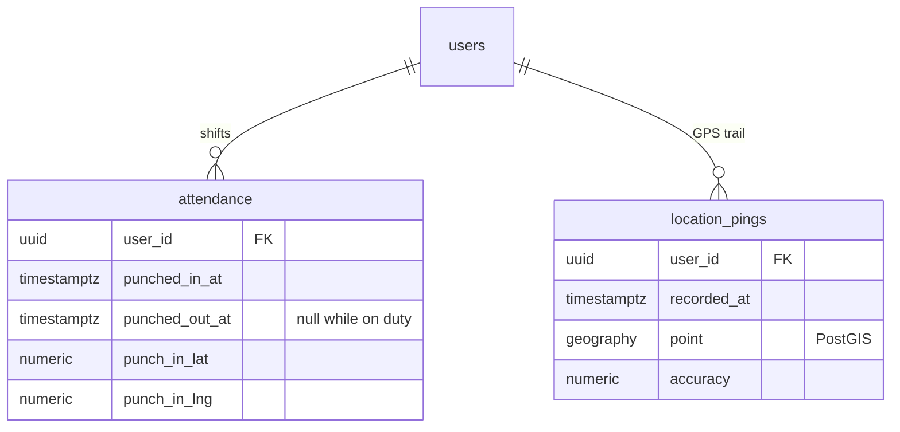
```mermaid
erDiagram
    users ||--o{ attendance : "shifts"
    users ||--o{ location_pings : "GPS trail"
    attendance {
        uuid user_id FK
        timestamptz punched_in_at
        timestamptz punched_out_at "null while on duty"
        numeric punch_in_lat
        numeric punch_in_lng
    }
    location_pings {
        uuid user_id FK
        timestamptz recorded_at
        geography point "PostGIS"
        numeric accuracy
    }
```

Three further tables hang off the agency rather than off a shift:

| Table | Key columns |
|---|---|
| `targets` | `agency_id`, `scope` (`agent`/`team`/`branch`/`agency`), `scope_id`, `month` (always the 1st), `metric` (`collection`/`resolution`/`rollback`/`normalization`/`recovery`), `target_value` |
| `audit_logs` | `agency_id`, `actor_id`, `action`, `entity_type`, `entity_id`, `details` (`jsonb`) |
| `dashboard_preferences` | `user_id`, the per-user dashboard widget layout |

`location_pings` uses a PostGIS `GEOGRAPHY(POINT)` column, has a unique constraint
on `(user_id, recorded_at)` so a re-sent offline batch cannot create duplicates,
and is purged on a 60-day retention window ([DEC-013](#dec-013)).

### 6.6 Migration history

Migrations are timestamp-prefixed SQL files run by `node-pg-migrate`, each with an
explicit Up and Down section. They are the closest thing this project has to an
ADR log — several carry substantial prose headers explaining sequencing and
failure modes.

| Range | Migrations | What they established |
|---|---|---|
| `1783216–1783300` | baseline-init, auth-tables | Core schema, `agency_id` everywhere, permissions and `capability_permissions` |
| `1783400–1783500` | import-engine, collection-workflow | Templates, runs, dispositions, call logs, PTPs, payments |
| `1783600–1783800` | location-tracking, tracking-view, offline-idempotency | PostGIS pings, `tracking.view`, `client_key` idempotency |
| `1783900–1784300` | field-visits-reallocation, buckets-master, allocation-snapshots, targets, payment-deposits | Field visits, canonical buckets, month snapshots, targets, deposit reconciliation |
| `1784400–1784900` | reports-self-scope, allocation-lifecycle, due-date-dpd, reminders, attachments, dual-assignment | Self-scoped reports, review queue, DPD cross-check, reminders, documents |
| `1785000–1785700` | customers-import-run-id, dashboard-preferences, correction-requests, payment-exceeds-due, customers-pos, disposition-channel, manager-id, field-config | Rollback support, correction workflow, POS, org chart, configurable fields |
| `1786000–1787500` | dashboard-kpi-support, field-config-cascade, team-leader-permissions, user-designation, multi-branch-multi-team, customer-branch, import-rollback | The designation model, multi-branch staff, customer branch dimension |
| `1787600–1788000` | branch-manager-agent-type, branch-manager-id, telecaller-teams, branch-manager-permissions, **remove-team-leader** | The org restructure — Branch Manager in, Team Leader out |
| `1788100–1788800` | ptp-kept-broken, next-action-dpd, receipt-no, ptp-standalone-create, snapshot-branch-id, performance-indexes, money-precision, audit-log | The Phase 2–8 hardening work |

---
---

# Part C — Access

## 7. Identity, authentication, and sessions

One login per person, regardless of how many capabilities they hold
([DEC-008](#dec-008)). The login identifier is the **phone number**, not an email
— field staff reliably have one and often don't have the other.

### 7.1 Login

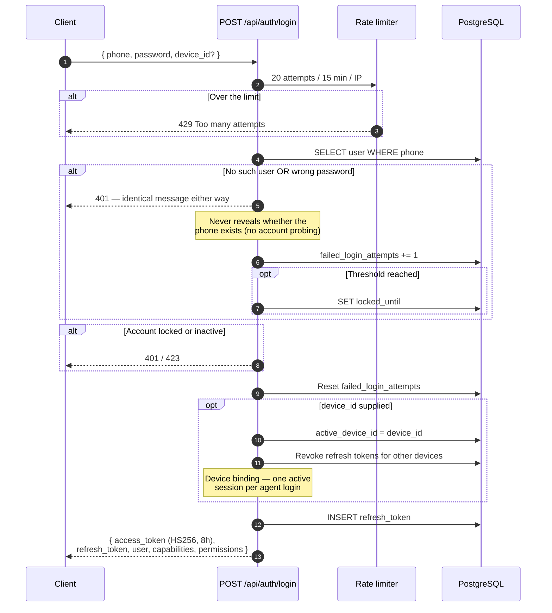
```mermaid
sequenceDiagram
    autonumber
    participant C as Client
    participant API as POST /api/auth/login
    participant RL as Rate limiter
    participant DB as PostgreSQL

    C->>API: { phone, password, device_id? }
    API->>RL: 20 attempts / 15 min / IP
    alt Over the limit
        RL-->>C: 429 Too many attempts
    end
    API->>DB: SELECT user WHERE phone
    alt No such user OR wrong password
        API-->>C: 401 — identical message either way
        Note over API: Never reveals whether the<br/>phone exists (no account probing)
        API->>DB: failed_login_attempts += 1
        opt Threshold reached
            API->>DB: SET locked_until
        end
    end
    alt Account locked or inactive
        API-->>C: 401 / 423
    end
    API->>DB: Reset failed_login_attempts
    opt device_id supplied
        API->>DB: active_device_id = device_id
        API->>DB: Revoke refresh tokens for other devices
        Note over API: Device binding — one active<br/>session per agent login
    end
    API->>DB: INSERT refresh_token
    API-->>C: { access_token (HS256, 8h),<br/>refresh_token, user, capabilities, permissions }
```

### 7.2 Refresh token rotation

Refresh tokens are **single-use**. Every successful refresh issues a new one and
revokes the presented token. Presenting an already-revoked token is treated as a
security event, not a routine 401 ([DEC-011](#dec-011)):

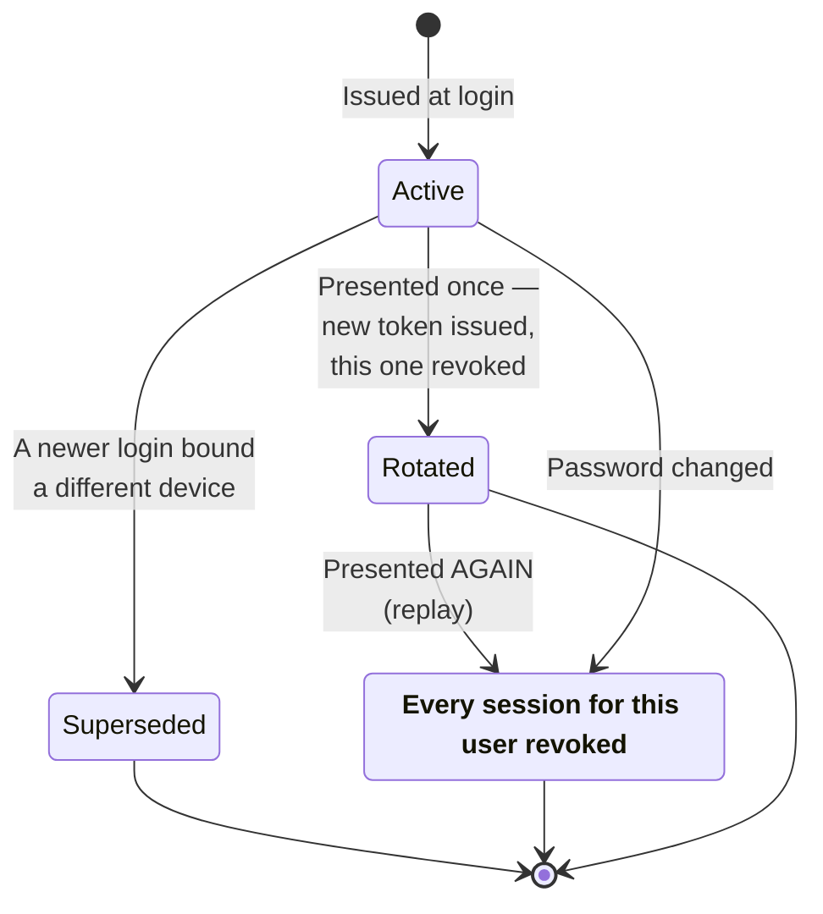
```mermaid
stateDiagram-v2
    [*] --> Active: Issued at login
    Active --> Rotated: Presented once —<br/>new token issued,<br/>this one revoked
    Rotated --> AllRevoked: Presented AGAIN<br/>(replay)
    Active --> Superseded: A newer login bound<br/>a different device
    Active --> AllRevoked: Password changed
    AllRevoked: <b>Every session for this user revoked</b>
    Superseded --> [*]
    AllRevoked --> [*]
    Rotated --> [*]
```

The reasoning: a revoked token being replayed means either a client bug or a
stolen-but-since-rotated token. Either way, revoking only the one request leaves a
leaked token riding along after the legitimate client has moved on. Revoking the
whole session family closes that.

### 7.3 Access token verification

Every authenticated request verifies the Bearer token and then **re-loads the user
from the database** ([DEC-010](#dec-010)). This costs one query per request and
buys immediate effect for deactivations and designation changes — a fired employee
loses access at once rather than at token expiry.

The JWT algorithm is **pinned to HS256** at verification time
([DEC-012](#dec-012)). Without pinning, `jsonwebtoken` honours whatever algorithm
the token header claims, which opens both the unsigned-`none` attack and the
RS256-verified-against-the-HMAC-secret confusion attack.

### 7.4 Password reset

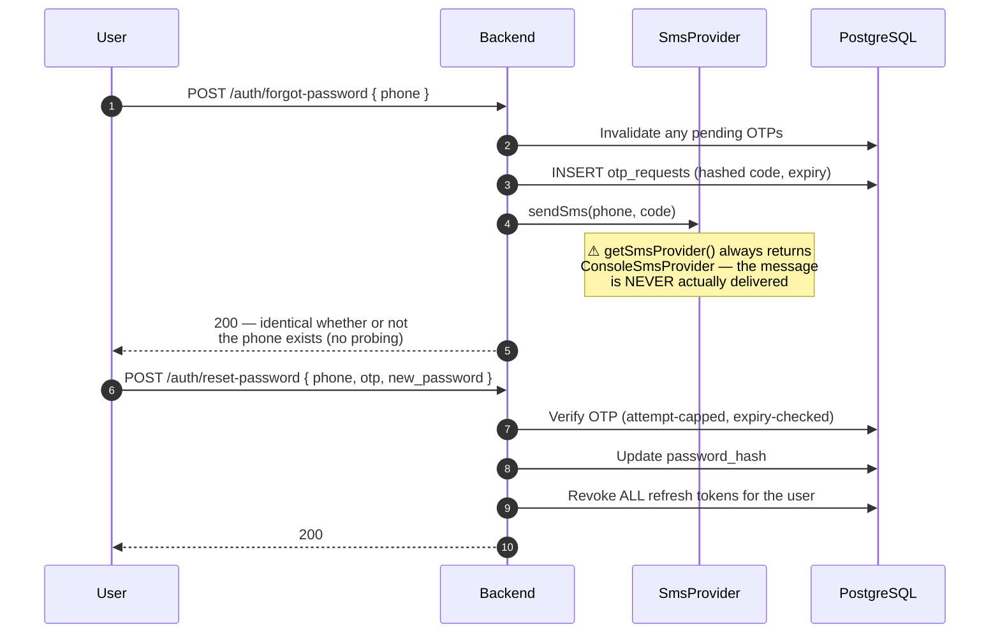
```mermaid
sequenceDiagram
    autonumber
    participant U as User
    participant API as Backend
    participant SMS as SmsProvider
    participant DB as PostgreSQL

    U->>API: POST /auth/forgot-password { phone }
    API->>DB: Invalidate any pending OTPs
    API->>DB: INSERT otp_requests (hashed code, expiry)
    API->>SMS: sendSms(phone, code)
    Note over SMS: ⚠ getSmsProvider() always returns<br/>ConsoleSmsProvider — the message<br/>is NEVER actually delivered
    API-->>U: 200 — identical whether or not<br/>the phone exists (no probing)
    U->>API: POST /auth/reset-password { phone, otp, new_password }
    API->>DB: Verify OTP (attempt-capped, expiry-checked)
    API->>DB: Update password_hash
    API->>DB: Revoke ALL refresh tokens for the user
    API-->>U: 200
```

The flow is complete and correct on the server. **It does not work in
production**, because no SMS vendor has ever been integrated — see
[§23](#23-known-gaps-and-open-decisions) and [DEC-090](#dec-090).

Two hardening details are worth recording. The OTP is echoed in the response only
under an explicit `ALLOW_OTP_ECHO` flag, never keyed off `NODE_ENV` — a
misconfigured `NODE_ENV` value was once enough to leak OTPs into every response
([DEC-014](#dec-014)). And `ConsoleSmsProvider` logs only *that* a send was
attempted in production, never the message body, because logging it put OTPs and
initial employee passwords in plaintext into production logs
([DEC-015](#dec-015)).

---

## 8. Authorization: capabilities, permissions, and scope

Authorization has two independent layers, and conflating them is the most common
source of bugs in this codebase.

| Layer | Question it answers | Where it lives |
|---|---|---|
| **Permission** | May this user call this endpoint at all? | `capability_permissions` table, `requirePermission()` |
| **Scope** | Of the rows this endpoint could return, which may this user see? | `services/scope.ts`, composed into each query |

A permission check alone is never sufficient for a customer-data endpoint.

### 8.1 The capability model

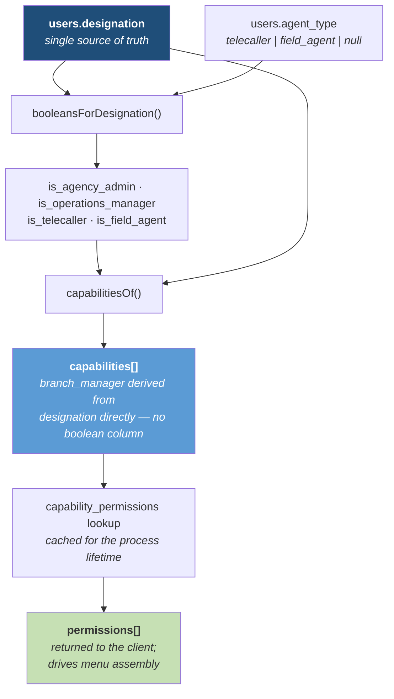
```mermaid
flowchart TD
    D["<b>users.designation</b><br/><i>single source of truth</i>"]
    AT["users.agent_type<br/><i>telecaller | field_agent | null</i>"]
    D --> B["booleansForDesignation()"]
    AT --> B
    B --> F["is_agency_admin · is_operations_manager<br/>is_telecaller · is_field_agent"]
    F --> C["capabilitiesOf()"]
    D --> C
    C --> CAP["<b>capabilities[]</b><br/><i>branch_manager derived from<br/>designation directly — no boolean column</i>"]
    CAP --> P["capability_permissions lookup<br/><i>cached for the process lifetime</i>"]
    P --> PERM["<b>permissions[]</b><br/><i>returned to the client;<br/>drives menu assembly</i>"]

    style D fill:#1f4e79,color:#fff
    style CAP fill:#5b9bd5,color:#fff
    style PERM fill:#c6e0b4
```

`agent_type` is what lets a `branch_manager` also carry frontline work: it sets
`is_telecaller` or `is_field_agent` on top of the management designation, so the
same person gets both the branch dashboard and a personal worklist without any
special-casing ([DEC-042](#dec-042)).

**Permissions are data, not code** ([DEC-009](#dec-009)). `capability_permissions`
is only ever written by migrations — no runtime route inserts, updates, or deletes
from it. That property is what makes it safe to cache for the life of the process
([DEC-070](#dec-070)), which removed a per-request query that every authenticated
call was paying on top of the user lookup.

### 8.2 Scope resolution

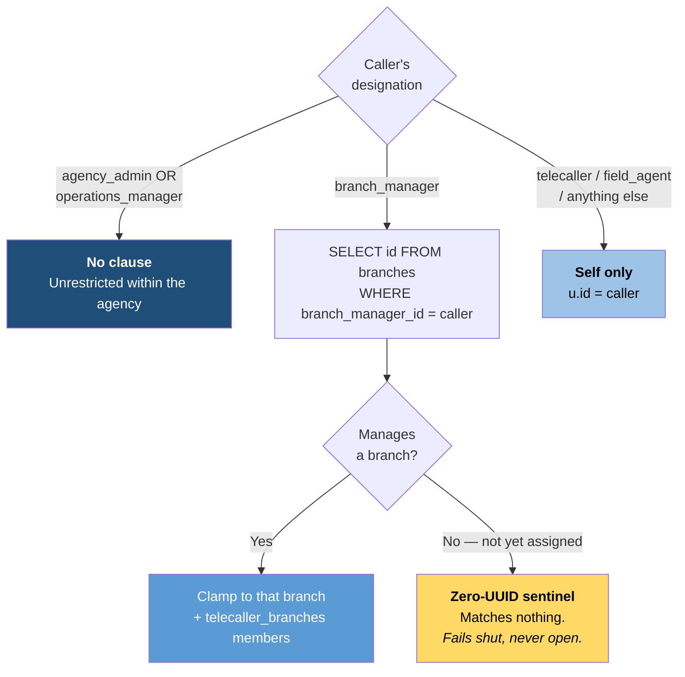
```mermaid
flowchart TD
    S{"Caller's<br/>designation"}
    S -->|"agency_admin OR<br/>operations_manager"| A["<b>No clause</b><br/>Unrestricted within the agency"]
    S -->|"branch_manager"| B["SELECT id FROM branches<br/>WHERE branch_manager_id = caller"]
    S -->|"telecaller / field_agent<br/>/ anything else"| C["<b>Self only</b><br/>u.id = caller"]

    B --> D{"Manages<br/>a branch?"}
    D -->|Yes| E["Clamp to that branch<br/>+ telecaller_branches members"]
    D -->|"No — not yet assigned"| F["<b>Zero-UUID sentinel</b><br/>Matches nothing.<br/><i>Fails shut, never open.</i>"]

    style A fill:#1f4e79,color:#fff
    style E fill:#5b9bd5,color:#fff
    style C fill:#9dc3e6,color:#000
    style F fill:#ffd966,color:#000
```

**Failing shut is the governing principle** ([DEC-043](#dec-043)). An unassigned
branch manager sees nothing rather than everything. This is why the mobile Branch
Dashboard shows *"Ask an admin to assign this branch"* rather than silently
displaying an empty state.

### 8.3 The five clamp helpers

Different queries join through different tables, so `scope.ts` exposes five
composable helpers rather than one. All live in
`backend/src/services/scope.ts`.

| Helper | Shape it clamps | Used by |
|---|---|---|
| `scopeFilter()` | A `users u` row | Employee lists, tracking, attendance |
| `resolveBranchClamp()` | Returns the raw branch id **and name** | Everything below |
| `customerBranchClamp()` | A `customers c` row | Customer lists, allocation, worklist |
| `agentBranchClamp()` | An agent's `users` row, by alias | Queries joining through the assigned agent |
| `customerWriteScopeClamp()` | Write paths against a customer | Call logs, payments, field visits, attachments, reminders |

Two of these encode hard-won lessons.

**Why the clamp carries a branch *name* as well as an id.** `customers.branch_id`
is opt-in per company and disabled by default — most lenders never populate it.
Clamping on the id alone would show a branch manager **zero** unallocated
customers for any company that hasn't opted in. So the clause matches either the
structured id, or a free-text `custom_fields->>'branch'` / `->>'Branch'` value
against the branch's name ([DEC-045](#dec-045)):

```sql
AND ( c.branch_id::text = $1
      OR ( c.branch_id IS NULL
           AND ( c.custom_fields->>'branch' ILIKE $2
                 OR c.custom_fields->>'Branch' ILIKE $2 ) ) )
```

**Why write paths need their own clamp.** Before `customerWriteScopeClamp()`
existed, five routes checked only `company.agency_id`. Any authenticated user
holding `payments.record` could record a collection against **any** customer in
the agency — an agent in Branch A could book a payment against Branch B's customer
and have it count toward their own numbers. The clamp allows a write when the
customer is assigned to the caller directly, or (for a branch manager) when the
customer's assigned agent falls within their branch ([DEC-044](#dec-044), a Phase 0
"stop the bleeding" fix).

### 8.4 What is deliberately *not* scoped

`branches.ts` and `teams.ts` GET routes, plus `buckets.ts` and `dispositions.ts`,
return their full agency-wide list to any authenticated user. This was flagged as
a gap during the Phase 9 audit and **reviewed, then left open as an explicit
decision** ([DEC-046](#dec-046)): these are org-structure and master-data names
only, with no financial or customer data attached, they are already agency-scoped,
and every role legitimately needs the complete list to render pickers. The
reasoning is recorded as an in-code comment on both routes so it does not get
re-flagged as an oversight.

---
---

# Part D — The backend

## 9. Backend architecture

### 9.1 Layering

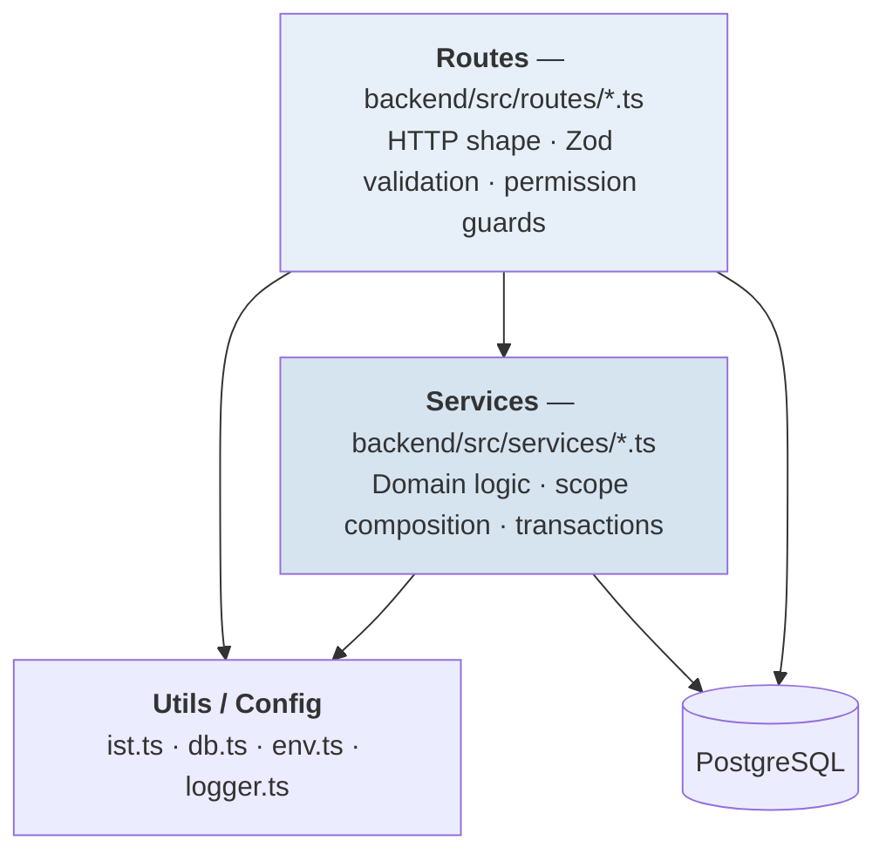
```mermaid
flowchart TD
    R["<b>Routes</b> — backend/src/routes/*.ts<br/>HTTP shape · Zod validation · permission guards"]
    S["<b>Services</b> — backend/src/services/*.ts<br/>Domain logic · scope composition · transactions"]
    U["<b>Utils / Config</b><br/>ist.ts · db.ts · env.ts · logger.ts"]
    D[("PostgreSQL")]

    R --> S
    R --> U
    S --> U
    S --> D
    R --> D

    style R fill:#e7f0f9
    style S fill:#d6e4f0
```

A pragmatic three-layer split rather than a strict hexagonal architecture
([DEC-016](#dec-016)). Simple routes query the pool directly; anything with real
domain logic, multi-statement transactions, or scope composition lives in a
service. Services never import routes.

### 9.2 Request lifecycle

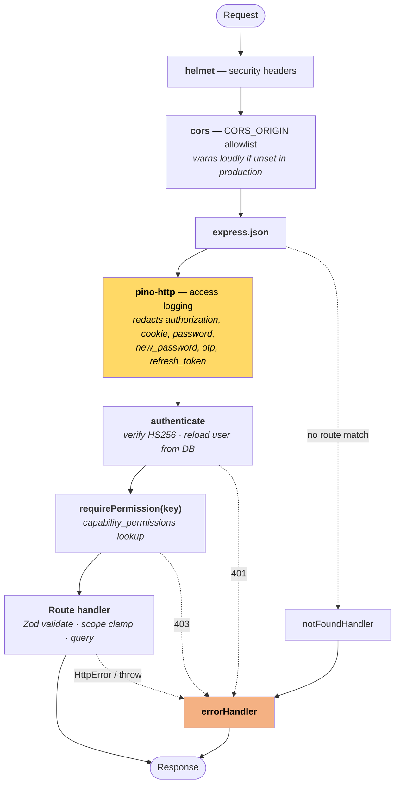
```mermaid
flowchart TD
    Req(["Request"]) --> H["<b>helmet</b> — security headers"]
    H --> C["<b>cors</b> — CORS_ORIGIN allowlist<br/><i>warns loudly if unset in production</i>"]
    C --> J["<b>express.json</b>"]
    J --> L["<b>pino-http</b> — access logging<br/><i>redacts authorization, cookie, password,<br/>new_password, otp, refresh_token</i>"]
    L --> A["<b>authenticate</b><br/><i>verify HS256 · reload user from DB</i>"]
    A --> P["<b>requirePermission(key)</b><br/><i>capability_permissions lookup</i>"]
    P --> RT["<b>Route handler</b><br/><i>Zod validate · scope clamp · query</i>"]
    RT --> Res(["Response"])

    A -.->|401| E["<b>errorHandler</b>"]
    P -.->|403| E
    RT -.->|"HttpError / throw"| E
    J -.->|"no route match"| NF["notFoundHandler"]
    NF --> E
    E --> Res

    style L fill:#ffd966,color:#000
    style E fill:#f4b183,color:#000
```

**Log redaction is not optional here** ([DEC-017](#dec-017)). Without it, access
and refresh tokens flow into every request log line, and on a validation error the
request body — carrying login and employee-creation passwords — goes with them.

**Error handling** is centralised in `middleware/error-handler.ts` around an
`HttpError(status, message)` class, with `asyncHandler` wrapping every async route
so a rejected promise reaches the handler rather than hanging the request
([DEC-018](#dec-018)).

**Validation** is Zod at the route boundary ([DEC-019](#dec-019)) — schemas parse
and coerce, and the parsed result is what the handler uses, so an unvalidated
value never reaches a query.

**The connection pool** logs and survives idle-client errors rather than letting
the process exit on a recoverable database hiccup ([DEC-020](#dec-020)).

---

## 10. API surface

31 route modules mounted under `/api`, wired in `backend/src/app.ts`.

| Base path | Module | Responsibility |
|---|---|---|
| `/api/health` | `health.ts` | Liveness probe; excluded from access logs |
| `/api/auth` | `auth.ts` | Login, refresh, logout, forgot/reset password, `/me` |
| `/api/branches` | `branches.ts` | Branch CRUD, branch-manager assignment |
| `/api/teams` | `teams.ts` | Team CRUD |
| `/api/companies` | `companies.ts` | Lender CRUD |
| `/api/employees` | `employees.ts` | Staff CRUD, designation, agent type, password reset |
| `/api/imports` | `imports.ts` | Upload, preview, commit, history, rollback, delete |
| `/api/import-templates` | `import-templates.ts` | Saved column mappings per company |
| `/api/import-reviews` | `import-reviews.ts` | Discrepancy queue, approve/reject |
| `/api/dispositions` | `dispositions.ts` | Disposition code master |
| `/api/customers` | `customers.ts` | List, search, Customer 360, branches filter |
| `/api/allocations` | `allocations.ts` | Unallocated queue, assign, reallocate, history |
| `/api/call-logs` | `call-logs.ts` | Log a call (idempotent), trail history |
| `/api/worklist` | `worklist.ts` | An agent's own book, ordered by next action date |
| `/api/ptps` | `ptps.ts` | Create, update, resolve kept/broken |
| `/api/payments` | `payments.ts` | Record (idempotent), deposits, receipts |
| `/api/attendance` | `attendance.ts` | Punch in/out, current status |
| `/api/attendance-records` | `attendance-records.ts` | Filterable, exportable attendance log |
| `/api/location` | `location.ts` | Ping ingestion (batch), tracking config |
| `/api/tracking` | `tracking.ts` | Live map, route replay, team-day summary |
| `/api/day-plan` | `day-plan.ts` | Per-agent daily plan and drill-downs |
| `/api/field-visits` | `field-visits.ts` | Record a visit (idempotent, photo + GPS) |
| `/api/attachments` | `attachments.ts` | Customer documents, upload and download |
| `/api/reallocation-requests` | `reallocation-requests.ts` | Raise, list, approve, reject |
| `/api/correction-requests` | `correction-requests.ts` | Raise, list, approve, reject |
| `/api/reminders` | `reminders.ts` | Personal reminders, due-today feed |
| `/api/buckets` | `buckets.ts` | Bucket config, canonical mapping |
| `/api/field-config` | `field-config.ts` | Field definitions, per-company enablement |
| `/api/targets` | `targets.ts` | Target CRUD, bulk import |
| `/api/reports` | `reports.ts` | The reporting engine — 12+ endpoints, Excel export |
| `/api/setup-status` | `setup-status.ts` | Six real EXISTS checks behind the setup checklist |
| `/api/dashboard-preferences` | `dashboard-preferences.ts` | Per-user widget layout |
| `/api` | `catalog.ts` | Products, and other shared lookups |

---

## 11. The import engine

### 11.1 The pipeline

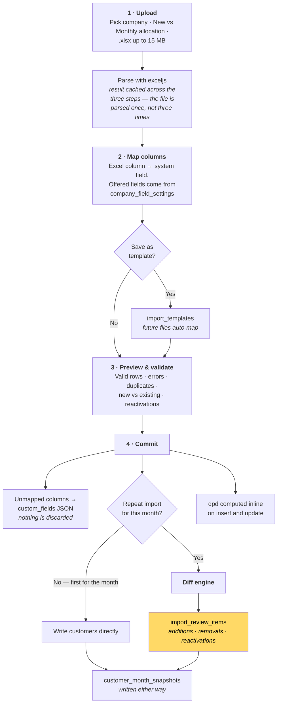
```mermaid
flowchart TD
    U["<b>1 · Upload</b><br/>Pick company · New vs Monthly allocation ·<br/>.xlsx up to 15 MB"] --> P1["Parse with exceljs<br/><i>result cached across the<br/>three steps — the file is<br/>parsed once, not three times</i>"]
    P1 --> M["<b>2 · Map columns</b><br/>Excel column → system field.<br/>Offered fields come from<br/>company_field_settings"]
    M --> T{"Save as<br/>template?"}
    T -->|Yes| TS["import_templates<br/><i>future files auto-map</i>"]
    T -->|No| V
    TS --> V["<b>3 · Preview &amp; validate</b><br/>Valid rows · errors · duplicates ·<br/>new vs existing · reactivations"]
    V --> C["<b>4 · Commit</b>"]
    C --> UM["Unmapped columns →<br/>custom_fields JSON<br/><i>nothing is discarded</i>"]
    C --> D{"Repeat import<br/>for this month?"}
    D -->|"No — first for the month"| W["Write customers directly"]
    D -->|Yes| DF["<b>Diff engine</b>"]
    DF --> RI["import_review_items<br/><i>additions · removals · reactivations</i>"]
    W --> SN["customer_month_snapshots<br/><i>written either way</i>"]
    RI --> SN
    C --> DPD["dpd computed inline<br/>on insert and update"]

    style RI fill:#ffd966,color:#000
```

### 11.2 The governing decision

**A repeat import never applies changes automatically.** Every discrepancy waits
for a human ([DEC-031](#dec-031)). This is the single most important rule in the
import engine, and it is what makes the monthly cycle auditable: an account is
never recalled, added, or reactivated without a named person approving it.

### 11.3 Review item lifecycle

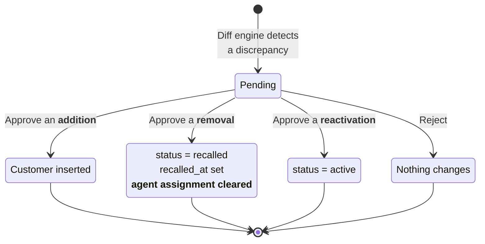
```mermaid
stateDiagram-v2
    [*] --> Pending: Diff engine detects<br/>a discrepancy
    Pending --> Approved_Addition: Approve an <b>addition</b>
    Pending --> Approved_Removal: Approve a <b>removal</b>
    Pending --> Approved_Reactivation: Approve a <b>reactivation</b>
    Pending --> Rejected: Reject
    Approved_Addition: Customer inserted
    Approved_Removal: status = recalled<br/>recalled_at set<br/><b>agent assignment cleared</b>
    Approved_Reactivation: status = active
    Rejected: Nothing changes
    Approved_Addition --> [*]
    Approved_Removal --> [*]
    Approved_Reactivation --> [*]
    Rejected --> [*]
```

Approving a removal also clears the agent assignment, mirroring what closing a
customer already does — otherwise a recalled case lingers as "assigned" even
though every active query filters it out ([DEC-034](#dec-034)).

### 11.4 Naming precision

`isMidMonthImport()` was renamed to `hasExistingAllocationForMonth()`, and
`is_mid_month` to `is_repeat_import` ([DEC-033](#dec-033)). The function never
checked a calendar day — it asked whether a prior allocation import already
existed for that company and month. Allocation files arrive at any point in the
month, so the logic was right but the name implied a date check that never
existed. A pure rename, but it removed a persistent source of misunderstanding.

### 11.5 Rollback

An import run can be rolled back or deleted. `import_row_backups` preserves the
pre-import state of updated rows. The rollback path takes `FOR UPDATE` row locks
inside its transaction and audits the action. Two limits are recorded honestly in
[§23](#23-known-gaps-and-open-decisions): the customer delete is still a **hard**
delete, and the "has this customer been worked since" check does not close the
race against `call_logs`/`field_visits`/`ptps` inserts, because those paths do not
lock the customer row.

---

## 12. The collections domain

### 12.1 Customer status

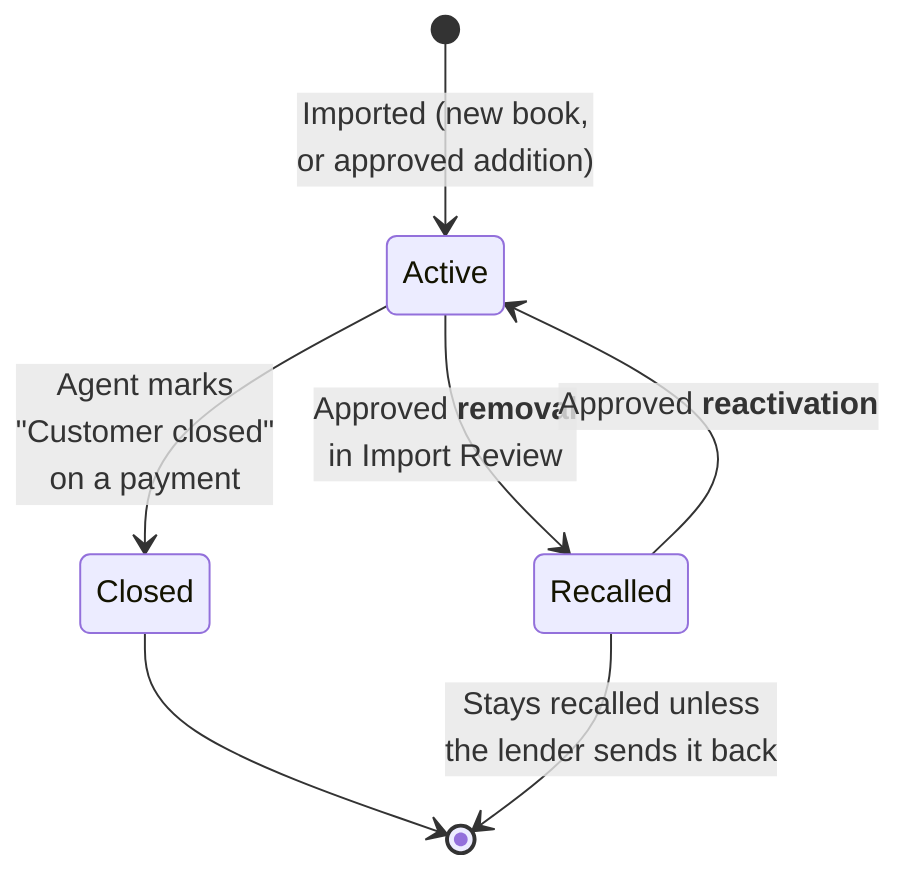
```mermaid
stateDiagram-v2
    [*] --> Active: Imported (new book,<br/>or approved addition)
    Active --> Closed: Agent marks<br/>"Customer closed"<br/>on a payment
    Active --> Recalled: Approved <b>removal</b><br/>in Import Review
    Recalled --> Active: Approved <b>reactivation</b>
    Closed --> [*]
    Recalled --> [*]: Stays recalled unless<br/>the lender sends it back
```

Every status-dependent query in the codebase uses explicit `status = 'active'`
equality, never a `!= 'closed'` negation ([DEC-035](#dec-035)). That single
convention is why introducing `recalled` correctly excluded it everywhere without
touching a single existing query. Payments are blocked on both `closed` and
`recalled` customers.

### 12.2 PTP lifecycle

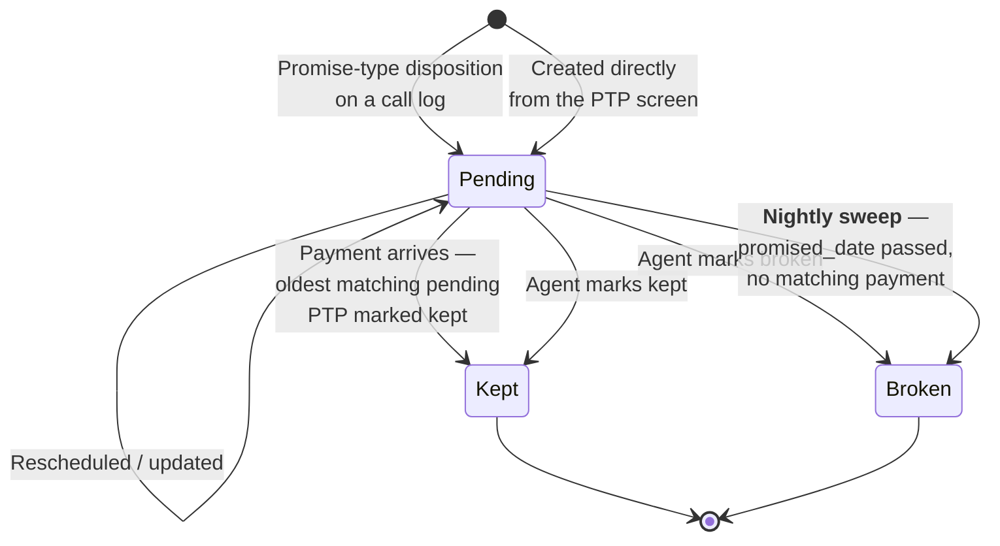
```mermaid
stateDiagram-v2
    [*] --> Pending: Promise-type disposition<br/>on a call log
    [*] --> Pending: Created directly<br/>from the PTP screen
    Pending --> Pending: Rescheduled / updated
    Pending --> Kept: Payment arrives —<br/>oldest matching pending<br/>PTP marked kept
    Pending --> Kept: Agent marks kept
    Pending --> Broken: Agent marks broken
    Pending --> Broken: <b>Nightly sweep</b> —<br/>promised_date passed,<br/>no matching payment
    Kept --> [*]
    Broken --> [*]
```

Two design points. PTPs are **never edited in place to change history** — a
rescheduled promise updates the live record, but the trail of what was promised
when survives in the call log that created it ([DEC-036](#dec-036)). And the
nightly sweep exists because without it a promise nobody followed up on sits at
`pending` forever, quietly inflating the kept/broken ratio ([DEC-037](#dec-037)).

Standalone PTP creation (migration `1788400000000_ptp-standalone-create.sql`) was
added later: originally a PTP could only be born from a call log, which meant an
agent who took a promise during a field visit had no way to record it
([DEC-038](#dec-038)).

### 12.3 Allocation lifecycle

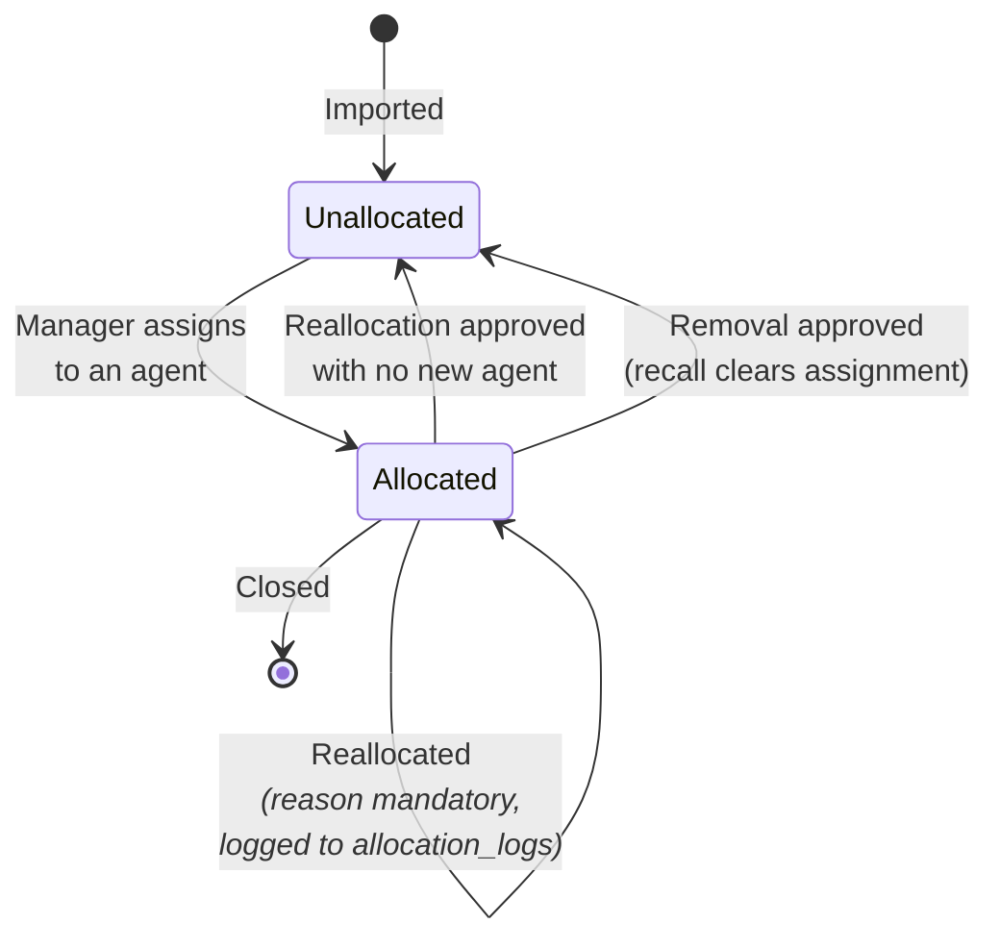
```mermaid
stateDiagram-v2
    [*] --> Unallocated: Imported
    Unallocated --> Allocated: Manager assigns<br/>to an agent
    Allocated --> Allocated: Reallocated<br/><i>(reason mandatory,<br/>logged to allocation_logs)</i>
    Allocated --> Unallocated: Reallocation approved<br/>with no new agent
    Allocated --> Unallocated: Removal approved<br/>(recall clears assignment)
    Allocated --> [*]: Closed
```

Allocation is **manual only** ([DEC-026](#dec-026)) — there is no auto-assignment
by geography, load, or performance. Every reassignment requires a reason and is
written to `allocation_logs`, which is what makes the recalled-customer report able
to name the last assigned agent even after the assignment itself has been cleared.

`customers` carries **two** assignment columns — `assigned_agent_id` and
`assigned_field_agent_id` — so a single account can be worked by a telecaller and a
field agent simultaneously ([DEC-027](#dec-027)).

### 12.4 Bucket handling and the DPD cross-check

Buckets come from the lender's file and are authoritative. There is deliberately
no way to edit a bucket label in the application ([DEC-028](#dec-028)). Each
company's labels are mapped to a **canonical 0–20 scale** so different lenders'
naming schemes can be compared on one axis ([DEC-029](#dec-029)).

```mermaid
flowchart TD
    P["Payment recorded"] --> N{"Does it bring<br/>the account to<br/>the 'Current' bucket?"}
    N -->|Yes| BM1["bucket_movements:<br/><b>Payment (in-month)</b><br/>+ 'normalized, pending<br/>lender confirmation' badge"]
    N -->|No| X["No movement"]
    I["Next monthly<br/>lender file"] --> C{"Bucket changed<br/>vs last snapshot?"}
    C -->|Yes| BM2["bucket_movements:<br/><b>Allocation (confirmed)</b>"]
    C -->|No| Y["No movement"]

    DD["EMI due_date"] --> DPD["DPD = today − due_date<br/><i>30-day convention:<br/>0-29→X, 30-59→1, 60-89→2…</i>"]
    DPD --> MM{"Disagrees with the<br/>lender's canonical bucket?"}
    MM -->|Yes| FLAG["<b>Bucket mismatch</b> —<br/>surfaced on the dashboard.<br/><i>Informational only.<br/>customers.bucket is never touched.</i>"]

    style FLAG fill:#ffd966,color:#000
    style BM1 fill:#d6e4f0
```

The DPD cross-check ([DEC-032](#dec-032)) was added after the owner pointed out
that taking lender buckets entirely on faith is not standard collection-agency
practice. It computes an independent aging figure from the EMI due date and flags
disagreement — but it **never overwrites** `customers.bucket`. The lender's label
stays authoritative; the cross-check is a "worth a second look" list.

---

## 13. Money, time, and precision

### 13.1 IST as the single source of "today"

`backend/src/utils/ist.ts` exists because "today" and "this month" were being
computed three different ways ([DEC-050](#dec-050)):

| The wrong way | Why it broke |
|---|---|
| `new Date().toISOString().slice(0,10)` | UTC — wrong for the first 5½ hours of every IST day |
| SQL `date_trunc('month', now())` | Also UTC, because the DB session clock is UTC |
| A `toLocaleString(...)` round-trip in report-service | Works, but is ICU-build-dependent and too fragile to repeat by hand at every call site |

The module exposes `istToday()`, `istMonthStart()`, `istMonth()`, and the
`IST_AT_TIME_ZONE` SQL fragment. For an agency operating entirely in one timezone,
this is a correct and much simpler answer than per-user timezone handling
([DEC-051](#dec-051)).

### 13.2 The DATE parser override

node-postgres's default `DATE` parser builds a JS `Date` at **local midnight**;
serialising it through `res.json()` converts to UTC and silently rolls the date
back a day in any timezone ahead of UTC — IST included. This affected every `DATE`
column in the schema (`due_date`, `allocation_month`, `month`, `promised_date`),
not just the one whose tests caught it. Fixed with a global type-parser override in
`config/db.ts` that returns the raw `'YYYY-MM-DD'` string
([DEC-052](#dec-052)), after confirming by code search that nothing relied on
these being real `Date` objects.

### 13.3 Money precision

Money columns are Postgres `numeric`. The precision issue that was flagged in
Phase 0 was **right-sized rather than fixed wholesale** ([DEC-053](#dec-053)):
per-payment arithmetic was corrected, but the aggregate report queries still carry
`::float` casts. The reasoning recorded at the time was that report aggregates are
display figures reconciled against the payment register, and rewriting 32+ casts
across the report engine without a live database to verify against carried more
risk than the rounding it would remove. This remains open and is listed in
[§23](#23-known-gaps-and-open-decisions).

On the clients, formatting is centralised: `frontend/src/utils/money.ts`
(`rupees()`, `lakh()`) and `mobile/lib/core/utils/money.dart`. Phase 7 unified
these, and the Phase 9 audit caught three stragglers still using ad-hoc
`toLocaleString` or their own `Intl.NumberFormat` instance ([DEC-081](#dec-081)).

### 13.4 Receipt numbering

`services/receipt-service.ts` generates `RD/<BRANCH>/<FY>/<seq>` — for example
`RD/SANG/25-26/00042`.

```mermaid
flowchart TD
    P["Payment being recorded"] --> B{"Collector has a<br/>resolvable branch?"}
    B -->|Yes| BC["branchCode = first 4 alphanumerics<br/>of the branch name"]
    B -->|"No — an admin recording directly, or a<br/>telecaller with no scalar branch"| GEN["branchCode = <b>GEN</b>"]
    BC --> K["scope_key = RD/{BRANCH}/{FY}<br/><i>FY is the Indian financial year, Apr–Mar</i>"]
    GEN --> K
    K --> S["INSERT INTO receipt_sequences ...<br/>ON CONFLICT DO UPDATE<br/>next_seq = next_seq + 1<br/>RETURNING next_seq<br/><i>atomic, inside the caller's transaction</i>"]
    S --> R["<b>RD/SANG/25-26/00042</b>"]

    style S fill:#d6e4f0
    style R fill:#c6e0b4
```

Three decisions are embedded here. The counter is scoped **per branch per Indian
financial year** (April–March), matching how a paper receipt book is normally
organised ([DEC-054](#dec-054)). The sequence is claimed with a single atomic
upsert inside the caller's transaction, so two concurrent payments cannot take the
same number ([DEC-055](#dec-055)). And there is no dedicated branch-code column —
the code is derived from the branch name, with a `GEN` fallback, rather than adding
a column and a migration for a cosmetic identifier ([DEC-056](#dec-056)).

---
---

# Part E — The clients

## 14. Mobile architecture

### 14.1 Layers

```mermaid
flowchart TD
    F["<b>features/</b><br/>auth · worklist · call_log · payment · field_visit<br/>ptps · reminders · attendance · attachments<br/>performance · account · dashboard <i>(3 role screens)</i>"]
    RO["<b>core/router.dart</b><br/><i>go_router + the punch-in gate</i>"]
    AUTH["<b>core/auth</b><br/>auth_provider"]
    OFF["<b>core/offline</b><br/>offline_queue · read_cache"]
    TR["<b>core/tracking</b><br/>tracking_service · tracking_task ·<br/>attendance_provider"]
    SUP["<b>core/</b> notifications · theme · utils · widgets"]
    API["<b>core/api/api_client.dart</b><br/><i>Dio + Bearer + one-shot refresh interceptor</i>"]
    H[("Hive box<br/><i>durable device storage</i>")]
    S(["Backend API"])

    F --> RO
    F --> AUTH
    F --> OFF
    F --> TR
    F --> SUP
    AUTH --> API
    OFF --> API
    TR --> API
    OFF --> H
    API --> S

    style F fill:#e7f0f9
    style API fill:#d6e4f0
```

State management is **Riverpod** ([DEC-057](#dec-057)) — providers are testable
without mounting a widget tree, which is what made `resolveDashboardRole()` and the
offline queue's retry classification unit-testable in isolation.

### 14.2 The offline queue

This is the most safety-critical component in the mobile app. Money-critical
actions must never be lost, and must never be double-recorded.

```mermaid
stateDiagram-v2
    [*] --> Queued: Action taken while offline<br/>(or a send failed)
    Queued --> Sending: flush() — FIFO,<br/>on reconnect or at startup
    Sending --> Done: 2xx — server accepted
    Sending --> Done: Duplicate client_key —<br/>server returns the row<br/>it already created
    Sending --> Dropped: <b>4xx</b> — permanent rejection<br/>(validation, closed customer,<br/>retired code). Reason surfaced.
    Sending --> Queued: <b>5xx / unknown</b> —<br/>transient, retry next flush
    Queued --> DeadLetter: retries exceed maxAutoRetries
    DeadLetter: <b>Dead letter</b><br/>Visible to the agent ·<br/>no longer auto-retried ·<br/><b>never silently deleted</b>
    Sending --> Queued: Network-level failure —<br/>stop the whole flush,<br/>keep everything queued
    Done --> [*]
    Dropped --> [*]
```

The classification is the decision ([DEC-058](#dec-058)): a **4xx** means the
server will never accept this item, so it is dropped with a visible reason rather
than blocking the queue forever behind it; a **5xx** means the server had a bad
moment, so the item is kept. After repeated transient failures an item becomes a
dead letter — still visible, still manually syncable, never discarded just because
the server was unhealthy.

Supporting decisions:

- **Idempotency by `client_key` UUID** ([DEC-059](#dec-059)). Every queued action
  carries one; the server answers a re-send with the row it already created. A
  half-synced queue can always be flushed again safely, which is what makes
  "retry everything" a correct recovery strategy.
- **Photos are copied out of the picker cache** into the app documents directory
  at enqueue time, because the OS may clear that cache before the queue drains
  ([DEC-060](#dec-060)).
- **`enqueue()` waits for Hive to finish opening** rather than silently no-oping
  against a null box — an early call would otherwise show the agent "saved
  offline" while nothing was persisted ([DEC-061](#dec-061)).
- **Connectivity events are debounced.** A captive portal or flaky signal can fire
  connectivity changes many times a second; a short debounce collapses a burst into
  one flush.
- **A queued punch-in that gets a 409 on sync is treated as success**, not a
  rejection — a 409 means the shift is already open, which is exactly the intended
  end state ([DEC-084](#dec-084)).

### 14.3 The punch-in gate

```mermaid
flowchart TD
    S(["App start"]) --> L{"Logged in?"}
    L -->|No| LI["/login"]
    L -->|Yes| P{"Punched in?"}
    P -->|No| PI["<b>/punch-in</b><br/><i>hard gate — no other route<br/>is reachable</i>"]
    P -->|Yes| H["/home"]
    PI -->|"Punch in succeeds<br/>(or is queued offline)"| H
    H -->|"Punch out"| PI

    style PI fill:#ffd966,color:#000
```

Punch-in is enforced as a `go_router` redirect, not a screen the user can skip
([DEC-063](#dec-063)). Attendance and location tracking are the basis for both
payroll-adjacent reporting and field accountability, so the app treats an open
shift as the precondition for doing any work at all.

### 14.4 Background location tracking

Chosen implementation: `geolocator` + `flutter_foreground_task`, both free, rather
than the paid `flutter_background_geolocation` ([DEC-064](#dec-064)). The service
is started **while the app is in the foreground** with
`foregroundServiceType="location"`, which keeps GPS access alive in the background
under plain while-in-use permission — no "Allow all the time" settings round-trip
for agents.

```mermaid
sequenceDiagram
    autonumber
    participant A as Agent
    participant P as attendance_provider
    participant T as tracking_task (isolate)
    participant S as Backend

    A->>P: punchIn()
    P->>P: Request notification + location permission
    P->>P: Take a GPS fix
    P->>S: POST /attendance/punch-in
    P->>S: GET /location/config → ping interval
    P->>T: Start foreground service
    Note over T: Persistent notification:<br/>"On duty — location tracking active"
    loop Every ~2 minutes
        T->>T: Take GPS fix
        T->>S: POST batch of pings
        alt Offline
            T->>T: Hold in memory (capped at 300 ≈ 10h)
            Note over T: Notification shows queued count
        end
    end
    A->>P: punchOut()
    P->>S: POST /attendance/punch-out
    P->>T: Stop service
    Note over T: Notification cleared
```

Supporting decisions: the ping interval is **served by the backend**
(`GET /location/config`) rather than hardcoded, so it can be tuned without an app
release ([DEC-065](#dec-065)). The server skips duplicate `(user_id, recorded_at)`
rows, making a re-sent batch safe. `init()` reconciles with
`GET /attendance/status` on startup — an open shift with a dead service resumes
tracking; a closed shift with a live service stops it — and adopts the server's
view on a 409 rather than erroring ([DEC-066](#dec-066)). Logout stops the service
so it never outlives the session's tokens.

The tracking isolate cannot reach Riverpod, but tokens live in secure storage, so
`buildDio()` is exported and the same interceptor stack works inside the isolate
([DEC-067](#dec-067)).

### 14.5 Optimistic offline login

`hasTokens()` deliberately does **not** check token expiry. It only decides whether
to attempt the optimistic-login-then-verify flow at app init; the real freshness
check happens server-side via `/auth/me`. Making it expiry-aware would break the
intentional "stay optimistically logged in while offline" design — a field agent
must be able to open the app and keep working through a connectivity gap
([DEC-068](#dec-068)). This was flagged during the Phase 9 audit and confirmed as
correct rather than changed.

---

## 15. Web frontend architecture

```mermaid
flowchart TD
    M["main.tsx"] --> A["App.tsx<br/><i>25 routes, React Router 6</i>"]
    A --> AC["AuthContext<br/><i>user · capabilities · permissions ·<br/>hasPermission()</i>"]
    A --> EB["ErrorBoundary"]
    A --> TM["ThemeModeProvider<br/><i>light / dark, persisted per device,<br/>defaults to OS preference</i>"]
    A --> WS["WorkScopeContext<br/><i>one 'my work only' switch</i>"]
    A --> L["AppLayout<br/><i>menu assembled from permissions</i>"]
    L --> PG["pages/*.tsx"]
    PG --> API["api/client.ts<br/><i>Axios + token refresh +<br/>session recovery +<br/>contextual error messages</i>"]
    PG --> CMP["components/<br/>dashboard/ · drawers · modals"]
    PG --> UT["utils/money.ts · utils/csv.ts<br/>theme/tokens.ts"]

    style AC fill:#d6e4f0
    style L fill:#d6e4f0
```

**The navigation menu is assembled from permissions, not from role names**
([DEC-069](#dec-069)). Each item is gated on the permission that actually unlocks
its page. This matters more than it sounds: an earlier version gated the whole
Organization submenu on `operations_manager || agency_admin`, which hid Branches,
Teams, Employees, and Org Chart from a branch manager even though the backend
grants them those permissions — they could reach the data through the API but had
no nav path to it.

Three deliberate visibility rules in `AppLayout.tsx`:

- **`My Worklist` shows for anyone holding `calls.log`**, including managers who
  carry an agent type — they need their own properly-scoped book rather than the
  org-wide Customers list ([DEC-071](#dec-071)).
- **`Customers` is hidden from individual contributors.** After the customer
  scoping fix it became a strict, less useful subset of My Worklist (no last-call
  or PTP context) — two nav items pointing at overlapping data. The route stays
  reachable directly; it is just not linked ([DEC-072](#dec-072)).
- **`My Requests` shows only for individual contributors**, tested as "holds
  `calls.log` but not `customers.allocate`" — the precise "works a book, doesn't
  manage one" test used throughout the layout.

**`WorkScopeContext`** replaced three separate, differently-labelled controls
across two pages that all meant the same thing. One switch in the header now drives
all of them ([DEC-073](#dec-073)).

**Responsive fixes.** Ant Design's `Sider breakpoint="lg"` collapses to zero width
below 992px with no way to reopen it — the entire navigation simply vanished on a
phone. It is now controlled explicitly with a header button shown at every width,
and auto-closes after navigating on a narrow screen ([DEC-074](#dec-074)).

**Theming** uses a token layer (`theme/tokens.ts`, `theme/light.ts`,
`theme/dark.ts`) over Ant Design's algorithm, with the brand colour preserved
across both modes. Note that the `space` and `radius` tokens have zero usages —
see [§23](#23-known-gaps-and-open-decisions).

---
---

# Part F — Cross-cutting

## 16. The reporting engine

`backend/src/services/report-service.ts` is the largest single service. It backs
the Dashboard, Management Dashboard, Reports page, mobile dashboards, and the
Excel export.

### 16.1 Snapshot path vs live path

```mermaid
flowchart TD
    Q["Report requested<br/>for month M"] --> C{"Is M a month that<br/>has been snapshotted?"}
    C -->|"Yes — a closed month"| SP["<b>Snapshot path</b><br/>Read customer_month_snapshots.<br/><i>Historically accurate — a closed<br/>month's numbers never change<br/>retroactively.</i>"]
    C -->|"No — the current month"| LP["<b>Live path</b><br/>Read customers directly.<br/><i>Reflects today, including<br/>changes since the last import.</i>"]
    SP --> S["Apply scope clamp"]
    LP --> S
    S --> F["Apply filters:<br/>company · product · bucket ·<br/>branch · team · agent · status"]
    F --> R["Aggregate → metrics"]

    style SP fill:#d6e4f0
    style LP fill:#e2efda
```

Both paths must exist ([DEC-075](#dec-075)): reporting on a closed month from live
data would let history change every time a customer's bucket moved, while reporting
on the current month from snapshots would show a stale picture.

**Both paths must also apply the same clamps** — and this is precisely where the
engine's worst bug lived twice. The team filter did a bare
`c.assigned_team_id = $N`, which collapses to zero rows for any agent who has no
team. It was fixed once on the snapshot path (`baseConditions()`) and reappeared on
the live path (`liveConditions()`), where the Phase 9 audit caught it. The fix
generalised `reportTeamClause()` to take a customer alias plus agent columns —
mirroring how `reportBranchClause()` already worked — and applied it in both places
([DEC-076](#dec-076)).

### 16.2 Target fallback

If no manual Collection target exists at any scope level, the dashboard falls back
to the book's own EMI schedule — the sum of each customer's EMI — as a computed
default ([DEC-077](#dec-077)). Every scope therefore always has a sensible
collection benchmark, even before anyone sets one. The fallback applies **only** to
Collection; the other four metrics show no target until one is set explicitly.

### 16.3 A note on `assigned_team_id`

`customers.assigned_team_id` is only ever set to the agent's own team at allocation
time, rather than being an independent "team book". `report-service.ts` explicitly
works around this. It is recorded as schema debt in
[§23](#23-known-gaps-and-open-decisions).

---

## 17. Background jobs

Three jobs run in-process via `node-cron`, started from `server.ts` only — never in
tests ([DEC-080](#dec-080)).

| Schedule | Job | Why it exists |
|---|---|---|
| `0 3 * * *` | `purgeOldLocationPings` | 60-day retention on GPS data |
| Daily | `markOverduePtpsBroken` | A PTP never matched by a payment would otherwise sit `pending` forever |
| Daily | `refreshAllDpd` | DPD changes every day purely from time passing |

The DPD job is different in kind from the other two: it does not repair a one-off
write gap, it maintains a value that decays with the calendar.

### 17.1 Advisory locking

```mermaid
sequenceDiagram
    autonumber
    participant R1 as Replica 1
    participant R2 as Replica 2
    participant PG as PostgreSQL

    Note over R1,R2: 03:00 — cron fires on every replica
    R1->>PG: SELECT pg_try_advisory_lock(187001)
    R2->>PG: SELECT pg_try_advisory_lock(187001)
    PG-->>R1: true
    PG-->>R2: false
    R2->>R2: Log "another instance holds the lock", skip
    R1->>R1: Run the job body
    R1->>PG: SELECT pg_advisory_unlock(187001)
```

`node-cron` runs in-process with no coordination between instances — on more than
one replica, every one fires its own copy of every job at the same moment. Each of
these three jobs happens to be idempotent, so this was never a correctness bug,
only duplicated work. But "happens to be idempotent today" is not a property to
keep relying on as jobs are added. A Postgres advisory lock needs no new
infrastructure — the pool already exists — and makes exactly one instance run the
body ([DEC-062](#dec-062)). Lock keys (`187001`–`187003`) are distinct 32-bit
values, chosen because the advisory keyspace is database-wide.

---

## 18. Observability, audit, and security posture

### 18.1 Logging

Pino structured JSON via `pino-http`, with `/api/health` excluded from access logs
to keep probe noise out. Redaction covers `req.headers.authorization`,
`req.headers.cookie`, `req.body.password`, `req.body.new_password`, `req.body.otp`,
and `req.body.refresh_token` ([DEC-017](#dec-017)).

### 18.2 Audit logging

`audit_logs` plus a `recordAuditLog()` helper. Two design properties
([DEC-082](#dec-082)):

- It accepts either a `PoolClient` or the bare pool, so when a transaction is
  already open the audit row commits or rolls back **atomically with the action it
  describes**.
- A logging failure is caught and logged, never rethrown. An audit write must never
  mask or block the action it is recording.

**Coverage is a subset, honestly.** Currently wired: employee designation, branch,
team and `is_active` changes; password resets; deposit marking; import rollback and
run deletion. **Not yet wired**: target edits, disposition and bucket master edits,
customer re-branching, and login/logout. Extending coverage is a small follow-up —
the table and pattern already exist.

### 18.3 Security posture summary

| Control | Implementation |
|---|---|
| Transport | HTTPS in production; `helmet` security headers |
| CORS | `CORS_ORIGIN` allowlist; logs a loud warning if unset in production |
| Password storage | bcrypt via `bcryptjs` |
| Access tokens | JWT HS256, algorithm pinned at verification, 8h default |
| Refresh tokens | Single-use with rotation; replay revokes the whole session family |
| Device binding | One active device per login; a new login revokes others |
| Account lockout | `failed_login_attempts` + `locked_until`, configurable |
| Rate limiting | Login 20/15min/IP; OTP requests 5/15min/IP |
| Account probing | Identical responses for unknown-phone and wrong-password, and on forgot-password |
| SQL injection | Parameterised queries throughout; no string interpolation of user input |
| Storage keys | Regex-validated `prefix/uuid.ext`, no client-supplied path parts |
| Secrets | Environment variables only; `JWT_SECRET` generated at deploy on Render |
| Log hygiene | Token, password, and OTP redaction; SMS bodies never logged in production |

**Why per-IP rate limiting was added on top of per-account lockout**
([DEC-083](#dec-083)): lockout protects one account from many attempts, but cannot
see credential stuffing spread thinly across *many* accounts from one source, nor
OTP bombing of a single phone number — which costs real SMS spend and can be used
to harass the number's owner. The windows are generous enough not to lock out a
shared-NAT office network doing ordinary retries.

---

## 19. Performance and scale

The Phase 8 work, plus the Phase 9 audit's findings.

| Change | Problem it solved |
|---|---|
| `1788600000000_performance-indexes.sql` | Composite indexes on the hot filter/scope paths |
| `capability_permissions` cached process-wide | Every authenticated request was paying a query for effectively static data ([DEC-070](#dec-070)) |
| Parsed sheet cached across upload → preview → commit | The same `.xlsx` was being parsed three times per import ([DEC-078](#dec-078)) |
| Pending-count refetch de-duplicated | Import Review, Correction Requests, and Reallocation Requests each fired a second, duplicate count request on every load — even while already viewing the pending list, which returns that count for free ([DEC-079](#dec-079)) |
| Ping backlog no longer re-POSTed whole every tick | The tracking isolate was resending the entire backlog on every tick |

**What was explicitly *not* done.** The per-row INSERT/UPDATE/snapshot-upsert loop
in `commitImport()` was correctly identified as the root cause of large imports
timing out. Rewriting it into `unnest()`/`COPY`-based bulk statements was **raised
to the user rather than attempted unilaterally**, because no live Postgres was
available to verify `ON CONFLICT` semantics for within-batch duplicate loan numbers.
The user chose to ship only the safer win (the parse cache) and skip the batching
([DEC-078](#dec-078)). The write loop is unchanged and will still time out on a
file of roughly 20,000 rows.

---

## 20. Testing strategy

| Suite | Framework | Files | Covers |
|---|---|---|---|
| Backend | Vitest + Supertest | 30 | Auth, org, imports, review, allocation lifecycle, collections workflow, reports, tracking, attendance, IST boundaries, offline idempotency, correction requests, buckets, targets, deposits |
| Mobile | `flutter_test` | 8 | Offline queue error classification and retry transitions, money formatting, disposition provider, call-log business logic, dashboard role routing, role dashboards |
| Frontend | — | 0 | Type-checked (`tsc -b`) and build-verified only |

Notable coverage choices:

- **`e2e-allocation-lifecycle.test.ts`** drives a full multi-company, multi-month
  scenario through the real HTTP API — first-of-month vs repeat import routing,
  removals and additions in review, a reactivation, canonical bucket mapping across
  two entirely different label schemes, DPD mismatch detection, bucket movements
  from both sources, dimension breakdown reconciliation, and the recalled-customer
  report.
- **Fixtures are generated from one source of truth.**
  `backend/test/fixtures/build-scenarios.ts` feeds both the tracked `.xlsx` demo
  files used for manual QA and the automated e2e test, so the two can never
  silently drift apart ([DEC-085](#dec-085)).
- **`resolveDashboardRole()` was extracted as a pure function** specifically so the
  role-routing branch has a fast deterministic test, independent of a widget tree
  that pulls in Hive and connectivity platform channels ([DEC-086](#dec-086)).

> ### ⚠ The standing caveat
>
> **No live PostgreSQL has ever been available in this development environment,
> across any of the nine phases.** All backend verification has been
> `tsc --noEmit` / `npm run build` plus careful manual review of every query and
> transaction boundary touched. The test suite has never actually been run against
> a real database, and no manual QA pass has been made through the running app.
>
> This is the single largest gap in confidence in the whole project. Before or
> during production rollout: run `backend/test/*.test.ts` against a real database,
> and walk the manual role and device checklists in `docs/TESTING_GUIDE.md` by hand.

---

## 21. Deployment and environments

### 21.1 Local development

`docker-compose.yml` brings up two containers:

- **`postgis/postgis:16-3.4`** on port 5432 — PostGIS is required, not optional
- **Adminer** on port 8080 for database inspection

Backend runs via `tsx watch`, frontend via Vite dev server, mobile via
`flutter run`. See `SETUP_GUIDE.md`.

### 21.2 Production

`render.yaml` is a Render blueprint: a managed Postgres instance plus one Node web
service with `healthCheckPath: /api/health`. The build command runs migrations
before start (`npm install && npm run build && npm run migrate:up`)
([DEC-087](#dec-087)) — migrations are part of deployment, not a separate manual
step.

`JWT_SECRET` is generated by Render rather than committed anywhere
([DEC-088](#dec-088)).

### 21.3 Environment variables

| Variable | Purpose |
|---|---|
| `NODE_ENV` | Environment marker |
| `PORT` | Listen port |
| `DATABASE_URL` | Postgres connection string |
| `JWT_SECRET` | Access token signing key |
| `JWT_EXPIRES_IN` | Access token TTL (default `8h`) |
| `REFRESH_TOKEN_TTL_DAYS` | Refresh token lifetime |
| `CORS_ORIGIN` | Comma-separated allowlist |
| `LOCKOUT_MAX_ATTEMPTS`, `LOCKOUT_DURATION_MINUTES` | Account lockout tuning |
| `OTP_EXPIRY_MINUTES`, `OTP_MAX_VERIFY_ATTEMPTS` | OTP tuning |
| `ALLOW_OTP_ECHO` | Explicit opt-in to echo OTPs in responses (dev only) |
| `SMS_PROVIDER_API_KEY` | Reserved — **no provider is wired up** |
| `UPLOAD_DIR` | Local disk storage root (dev fallback) |
| `R2_ENDPOINT`, `R2_ACCESS_KEY_ID`, `R2_SECRET_ACCESS_KEY`, `R2_BUCKET` | Cloudflare R2 object storage |

### 21.4 Storage fallback

`getStorageProvider()` returns an S3-backed provider when all four R2 variables are
set, and `LocalDiskStorage` otherwise ([DEC-089](#dec-089)).

> **Operational warning.** Render's free plan does not persist local disk across
> deploys or restarts. Until all four R2 variables are set, every uploaded payment
> proof, visit photo, and customer document is lost on the next deploy.

---
---

# Part G — The record

## 22. Decision register

Every significant decision, with evidence. Grouped thematically; see
[§24](#24-evolution-timeline) for chronological order.

Evidence cites a file path, a migration, or a commit SHA. Where a decision was
later reversed, the reversing decision is linked.

### 22.1 Foundational and stack

<a id="dec-001"></a>**DEC-001 — Multi-tenant from day one, with one tenant live.**
`agency_id` scopes every tenant-owned table from the baseline migration, even
though only Rudrayani is live. *Alternative:* single-tenant now, retrofit later.
*Consequence:* costs a column and index per table; makes a second agency a
configuration exercise rather than a rewrite. *Evidence:*
`rudrayani-crm-build-brief.md` §2; `1783216000000_baseline-init.sql`.

<a id="dec-002"></a>**DEC-002 — A Company is a data source, not an org unit.**
Staff belong to branches and teams, never to a lender; one team works accounts from
many lenders. *Consequence:* allocation is a user↔customer relationship with no
company dimension. *Evidence:* brief §2; `customers.company_id` vs
`users.branch_id`.

<a id="dec-003"></a>**DEC-003 — OpenStreetMap + Leaflet over Google Maps/Mapbox.**
*Context:* live tracking refreshes every 30s per manager and route replay renders a
full day of pings. *Consequence:* no per-load cost; `react-leaflet` on web.
*Evidence:* brief §9 and §14 (resolved question 3).

<a id="dec-004"></a>**DEC-004 — PostgreSQL + PostGIS over SQL Server.** *Context:*
predecessor stack was ASP.NET Core + SQL Server + Azure. *Rationale:* PostGIS makes
route tracking and proximity queries native; `jsonb` fits per-lender custom import
columns; no licensing cost. *Evidence:* brief §11.

<a id="dec-005"></a>**DEC-005 — One Node process serves both clients' API and runs
the jobs.** *Alternatives:* separate worker tier, message queue. *Consequence:*
minimal infrastructure; forced the advisory-lock solution in
[DEC-062](#dec-062). *Evidence:* `backend/src/server.ts`, `jobs/scheduler.ts`.

<a id="dec-006"></a>**DEC-006 — No ORM; hand-written SQL over `pg`.**
*Consequence:* the composable scope clamps in `services/scope.ts` are natural to
express, including the "structured id OR free-text JSON name" clause that would be
awkward through a query builder. *Evidence:* `backend/package.json` (no ORM
dependency); `services/scope.ts`.

<a id="dec-007"></a>**DEC-007 — Flutter for mobile.** *Rationale:* one codebase,
with maintained free packages for Android foreground-service GPS, durable local
storage, and offline-capable local notifications. *Evidence:* brief §11;
`mobile/pubspec.yaml`.

### 22.2 Identity and authorization

<a id="dec-008"></a>**DEC-008 — One login per person, UI assembled from
capabilities.** *Alternative:* separate accounts per role. *Consequence:* a person
holding management and frontline capability gets both surfaces without a special
case. *Evidence:* brief §3, §10; `types/user.ts`.

<a id="dec-009"></a>**DEC-009 — Permissions live in a table, not in code.**
*Consequence:* a permission change is a migration, not a deploy of new logic.
*Evidence:* `1783300000000_auth-tables.sql`;
`services/permission-service.ts`.

<a id="dec-010"></a>**DEC-010 — Reload the user from the database on every
authenticated request.** *Trade-off:* one query per request, in exchange for
deactivations and designation changes taking effect immediately rather than at
token expiry. *Evidence:* `middleware/authenticate.ts`.

<a id="dec-011"></a>**DEC-011 — A replayed refresh token revokes every session for
that user.** *Context:* a revoked token presented again means a client bug or a
stolen-but-rotated token. *Consequence:* a leaked token cannot keep riding along
after the legitimate client has moved on. *Evidence:* `services/auth-service.ts`.

<a id="dec-012"></a>**DEC-012 — Pin the JWT algorithm to HS256 at verification.**
*Context:* `jsonwebtoken` otherwise honours the algorithm the token header claims.
*Consequence:* closes the unsigned-`none` and RS256-verified-against-HMAC-secret
attacks. *Evidence:* `middleware/authenticate.ts`.

<a id="dec-014"></a>**DEC-014 — OTP echo gated on an explicit `ALLOW_OTP_ECHO`
flag, never on `NODE_ENV`.** *Context:* a misconfigured `NODE_ENV` value was once
enough to leak OTPs into every response. *Evidence:* `services/auth-service.ts`;
`config/env.ts`.

<a id="dec-015"></a>**DEC-015 — Never log SMS message bodies in production.**
*Context:* the console stub was putting OTPs and initial employee passwords in
plaintext into production logs. *Consequence:* production logs record only that a
send was attempted — still visible as an operational gap. *Evidence:*
`services/sms/sms-provider.ts`.

<a id="dec-041"></a>**DEC-041 — `branch_manager` has no boolean column; it is
derived from `designation`.** *Rationale:* avoids re-introducing boolean sprawl for
a rank that needs exactly one source of truth. *Evidence:* `types/user.ts`
`capabilitiesOf()`.

<a id="dec-042"></a>**DEC-042 — `agent_type` is orthogonal to `designation`.**
*Consequence:* a branch manager who also works accounts is expressible without a
dual-role special case anywhere. *Evidence:* `types/user.ts`
`booleansForDesignation()`; `1787600000000_branch-manager-agent-type.sql`.

<a id="dec-043"></a>**DEC-043 — Scope resolution fails shut.** An unassigned branch
manager gets a zero-UUID sentinel that matches nothing, rather than falling through
to unrestricted. *Evidence:* `services/scope.ts` `NO_BRANCH_SENTINEL`.

<a id="dec-044"></a>**DEC-044 — Write paths need their own scope clamp.**
*Context:* five routes checked only `agency_id`, so any user with `payments.record`
could book a collection against any customer in the agency. *Evidence:*
`services/scope.ts` `customerWriteScopeClamp()`; commit `645b604` (Phase 0).

<a id="dec-045"></a>**DEC-045 — The branch clamp matches on branch *name* as well
as id.** *Context:* `customers.branch_id` is opt-in per company and disabled by
default, so clamping on the id alone would show a branch manager zero rows for most
companies. *Evidence:* `services/scope.ts` `customerBranchClamp()`;
`1787400000000_field-config-customer-branch.sql`.

<a id="dec-046"></a>**DEC-046 — Org-structure metadata GETs stay unscoped, by
decision.** `branches`, `teams`, `buckets`, `dispositions` return the full
agency-wide list to any authenticated user. *Rationale:* names only, no financial or
customer data, already agency-scoped, and every role needs the list for pickers.
*Consequence:* converted from a silent gap to a documented decision with in-code
comments, rather than risking breaking legitimate pickers with an unverified change.
*Evidence:* `docs/deferred-work.md`; in-code comments on both routes.

<a id="dec-068"></a>**DEC-068 — `hasTokens()` deliberately ignores expiry.** It
only gates the optimistic-login-then-verify flow; the real freshness check is
server-side via `/auth/me`. Making it expiry-aware would break the intentional
"stay logged in offline" design. *Evidence:* Phase 9 audit, recorded in
`docs/deferred-work.md`.

<a id="dec-083"></a>**DEC-083 — Per-IP rate limiting on top of per-account
lockout.** *Context:* lockout cannot see credential stuffing spread across many
accounts from one source, nor OTP bombing of one number. *Evidence:*
`middleware/rate-limit.ts`.

### 22.3 Organisational structure

<a id="dec-039"></a>**DEC-039 — Multi-branch and multi-team staff via junction
tables.** `telecaller_branches` and `telecaller_teams` express additional
assignments beyond the scalar `branch_id`/`team_id`. *Consequence:* `scopeFilter()`
must check both, which is why a multi-branch telecaller stays visible to every
branch manager who has them. *Evidence:*
`1787200000000_multi-branch-multi-team.sql`; `1787800000000_telecaller-teams.sql`.

<a id="dec-040"></a>**DEC-040 — `manager_id` is a pure reporting line.** It powers
the Org Chart only and has no effect on permissions or visibility. *Rationale:*
"who reports to whom" and "who can see what" are genuinely different questions.
*Evidence:* `1785700000000_manager-id.sql`; `pages/OrgChartPage.tsx`.

<a id="dec-047"></a>**DEC-047 — Team Leader removed entirely; Branch Manager
introduced.** *Context:* the original brief made Team Leader a designation
([DEC-048](#dec-048)); in practice the rank added a layer without adding
distinctions. Teams now report directly to their branch's manager. *Reverses:*
[DEC-048](#dec-048). *Evidence:* `1788000000000_remove-team-leader.sql`; commits
`c91d2e0`, `03d94e8`.

<a id="dec-048"></a>**DEC-048 — (Superseded) Team Leader and Branch Manager as
designations, not fixed rungs.** Assigned by an Operations Manager to any employee,
which is what made a Team-Leader-who-is-also-a-Telecaller expressible without a
special case. *Superseded by:* [DEC-047](#dec-047), which kept the principle and
dropped the rank. *Evidence:* brief §3 and §14 (resolved question 1).

<a id="dec-049"></a>**DEC-049 — The Team Leader removal migration is sequenced,
guarded, and archives history.** Nine explicit steps: capture the affected ids
before mutating; promote each Team Leader to Branch Manager if their branch has none
yet, else demote to Field Agent; **archive `team_leaders` into
`team_leaders_archive` before dropping it**; repoint every affected `manager_id`;
**abort loudly** if any branch with staff still lacks a manager; then drop the
table, move permissions, tighten the `CHECK` constraint, and drop `is_team_leader`.
*Rationale:* better to surface a data problem during a controlled migration than
leave a dangling `manager_id` for a runtime assertion to reject later. *Honest
limitation, stated in the file:* the Down migration restores schema shape only — it
cannot restore the original `designation` values. *Evidence:*
`1788000000000_remove-team-leader.sql`.

<a id="dec-013"></a>**DEC-013 — 60-day location retention, purged on a schedule.**
*Evidence:* brief §9 and §14 (resolved question 4); `jobs/purge-pings.ts`.

### 22.4 Import and data intake

<a id="dec-021"></a>**DEC-021 — Excel files, not lender API integrations.** Each
lender has a different layout; a mapping engine absorbs that variance without
per-lender code. *Evidence:* brief §4; `services/import-service.ts`.

<a id="dec-023"></a>**DEC-023 — Unmapped columns are preserved as `custom_fields`
JSON.** *Consequence:* no import data is ever lost, and the branch clamp can fall
back to reading a free-text branch name out of it. *Evidence:* brief §4;
`customers.custom_fields`.

<a id="dec-024"></a>**DEC-024 — Disposition codes are a configurable master table,
not a hardcoded enum.** *Context:* the source `Trail_Codes.xlsx` already showed
real-world evolution — blank result codes, duplicate categories. *Evidence:* brief
§7; `routes/dispositions.ts`; `migrations/seed_disposition_codes.ts`.

<a id="dec-025"></a>**DEC-025 — Each disposition code declares `needs_*` flags
rather than the client regex-parsing `remark_template`.** *Consequence:* the client
renders exactly the required inputs and composes the remark by substitution — far
more reliable than placeholder parsing. *Evidence:* brief §7;
`disposition_codes.needs_amount` etc.

<a id="dec-028"></a>**DEC-028 — Bucket labels come from the lender and are never
editable in-app.** *Evidence:* brief §4 (confirmed); `pages/BucketsPage.tsx`
configures behaviour only.

<a id="dec-029"></a>**DEC-029 — Canonical 0–20 bucket mapping.** Lets different
lenders' naming schemes be compared on one scale, and drives the Normalization and
Recovery metrics. *Evidence:* `1784000000000_buckets-master.sql`.

<a id="dec-030"></a>**DEC-030 — Every loan gets a month snapshot regardless of
review outcome.** *Consequence:* a closed month's reported numbers never change
retroactively. *Evidence:* `1784100000000_allocation-snapshots.sql`;
`customer_month_snapshots`.

<a id="dec-031"></a>**DEC-031 — A repeat import never applies changes
automatically.** Every discrepancy waits in Import Review for a named person.
*Evidence:* `1784500000000_allocation-lifecycle.sql` header:
*"instead of being applied automatically"*; `1785400000000_import-review-updates.sql`
header: *"instead of applying blind"*.

<a id="dec-032"></a>**DEC-032 — The DPD cross-check is informational and never
overwrites the lender's bucket.** *Context:* owner feedback that taking lender
buckets entirely on faith is not standard collection-agency practice. *Consequence:*
`GET /reports/bucket-mismatches` is live and as-of-today rather than month-scoped —
a mismatch is a right-now fact. *Evidence:*
`1784600000000_due-date-dpd.sql`; `docs/DEVLOG.md` Phase 7 correction round.

<a id="dec-033"></a>**DEC-033 — Rename `isMidMonthImport` →
`hasExistingAllocationForMonth`.** The function never checked a calendar day; the
name implied a rule that did not exist. Pure rename. *Evidence:* `DEVLOG.md`
Phase 7 correction round.

<a id="dec-034"></a>**DEC-034 — Approving a removal also clears the agent
assignment.** Mirrors what closing a customer already does; prevents a recalled case
lingering as "assigned". *Evidence:* `DEVLOG.md` §7.8.

<a id="dec-035"></a>**DEC-035 — Status queries use explicit `= 'active'`, never
`!= 'closed'`.** *Consequence:* introducing `recalled` was correctly excluded
everywhere with no query changes. *Evidence:* `DEVLOG.md` §7.8, which records the
sweep confirming this.

<a id="dec-078"></a>**DEC-078 — Cache the parsed sheet across upload/preview/commit;
do NOT bulk-rewrite the per-row write loop.** *Context:* the per-row loop is the
real cause of large-import timeouts, but rewriting it into `unnest()`/`COPY`
required verifying `ON CONFLICT` semantics for within-batch duplicate loan numbers,
and no live Postgres was available. **Raised to the user rather than attempted
unilaterally**; the user chose the safer win. *Consequence:* still times out at
roughly 20k rows. *Evidence:* `docs/deferred-work.md` §"Scoped down during
implementation (Phase 8)".

### 22.5 Collections domain

<a id="dec-022"></a>**DEC-022 — Click-to-call hands off to the OS dialer; no
embedded VoIP or SIP.** *Consequence:* there is no automatic call-connect event, so
the agent logs the disposition manually. Call duration is an optional, unvalidated
field. *Evidence:* brief §8.

<a id="dec-026"></a>**DEC-026 — Allocation is manual only.** No auto-assignment by
geography, load, or performance. *Evidence:* brief §5.

<a id="dec-027"></a>**DEC-027 — Two assignment columns per customer.**
`assigned_agent_id` and `assigned_field_agent_id` let a telecaller and a field agent
work the same account simultaneously. *Evidence:*
`1784900000000_dual-assignment.sql`.

<a id="dec-036"></a>**DEC-036 — PTP history is preserved via the call log that
created it.** Rescheduling updates the live promise; the record of what was promised
when survives in the trail. *Evidence:* `1788100000000_ptp-kept-broken.sql`;
`services/ptp-service.ts`.

<a id="dec-037"></a>**DEC-037 — A nightly sweep marks overdue PTPs broken.**
Without it, a promise nobody followed up on sits `pending` forever and inflates the
kept/broken ratio. *Evidence:* `jobs/mark_broken_ptps.ts`; `jobs/scheduler.ts`.

<a id="dec-038"></a>**DEC-038 — PTPs can be created standalone, not only from a call
log.** *Context:* an agent taking a promise during a field visit previously had no
way to record it. *Evidence:* `1788400000000_ptp-standalone-create.sql`.

<a id="dec-064b"></a>**DEC-064b — Signature capture was built and then removed.**
Queue items from before 2026-07-06 may still carry a `signature_path` key, which is
read and ignored rather than treated as corrupt. *Evidence:*
`mobile/lib/core/offline/offline_queue.dart`.

<a id="dec-091"></a>**DEC-091 — Correction requests replace direct edits.** An agent
cannot edit a saved payment, call log, or PTP; they propose a change with a reason
and a manager approves. Only a narrow field list is correctable — never the
customer, the collecting agent, or any timestamp. *Rationale:* collections work is
audited; an editable trail is not a trail. *Evidence:*
`1785200000000_correction-requests.sql`; `routes/correction-requests.ts`.

<a id="dec-092"></a>**DEC-092 — Worklist ordering is driven by
`next_action_date`.** With explicit nulls handling so accounts with no scheduled
action do not crowd out urgent ones. *Evidence:*
`1788200000000_customer-next-action-dpd-updated-at.sql`; `routes/worklist.ts`.

### 22.6 Money and time

<a id="dec-050"></a>**DEC-050 — One IST utility module replaces three ad-hoc
approaches.** *Evidence:* `backend/src/utils/ist.ts` header, which names all three.

<a id="dec-051"></a>**DEC-051 — IST is hardcoded; no per-user timezone.** Correct
and much simpler for a single-timezone agency. *Evidence:* `utils/ist.ts`
`IST_TZ`.

<a id="dec-052"></a>**DEC-052 — Global `DATE` type-parser override returning raw
strings.** *Context:* node-postgres builds a `Date` at local midnight, and
serialising it rolls the date back a day in any timezone ahead of UTC. Affected
every `DATE` column, not just the one whose tests caught it. *Evidence:*
`config/db.ts`; `DEVLOG.md` Phase 7 correction round.

<a id="dec-053"></a>**DEC-053 — Money precision fixed at payment level only;
aggregate `::float` casts left in place.** *Rationale:* report aggregates are
display figures reconciled against the payment register, and rewriting 32+ casts
without a live database carried more risk than the rounding removed. **Still
open.** *Evidence:* commit `736febe`; `docs/deferred-work.md`.

<a id="dec-054"></a>**DEC-054 — Receipt numbers are scoped per branch per Indian
financial year.** Matches how a paper receipt book is organised. *Evidence:*
`services/receipt-service.ts`; `1788300000000_payment-receipt-no.sql`.

<a id="dec-055"></a>**DEC-055 — The receipt sequence is claimed with one atomic
upsert inside the caller's transaction.** Two concurrent payments cannot take the
same number. *Evidence:* `services/receipt-service.ts` `nextReceiptNo()`.

<a id="dec-056"></a>**DEC-056 — Branch code derived from the branch name, with a
`GEN` fallback.** No dedicated code column was added for a cosmetic identifier.
*Evidence:* `services/receipt-service.ts` `branchCode()`.

### 22.7 Mobile

<a id="dec-057"></a>**DEC-057 — Riverpod for state.** Providers are testable without
a widget tree. *Evidence:* `mobile/pubspec.yaml`; `test/*.dart`.

<a id="dec-058"></a>**DEC-058 — Offline queue classifies failures: 4xx drops, 5xx
retries, then dead-letters.** A permanent rejection must not block the queue behind
it forever; a server hiccup must never delete an agent's work. *Evidence:*
`mobile/lib/core/offline/offline_queue.dart` `flush()`.

<a id="dec-059"></a>**DEC-059 — Idempotency by `client_key` UUID on every queued
action.** The server answers a re-send with the row it already created, making
"retry everything" a correct recovery strategy. *Evidence:*
`1783800000000_offline-idempotency.sql`; `offline_queue.dart`.

<a id="dec-060"></a>**DEC-060 — Photos are copied out of the picker cache at enqueue
time.** The OS may clear that cache before the queue drains. *Evidence:*
`offline_queue.dart`.

<a id="dec-061"></a>**DEC-061 — `enqueue()` waits for Hive and throws rather than
silently no-oping.** Otherwise an early call shows "saved offline" while nothing was
persisted. *Evidence:* `offline_queue.dart`.

<a id="dec-062"></a>**DEC-062 — Postgres advisory locks for multi-replica job
safety.** *Rationale:* each job is idempotent today, but "happens to be idempotent"
is not a property to keep relying on. No new infrastructure needed. *Evidence:*
`jobs/scheduler.ts` `runWithLock()`.

<a id="dec-063"></a>**DEC-063 — Punch-in is a hard router gate.** No screen is
reachable until a shift is open. *Evidence:* `mobile/lib/core/router.dart`
redirect; commit `363a885`.

<a id="dec-064"></a>**DEC-064 — `geolocator` + `flutter_foreground_task` over paid
`flutter_background_geolocation`.** Starting the service while the app is in the
foreground with `foregroundServiceType="location"` keeps background GPS under plain
while-in-use permission — no "Allow all the time" round-trip for agents.
*Evidence:* `DEVLOG.md` Task 4.2 "Design choice".

<a id="dec-065"></a>**DEC-065 — The ping interval is served by the backend, not
hardcoded.** Tunable without an app release. *Evidence:*
`GET /api/location/config`; `tracking_task.dart`.

<a id="dec-066"></a>**DEC-066 — `init()` reconciles punch state with the server and
adopts the server's view on 409.** An open shift with a dead service resumes
tracking; a closed shift with a live service stops it. *Evidence:*
`attendance_provider.dart`.

<a id="dec-067"></a>**DEC-067 — `buildDio()` is exported so the tracking isolate
reuses the same interceptor stack.** The isolate cannot reach Riverpod, but tokens
live in secure storage. *Evidence:* `mobile/lib/core/api/api_client.dart`.

<a id="dec-084"></a>**DEC-084 — A 409 on a queued punch-in sync is a silent
success.** The shift is already open, which is the intended end state — not a
failure to surface to the agent. *Evidence:* `offline_queue.dart`; Phase 9 fix.

<a id="dec-086"></a>**DEC-086 — `resolveDashboardRole()` extracted as a pure
function for testability.** The full widget tree pulls in Hive and connectivity
platform channels, making a routing-only test impractical otherwise. *Evidence:*
`home_shell.dart`; `test/home_shell_dashboard_role_test.dart`.

<a id="dec-093"></a>**DEC-093 — Local notifications only; no Firebase.** Reminders
are scheduled on-device and fire without network or a push service. *Evidence:*
`mobile/pubspec.yaml` comment: *"Reminders: local (on-device) scheduled
notifications, no Firebase"*.

### 22.8 Web frontend

<a id="dec-069"></a>**DEC-069 — The nav menu is gated per-item on the actual
permission, not on role names.** *Context:* gating the Organization submenu on
`operations_manager || agency_admin` hid pages from a branch manager that the
backend granted them. *Evidence:* `components/AppLayout.tsx`.

<a id="dec-071"></a>**DEC-071 — `My Worklist` shows for anyone with `calls.log`.**
Managers who carry an agent type need their own scoped book, not the org-wide list.
*Evidence:* `AppLayout.tsx`.

<a id="dec-072"></a>**DEC-072 — `Customers` is hidden from individual
contributors.** After the scoping fix it became a strict, less useful subset of My
Worklist. The route stays reachable; it is just not linked. *Evidence:*
`AppLayout.tsx`.

<a id="dec-073"></a>**DEC-073 — One `WorkScopeContext` switch replaces three
inconsistent toggles.** *Evidence:* `scope/WorkScopeContext.tsx`; `AppLayout.tsx`.

<a id="dec-074"></a>**DEC-074 — The nav drawer is explicitly controlled with a
header button at every width.** Ant Design's `breakpoint="lg"` collapsed the Sider
to zero with no trigger to reopen it — the nav vanished entirely on a phone.
*Evidence:* `AppLayout.tsx`.

<a id="dec-094"></a>**DEC-094 — The Gauge is hand-built, not a chart-library
component.** The design's dashed outer arc could not be expressed through the
library. *Evidence:* `components/dashboard/Gauge.tsx`.

<a id="dec-095"></a>**DEC-095 — Reports page excludes saved report definitions and
Deposits, by decision.** Saved definitions need their own persistence and management
UI; Deposits already has a dedicated page. *Evidence:* `pages/ReportsPage.tsx`
header comment.

<a id="dec-096"></a>**DEC-096 — The setup checklist is backed by real `EXISTS`
checks, not client-side guessing.** It cannot drift out of sync or nag about
something already done. *Evidence:* `routes/setup-status.ts`;
`components/dashboard/SetupChecklist.tsx`.

### 22.9 Reporting, operations, and infrastructure

<a id="dec-075"></a>**DEC-075 — Reports read snapshots for closed months and live
data for the current one.** *Rationale:* reporting a closed month from live data
would let history change every time a bucket moved; reporting the current month
from snapshots would show a stale picture. *Consequence:* two code paths that must
apply identical scope clamps and filters — which is exactly where
[DEC-076](#dec-076) went wrong. *Evidence:* `services/report-service.ts`
`baseConditions()` vs `liveConditions()`.

<a id="dec-076"></a>**DEC-076 — Team filtering goes through a shared
`reportTeamClause()`, applied on both report paths.** *Context:* a bare
`c.assigned_team_id = $N` collapses to zero rows for any agent with no team. It was
fixed on the snapshot path and **reappeared on the live path**, where the Phase 9
audit caught it. *Consequence:* `reportTeamClause()` now takes a customer alias plus
agent columns, mirroring `reportBranchClause()`, and is applied in both places.
*Evidence:* commit `d3987c2`; `docs/deferred-work.md` item 1B.4.

<a id="dec-077"></a>**DEC-077 — Collection targets fall back to the book's own EMI
schedule.** When no manual Collection target exists at any scope level, the sum of
each customer's EMI is used as a computed default, so every scope always has a
benchmark. *Scope of the rule:* Collection only — Resolution, Roll Back,
Normalization, and Recovery show no target until one is set explicitly. *Evidence:*
`services/report-service.ts`; `routes/targets.ts`.

<a id="dec-016"></a>**DEC-016 — Pragmatic three-layer split, not hexagonal
architecture.** Simple routes query the pool directly; domain logic and transactions
live in services. *Evidence:* `backend/src/routes/` vs `backend/src/services/`.

<a id="dec-017"></a>**DEC-017 — Redact tokens, passwords, and OTPs from HTTP
logs.** Without it, every request log line carries the authorization header, and a
validation error carries the request body with it. *Evidence:* `app.ts` pino-http
`redact` config.

<a id="dec-018"></a>**DEC-018 — Centralised `HttpError` + `asyncHandler`.** A
rejected promise reaches the error handler rather than hanging the request.
*Evidence:* `middleware/error-handler.ts`, `middleware/async-handler.ts`.

<a id="dec-019"></a>**DEC-019 — Zod validation at the route boundary.** The parsed
result is what the handler uses, so an unvalidated value never reaches a query.
*Evidence:* `backend/package.json`; every route module.

<a id="dec-020"></a>**DEC-020 — The pool survives idle-client errors.** Logged, not
fatal — a recoverable database hiccup should not take the server down. *Evidence:*
`config/db.ts`.

<a id="dec-070"></a>**DEC-070 — Cache `capability_permissions` for the process
lifetime.** Safe because the table is only ever written by migrations. Removes a
per-request query for effectively static data. *Evidence:*
`services/permission-service.ts`; Phase 8.3.

<a id="dec-079"></a>**DEC-079 — Skip the duplicate pending-count request when
already viewing the pending list.** Three queue pages each fired a second, redundant
count request on every load. *Evidence:* `ImportReviewPage.tsx`,
`CorrectionRequestsPage.tsx`, `ReallocationRequestsPage.tsx`; Phase 9 fix.

<a id="dec-080"></a>**DEC-080 — Scheduled jobs start from `server.ts` only, never in
tests.** *Evidence:* `jobs/scheduler.ts` `startScheduledJobs()`.

<a id="dec-081"></a>**DEC-081 — Currency and date formatting are centralised.**
Phase 7 unified them; the Phase 9 audit caught three stragglers still using ad-hoc
formatting. *Evidence:* `frontend/src/utils/money.ts`;
`mobile/lib/core/utils/money.dart`.

<a id="dec-082"></a>**DEC-082 — Audit writes join the caller's transaction, and
never rethrow.** The audit row commits or rolls back atomically with the action;
a logging failure must never mask the action it describes. *Evidence:*
`services/audit-log-service.ts`.

<a id="dec-085"></a>**DEC-085 — Test fixtures and demo files share one source of
truth.** `build-scenarios.ts` feeds both the tracked `.xlsx` demo files and the
automated e2e test, so they cannot silently drift. *Evidence:*
`backend/test/fixtures/build-scenarios.ts`.

<a id="dec-087"></a>**DEC-087 — Migrations run as part of the deploy build
command.** Not a separate manual step. *Evidence:* `render.yaml` `buildCommand`.

<a id="dec-088"></a>**DEC-088 — `JWT_SECRET` is generated at deploy time.** Never
committed. *Evidence:* `render.yaml` `generateValue: true`.

<a id="dec-089"></a>**DEC-089 — Storage is an interface with a local-disk
fallback.** S3-compatible R2 when all four variables are set, local disk otherwise.
*Evidence:* `services/storage/storage-provider.ts`.

<a id="dec-090"></a>**DEC-090 — The SMS provider is an interface with a console stub
— and no real vendor has been chosen.** Swapping one in means adding a class and
branching in `getSmsProvider()`; nothing else changes. **This is the single most
severe open item in the project** — see [§23](#23-known-gaps-and-open-decisions).
*Evidence:* `services/sms/sms-provider.ts`.

<a id="dec-097"></a>**DEC-097 — Import rollback TOCTOU narrowed, not closed.**
The "has this customer been worked since" checks were moved inside their
transactions with `FOR UPDATE` locks, closing the race against writers that also
lock the customer row (payments do). It does **not** close the race against
`call_logs`/`field_visits`/`ptps` inserts, which take no such lock. Judged out of
scope for that pass. **Still open.** *Evidence:* `docs/deferred-work.md` Phase 8.

<a id="dec-098"></a>**DEC-098 — Customer deletion on rollback remains a hard
delete.** Soft-deleting would need a `deleted_at` column plus auditing and rewiring
every query that reads `customers` — a wide blast radius, hard to verify without a
live database. Left as-is pending an explicit decision. **Still open.** *Evidence:*
`docs/deferred-work.md` Phase 8.

<a id="dec-099"></a>**DEC-099 — `docs/deferred-work.md` exists so scoped-out work
survives the plan.** Phase 0 required it; it was not actually created until Phase 9.
*Evidence:* `docs/deferred-work.md`.

---

## 23. Known gaps and open decisions

Stated plainly. Sourced from `docs/deferred-work.md`, which remains the live
tracking document.

### 23.1 Blocking or severe

| Gap | Detail |
|---|---|
| **Password reset does not work in production** | `getSmsProvider()` unconditionally returns `ConsoleSmsProvider`. No SMS vendor was ever integrated, so an OTP never reaches anyone, and the "SMS invite + first-login set-password" replacement was never built. **Blocked on a decision only the user can make** — choosing a vendor (Twilio, MSG91, …) and supplying credentials. Workaround: an admin sets passwords directly. |
| **No suite has ever run against a live database** | See [§20](#20-testing-strategy). All backend verification has been type-check and build plus manual query review, across all nine phases. |
| **Battery-drain work is largely absent** | Only the "re-POST the whole backlog every tick" bug was fixed. Still missing: motion gating, distance filter, accuracy downgrade when stationary, punch-out reminder, auto punch-out. The 300-ping cap silently drops the *oldest* pings, discarding the morning route. Flagged as a real adoption risk — field staff uninstall apps over this. |
| **Large imports time out** | The per-row write loop in `commitImport()` is unchanged; ~20k-row files will fail. See [DEC-078](#dec-078). |

### 23.2 Functional gaps

- **Worklist search is narrower than intended.** `/worklist?q=` searches only within
  the agent's already-allocated set; it cannot find a customer outside today's
  allocation — the exact scenario of a customer calling the agent back. The mobile
  client does not even send `q`, filtering the loaded list client-side instead.
- **Dashboard chart types were never built.** No target-vs-actual trend line, bucket
  distribution, or agent comparison — still just `OverviewChart`,
  `TrailAnalyticsCard`, and `Gauge`, the three the plan named as insufficient.
- **Contactability and agent-productivity reports are entirely missing** — no
  backend, no UI. Raw exports (payment register, trail register, PTP register) do
  not exist either; only the customer list has CSV export.
- **Report export has no background job and no timeout guard** — seven heavy report
  functions run sequentially inside one request.
- **URL-synced filters and CSV export landed only on Customers**, not on Allocation,
  Employees, Worklist, Deposits, Import Review, or the request queues.
- **Login routing is not role-aware.** Every role lands on `/`. A
  `PendingApprovalsAlert` widget was added as a smaller, explicitly-scoped
  substitute.
- **No responsive table work.** `scroll={{x:1500+}}` remains on Customers, Worklist,
  and Allocation, with no `responsive:` column hiding and no card fallback below
  `md`.
- **The design token sweep never happened.** `space` and `radius` in `tokens.ts`
  have zero usages; hardcoded hex colours and duplicate Selects remain.
- Smaller residuals: no inline PTP-due quick action on worklist rows; no live
  Indian-grouping formatter on the payment amount input; `LoadingState` applied to
  only 2 of the 6+ screens named; no regression test asserting that a branch manager
  with no branch sees zero rows.

### 23.3 Deferred by decision, before implementation

- **Localization.** Zero i18n infrastructure; ~400 hard-coded English strings;
  `main.dart` declares no `localizationsDelegates` or `supportedLocales`, so even
  date pickers are English-only. **This remains the largest single untouched
  adoption lever** for Sangli, Kolhapur, and Latur.
- **Contactability data.** Exactly one phone number per customer
  (`customers.mobile_number`). No co-borrower or guarantor records. Address has no
  dedicated column and lands in `custom_fields`. No customer language preference.
- **Commercial layer.** No commission rate card, invoicing, or incentive slabs. A
  `billing.view` permission is seeded with no backing schema at all.
- **Legal and settlement.** No settlement offers, waivers, legal notice or Sec-138
  tracking, repossession, or cheque-bounce/NACH return history. `payments.mode` is
  free text with no instrument table.
- **Field features.** No route optimisation, in-app turn-by-turn navigation,
  attendance selfie, call-recording reference, leaderboard, or end-of-day summary.
- **Reporting.** No cost-per-collection (no cost data in the schema at all). The
  aging/roll-rate matrix's raw material exists in snapshots plus `buckets.sort_order`
  but is reduced to a binary resolved/rolled-back flag. No company-wise settlement
  split. `targets.month` is always the 1st, so no daily target series.
- **Notifications.** No notification log table, no delivery receipts, no
  customer-facing messages (no payment-received SMS, no PTP reminder, no receipt
  delivery) despite `reminders` being a first-class table. No email channel
  anywhere.

### 23.4 Schema debt

- `team_leaders_archive` is dead weight, kept from the removal migration.
- `mobile/lib/features/team/` is an empty directory left behind by the same
  removal — the mobile "My Team" tab it held no longer exists.
- `assigned_team_id` is only ever the agent's own team at allocation time rather
  than an independent team book; `report-service.ts` explicitly works around this.
- Aggregate `::float` casts in `report-service.ts` — see [DEC-053](#dec-053).

### 23.5 Audit coverage

`recordAuditLog()` is wired into employee designation/branch/team/`is_active`
changes, password resets, deposit marking, and import rollback and deletion. **Not
yet wired:** target edits, disposition and bucket master edits, customer
re-branching, and login/logout. A small follow-up — the pattern and table exist.

---

## 24. Evolution timeline

```mermaid
flowchart LR
    subgraph B1["<b>Original build</b> — Jul 2026"]
        direction TB
        P01["<b>Phases 0–1</b> · Environment, TypeScript backend,<br/>auth with lockout and OTP, capability permissions,<br/>web portal scaffold"]
        P2["<b>Phase 2</b> · Excel import engine, products and buckets<br/>derived from data, disposition master"]
        P3["<b>Phase 3</b> · Allocation, calling and disposition logging,<br/>PTP, payments, Flutter app foundation"]
        P4["<b>Phase 4</b> · Attendance and location ingestion,<br/>background GPS, live map and route replay,<br/>offline queue with idempotency"]
        P5["<b>Phase 5</b> · Performance dashboard, targets,<br/>monthly allocation imports and snapshots, deposits"]
        P7["<b>Phase 7</b> · Allocation lifecycle, import discrepancy<br/>review, Customer 360, granular reporting"]
        P7C["<b>Phase 7 correction</b> · Owner feedback — DPD cross-check,<br/>terminology fix, mobile parity, recalled report,<br/>realistic multi-company fixtures"]
        P01 --> P2 --> P3 --> P4 --> P5 --> P7 --> P7C
    end

    subgraph B2["<b>Org restructure</b>"]
        direction TB
        OR["Designation model · branch_manager introduced,<br/>multi-branch and multi-team staff,<br/><b>team_leader removed entirely</b>"]
    end

    subgraph B3["<b>Adoption recovery</b> — Phases 0–9"]
        direction TB
        A0["<b>Phase 0</b> · Stop the bleeding — data loss,<br/>cross-branch financial leaks, RBAC gaps"]
        A1["<b>Phases 1 &amp; 1B</b> · Unlock mobile field staff and branch<br/>managers; fix 7 dashboard filtering bugs"]
        A2["<b>Phase 2</b> · Repair the collections loop — PTP kept/broken,<br/>receipt numbers, next-action-date"]
        A34["<b>Phases 3 &amp; 4</b> · Cut daily friction on mobile<br/>and in the web portal"]
        A5["<b>Phase 5</b> · Day-one onboarding — setup checklist,<br/>contextual empty states, pending-approvals alert"]
        A6["<b>Phase 6</b> · Owner reporting — Reports page,<br/>dashboard restructure, export resilience"]
        A7["<b>Phase 7</b> · Visual and UX consistency — currency, dates,<br/>typography, bucket severity, dark mode"]
        A8["<b>Phase 8</b> · Performance and data integrity — indexes,<br/>caching, audit log, concurrency"]
        A9["<b>Phase 9</b> · Strict verification audit — re-check every<br/>phase against shipped code, fix 7 real gaps"]
        A0 --> A1 --> A2 --> A34 --> A5 --> A6 --> A7 --> A8 --> A9
    end

    P7C --> OR
    OR --> A0

    style B1 fill:#eef4fb
    style B2 fill:#fff2cc
    style B3 fill:#e2efda
    style OR fill:#ffd966,color:#000
    style A9 fill:#c6e0b4
```

### What Phase 9 established

The Phase 9 audit re-checked every numbered item in Phases 0–7 against the code on
`main` — not against the PR descriptions claiming completion. The finding worth
recording permanently: **"the PR merged" and "the plan item is done" are different
claims.** Six items had shipped incomplete or been silently regressed by later work:

- The team-filter collapse was fixed on one code path and reappeared on another.
- Punch-in had no offline fallback, despite being a money-critical action and
  despite Phase 1's own completion criterion naming it.
- `dpd` was not computed at import time, only by the nightly job — leaving a fresh
  customer at `NULL` for up to 24 hours.
- Three currency formatters still bypassed the shared utilities.
- Reminder tiles undershot the accessibility tap-target minimum.
- Three queue pages fired redundant count requests.

Three further items were investigated and confirmed as **non-issues** — worth
recording so they are not re-flagged: `filterOptions()` queries catalog tables with
no branch dimension, so there is nothing to clamp; `hasTokens()` ignoring expiry is
deliberate ([DEC-068](#dec-068)); and the unscoped org-metadata GETs are an explicit
decision ([DEC-046](#dec-046)).

---

## Appendix — Related documents

| Document | Covers |
|---|---|
| `docs/USAGE_GUIDE_EN.md` | End-to-end usage guide, with a journey per role |
| `docs/metrics-formulas.md` | Authoritative formula behind every dashboard number |
| `docs/deferred-work.md` | The live tracking document for gaps and scoped-out work |
| `docs/TESTING_GUIDE.md` | Manual test scenarios by role |
| `docs/DEPLOYMENT.md` | Deployment procedure |
| `docs/DEVLOG.md` | Chronological development log, phase by phase |
| `docs/design-brief.md` | Visual design direction |
| `rudrayani-crm-build-brief.md` | The original build brief and its resolved decisions |
| `SETUP_GUIDE.md` | Local development setup |
