# Rudrayani CRM — Complete Usage Guide

*An end-to-end guide to the Rudrayani Fintech collection-agency CRM: the web
portal (management) and the Android mobile app (field and calling staff).*

**Document version:** 2.0 · **Applies to:** the system as of the Phase 9
verification audit · **Audience:** every role, from Agency Admin to Field Agent.

> **What changed in version 2.0.** The **Team Leader** role no longer exists.
> It was removed from the system entirely and replaced by **Branch Manager** —
> teams now report directly to their branch's manager, with no intermediary
> rank. If you have an older copy of this guide that mentions Team Leaders or a
> mobile "My Team" tab, discard it; neither exists any more. This edition is
> also reorganised: it now leads with a **journey per role** rather than a tour
> of screens, so you can read only your own chapter and be productive.

---

## Table of Contents

**Part I — Understanding the system**
1. [What this system does](#1-what-this-system-does)
2. [Key terms — glossary](#2-key-terms--glossary)
3. [The five roles at a glance](#3-the-five-roles-at-a-glance)
4. [Who can see what — the three visibility tiers](#4-who-can-see-what--the-three-visibility-tiers)

**Part II — Your journey, by role**
5. [Agency Admin](#5-agency-admin)
6. [Operations Manager](#6-operations-manager)
7. [Branch Manager](#7-branch-manager)
8. [Telecaller](#8-telecaller)
9. [Field Agent](#9-field-agent)
10. [People who hold more than one role](#10-people-who-hold-more-than-one-role)

**Part III — Work that crosses roles**
11. [Cross-role workflows](#11-cross-role-workflows)

**Part IV — Reference**
12. [Web portal — page by page](#12-web-portal--page-by-page)
13. [Mobile app — screen by screen](#13-mobile-app--screen-by-screen)
14. [Best practices for agents](#14-best-practices-for-agents)
15. [Troubleshooting & FAQ](#15-troubleshooting--faq)
16. [Appendices](#16-appendices)

---
---

# Part I — Understanding the system

## 1. What this system does

Rudrayani CRM helps a **collection agency** recover overdue loan payments on
behalf of **finance companies** (lenders such as Hero FinCorp, Bajaj, TVS
Credit, HDB Financial, Tata Capital).

The shape of the business it models:

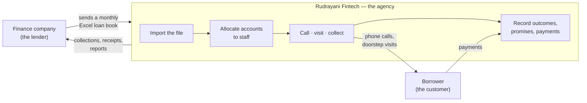

The agency imports a lender's loan book, assigns each overdue account to a
telecaller or field agent, and tracks every call, visit, promise-to-pay, and
rupee collected against it — from first contact until the account is either
**closed** (fully resolved) or **recalled** (pulled back by the lender).

### Two applications

| | Who uses it | What it's for |
|---|---|---|
| **Web portal** | Agency Admin, Operations Manager, Branch Manager | Import data, allocate work, approve queues, monitor staff, run reports |
| **Mobile app** (Android) | Telecaller, Field Agent — and any manager who also works accounts | Daily worklist, calling, visits, payments, attendance, personal performance |

Managers are not locked out of the mobile app, and agents are not locked out of
the web portal. Both apps assemble themselves from **what you are permitted to
do**, so you see your own pages and nothing else.

### One principle worth understanding early

**Nothing important happens automatically.** Repeat imports never silently
change your book — every discrepancy waits for a human decision. Agents cannot
edit a saved payment or call remark — they raise a correction request that a
manager approves. Reallocations require a logged reason. This is deliberate:
the system is designed to be auditable, because collections work is audited.

---

## 2. Key terms — glossary

| Term | Meaning |
|---|---|
| **Agency** | Your collection agency (Rudrayani Fintech). Everything in the system belongs to one agency. |
| **Company** | A finance company / lender whose loan book you collect for. A *data source*, not part of your staff org chart. |
| **Branch** | A physical office of your agency (Sangli, Pune, Kolhapur, Latur, Solapur). Each branch has at most one **Branch Manager**. |
| **Team** | A group of staff inside a branch. Teams report directly to the branch's manager. |
| **Designation** | Your rank in the system: Agency Admin, Operations Manager, Branch Manager, Telecaller, or Field Agent. This is the single source of truth for what you can do. |
| **Agent type** | Separate from designation. Marks a person as doing frontline collections work (telecalling or field work). A Branch Manager with an agent type manages a branch *and* works their own book. |
| **Capability / Permission** | The individual things a designation unlocks — e.g. `customers.allocate`, `imports.review`. Stored as configuration, not code. |
| **Customer / Loan Account** | One borrower's overdue loan, imported from a company's file. Status: **Active**, **Closed**, or **Recalled**. |
| **Bucket** | The lender's own label for how overdue a loan is ("30 DPD", "NPA 1"). Configured per company and mapped to a standard 0–20 "canonical" scale so different lenders can be compared. |
| **DPD** | Days Past Due — how many days overdue a loan's EMI is. |
| **POS (Principal Outstanding)** | The remaining loan principal still owed. Distinct from **Due Amount**, which is only the *current overdue arrears*. Portfolio-size figures use POS. |
| **Product** | The loan type ("Personal Loan", "Home Loan"), read automatically from the imported file. |
| **Allocation** | Assigning a loan account to a specific Telecaller or Field Agent. |
| **Unallocated Queue** | Imported accounts not yet assigned to anyone. |
| **Reallocation** | Moving an already-assigned account to a different agent. A reason is mandatory and is logged. |
| **Reallocation Request** | An agent asking (from the mobile app) to have a customer moved off them — wrong area, language mismatch, dispute. A manager approves or rejects. |
| **Correction Request** | An agent proposing a fix to one of their own already-saved records (payment amount, call remark, PTP detail). There is no direct edit button once saved. A manager approves or rejects. Only a narrow, safe set of fields is ever correctable — never the customer, the collecting agent, or any timestamp. |
| **Disposition / Disposition Code** | The recorded outcome of a call or visit — "PTP" (Promise to Pay), "RNR" (Ringing, No Response), "RTP" (Refuse to Pay). Each code declares which extra details it needs. |
| **Trail / Trail History** | The full ordered history of every call and visit logged against a customer. |
| **PTP (Promise to Pay)** | A commitment to pay a specific amount by a specific date. Status: **pending**, **kept**, or **broken**. |
| **Next Action Date** | The date a customer next needs attention. Drives the order of your worklist so the most urgent work rises to the top. |
| **Reminder** | A personal follow-up alert an agent sets for themselves, with or without a customer attached. Fires a phone notification at the chosen time. |
| **Field Visit** | A record of an in-person visit — requires a photo, captures GPS automatically. |
| **Payment** | Money collected, with amount, mode, date, and usually a photo proof. |
| **Receipt Number** | A sequential receipt identifier generated per branch per financial year when a payment is recorded. |
| **Deposit / Deposited** | Once collected cash is physically banked, an admin or ops user marks the payment "Deposited". Until then it shows as "Pending". |
| **Closed** | The account was fully resolved (paid off) and marked closed from the mobile Payment screen. |
| **Recalled** | The *lender* pulled the account back, told to the agency via a monthly import file. Not the same as Closed — it does not mean the debt was resolved. |
| **Normalized (pending lender confirmation)** | A blue badge shown when a payment has brought an account back to current *before* the lender's own file confirms it. The lender's label stays authoritative everywhere else. |
| **Bucket Movement** | A detected change in a customer's delinquency bucket — either "Payment (in-month)" (detected immediately) or "Allocation (confirmed)" (confirmed by the lender's next file). |
| **Import Template** | A saved mapping (Excel column → system field) for a company's file layout, so future uploads auto-map. |
| **Import Review Queue** | Where a manager decides what to do with discrepancies in a repeat monthly import: **additions**, **removals** (→ recalled), and **reactivations**. |
| **Custom Field / Detail Field** | Any import column that didn't map to a standard field is kept as a custom field so no data is lost. Some can be flagged to show on the Customer view. |
| **Field Definition** | An admin-configurable catalog entry describing an import column — what the Import wizard's mapping step offers. |
| **Target** | A monthly goal (₹ or count) per agent / team / branch / agency, for five metrics: Collection, Resolution, Roll Back, Normalization, Recovery. |
| **Punch In / Punch Out** | Starting and ending your work shift in the mobile app. Punching in starts location tracking. **You cannot use the mobile app at all until you punch in.** |
| **Day Plan** | A web page showing, for any day, every agent's attendance, PTPs due, reminders due, and activity. |
| **Setup Checklist** | A six-step guide shown on a new agency's dashboard: add a company, add branches, add employees, import a file, allocate, set targets. |
| **Sync queue / Dead letter** | Work you did offline waiting to reach the server. An item that repeatedly fails becomes a "dead letter" — still visible, never silently deleted, but no longer retried automatically. |
| **Org Chart** | A reporting-line tree. Every employee can optionally have a **Manager** (any other employee) purely for "who reports to whom" — separate from Branch and Team structure. |

---

## 3. The five roles at a glance

Your **designation** determines everything. There are exactly five.

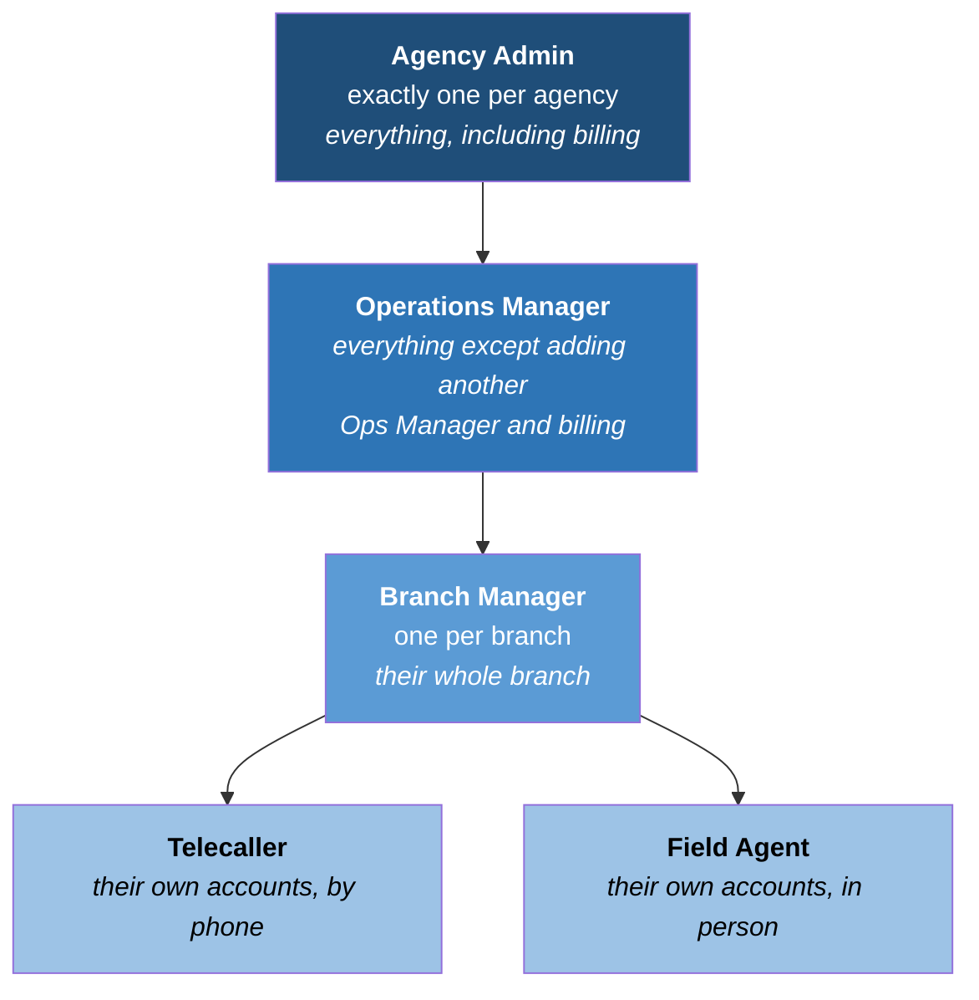

### What each role can do

A ✓ means the role holds that permission. This table is the authoritative
answer to "why can't I see that page?"

| What you want to do | Permission | Agency Admin | Ops Manager | Branch Manager | Telecaller | Field Agent |
|---|---|:---:|:---:|:---:|:---:|:---:|
| View employees | `employees.view` | ✓ | ✓ | ✓ | — | — |
| Add employees | `employees.create` | ✓ | ✓ | ✓ | — | — |
| Edit employees | `employees.update` | ✓ | ✓ | — | — | — |
| Deactivate employees | `employees.deactivate` | ✓ | ✓ | — | — | — |
| Add another Operations Manager | `ops_managers.create` | ✓ | — | — | — | — |
| Access billing | `billing.view` | ✓ | — | — | — | — |
| Create / rename branches | `branches.manage` | ✓ | ✓ | ✓ | — | — |
| Create / rename teams | `teams.manage` | ✓ | ✓ | ✓ | — | — |
| Manage companies & buckets | `companies.manage` | ✓ | ✓ | — | — | — |
| Run imports | `imports.manage` | ✓ | ✓ | — | — | — |
| Decide import discrepancies | `imports.review` | ✓ | ✓ | — | — | — |
| Maintain disposition codes | `dispositions.manage` | ✓ | ✓ | — | — | — |
| View customers | `customers.view` | ✓ | ✓ | ✓ | ✓ | ✓ |
| Allocate / reallocate customers | `customers.allocate` | ✓ | ✓ | ✓ | — | — |
| View team & agency reports | `reports.view` | ✓ | ✓ | ✓ | — | — |
| View own performance | `reports.view_self` | ✓ | ✓ | ✓ | ✓ | ✓ |
| Set targets | `targets.manage` | ✓ | ✓ | — | — | — |
| Mark payments deposited | `payments.deposit` | ✓ | ✓ | — | — | — |
| Log calls | `calls.log` | ✓ | ✓ | ✓ | ✓ | ✓ |
| Record payments | `payments.record` | ✓ | ✓ | ✓ | ✓ | ✓ |
| Punch in / out | `attendance.punch` | ✓ | ✓ | ✓ | ✓ | ✓ |
| Set reminders | `reminders.manage` | ✓ | ✓ | ✓ | ✓ | ✓ |
| See tracking / attendance | `tracking.view` | ✓ | ✓ | ✓ | ✓ | ✓ |

Two rows in that table are easy to misread:

- **`tracking.view` is held by everyone**, but it does not mean an agent can
  watch their colleagues. Permission decides *whether the page opens*; the
  visibility tier (next section) decides *what appears on it*. An agent opening
  a tracking view sees only their own attendance and route.
- **`employees.create` without `employees.update`** is the Branch Manager's
  position exactly: they can bring new staff into their branch, but cannot edit
  or deactivate anyone afterwards. That is an intentional escalation boundary —
  changing someone's designation or switching off their account is an
  Ops-and-above action.

---

## 4. Who can see what — the three visibility tiers

Permissions decide which pages open. **Scope** decides how much data appears on
them. There are exactly three tiers.

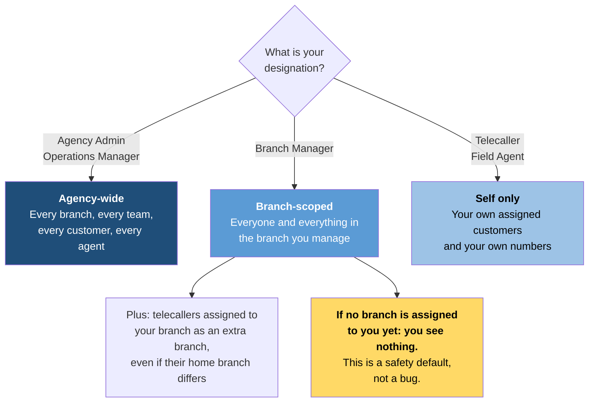

### A worked example

Priya manages the **Sangli** branch. Rahul is an Operations Manager. Sunil is a
telecaller in Sangli. Meena is a telecaller in Pune.

- **Rahul** opens the Customers page and sees every account in the agency —
  Sangli, Pune, everywhere.
- **Priya** opens the same page and sees only Sangli accounts. If she filters
  for Pune, she gets zero rows. This is correct, not broken.
- **Sunil** opens his worklist and sees only the accounts allocated to him —
  not every Sangli account, just his own.
- If Sunil is *also* assigned to Pune as a second branch, then the **Pune**
  branch manager can see him too, even though his home branch is Sangli.
- **Meena's** accounts never appear anywhere in Priya's portal.

### Two behaviours worth knowing

**A Branch Manager with no branch assigned sees nothing at all.** If you have
been given the Branch Manager designation but nobody has yet set you as the
manager of an actual branch, every list will be empty. The system deliberately
fails to "nothing" rather than "everything". Ask an Ops Manager to assign you to
a branch — on the mobile Branch Dashboard you will see the message *"Ask an
admin to assign this branch"*.

**Branch scoping tolerates messy lender data.** Not every lender's file includes
a branch column. When it doesn't, the system falls back to matching the branch
*name* recorded against the customer, so a Branch Manager still sees their book
instead of an empty screen.

---
---

# Part II — Your journey, by role

Each of the next five chapters follows the same shape: who you are, your first
day, a typical day, everything you can do, and what you can't do and why. Read
your own chapter; skim the others only if you manage those people.

---

## 5. Agency Admin

> **Where you work:** primarily the web portal. The mobile app is available to
> you and shows the branch-manager-style dashboard.
> **How many of you there are:** exactly one per agency.

### 5.1 Who you are

You are the owner of the agency's account. You can do everything anyone else can
do, plus two things nobody else can: **add Operations Managers** and **access
billing**. Your own account cannot be edited or deactivated from the Employees
page — it is managed separately, on purpose, so nobody can lock the agency out
of its own system.

### 5.2 Day one — standing the agency up

There is no self-registration. Your account is created during the agency's
technical setup. When you log in for the first time, the dashboard will be full
of zeros — that is expected, and a **Setup Checklist** appears at the top with
six steps. Work down it in order; each step links straight to the page you need.

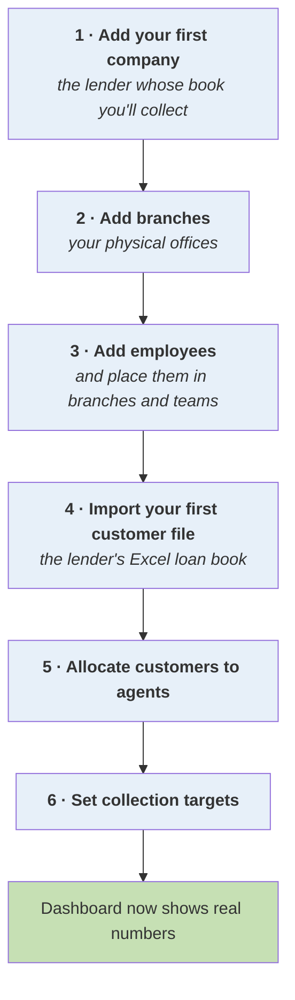

Each step's tick comes from a real check against your data, not a box you can
tick yourself — so the checklist cannot get out of sync, and won't keep nagging
about something you've already done. You can dismiss it once you're set up.

**The order matters.** Branches must exist before you can place employees in
them. A company must exist before you can import its file. Customers must be
imported before there is anything to allocate.

### 5.3 A typical day

Most days you are not doing setup — you're checking that the operation is
healthy.

1. **Open the Dashboard.** Check Collection MTD against target, and the
   "days left in month" indicator. If there are pending approvals anywhere, an
   alert strip at the top tells you before you go looking.
2. **Clear the queues.** Import Review, Reallocation Requests, Correction
   Requests. Nothing in these moves until a human decides, so they are the first
   place work gets stuck.
3. **Check the Agent Daily Activity page** for supervision — what each agent did,
   collection %, top and bottom performers.
4. **Check Deposits.** Cash collected in the field is only reconciled once
   somebody marks it deposited. Left undone, your reporting understates what
   actually reached the bank.
5. **Spot-check Tracking or Day Plan** if a branch's numbers look wrong.

### 5.4 Everything you can do

| Area | Pages | Notes |
|---|---|---|
| **Organisation** | Companies, Branches, Teams, Employees, Org Chart | Only you can grant the Operations Manager designation |
| **Master data** | Buckets, Field Config, Dispositions | Agency-wide configuration |
| **Data intake** | Import, Import Review | The 4-step import wizard and the discrepancy queue |
| **Work management** | Customers, Allocation, Reallocation Requests, Correction Requests | |
| **Reporting** | Dashboard, Agent Daily Activity, Reports, Targets | Export to Excel from all of them |
| **Oversight** | Tracking, Day Plan, Attendance, Deposits | |
| **Your own book** | My Worklist | Only if you also carry an agent type |

### 5.5 What you cannot do

Almost nothing — but two limits are worth knowing:

- **You cannot edit a bucket label.** Bucket labels arrive from the lender's
  file and are authoritative. You configure how buckets *behave* (order,
  category, canonical mapping) on the Buckets page, but you never type a label.
- **You cannot make a repeat import apply itself.** Every discrepancy goes to
  Import Review, every time, by design.

---

## 6. Operations Manager

> **Where you work:** primarily the web portal; the mobile app is available and
> shows the branch-manager-style dashboard.

### 6.1 Who you are

You run the agency day to day. You can do everything the Agency Admin can,
**except** adding another Operations Manager and accessing billing. In practice
this means you are the person who actually operates the system: you import the
books, decide the discrepancies, set the targets, and keep the branches honest.

### 6.2 Day one

Your account is created for you by the Agency Admin on the Employees page. Log
in with your phone number and the initial password you were given. You land on
the Dashboard with full agency-wide visibility from the first minute.

If the agency is brand new, you will see the same Setup Checklist described in
§5.2 — and in most agencies it is the Ops Manager, not the Admin, who actually
works through it.

### 6.3 A typical day

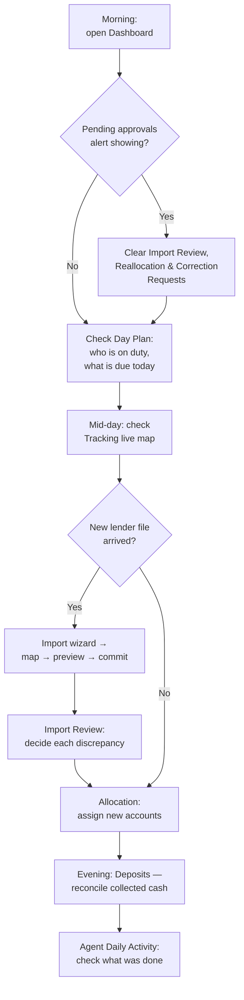

### 6.4 Your core responsibilities in detail

**Bringing in a lender's book.** The Import wizard is four steps: Select &
Upload → Map Columns → Preview & Validate → Done. Save your column mapping as a
**Template** the first time; every future file from that company then auto-maps.
Any column you don't map is kept as a custom field — no data is ever lost.
Maximum file size is 15 MB.

**Deciding discrepancies.** A repeat import for a month you've already loaded
never applies changes on its own. It produces three kinds of item in Import
Review, each of which you approve or reject:

| Type | Tag | What approving does |
|---|---|---|
| **Addition** | blue | Inserts the new customer |
| **Removal** | red | Marks the customer **Recalled** and clears their agent assignment |
| **Reactivation** | orange | Restores a previously recalled customer to Active |

Expand any row before deciding — you'll see the customer's last remark, pending
PTP, and amount paid this month.

**Allocating work.** The Allocation page has two tabs: the **Unallocated Queue**
(filter, multi-select, pick an agent, Assign) and **Allocated** (multi-select,
Reallocate with a mandatory reason, or view the full reassignment History for
any row).

**Setting targets.** Targets can be set per agent, per team, per branch, or for
the whole agency, across five metrics. If nobody has set a Collection target at
any level, the dashboard falls back to the book's own EMI schedule as a computed
default — so there is always a sensible benchmark. That fallback applies only to
Collection; the other four show no target until you set one.

**Reconciling cash.** On the Deposits page, filter to Pending, multi-select, and
Mark deposited. Already-deposited rows cannot be unchecked. This feeds the
dashboard's Deposited Metrics directly.

### 6.5 What you cannot do, and why

- **Add another Operations Manager.** That is the Agency Admin's call alone — it
  is the one action that widens the circle of people with near-total access.
- **Access billing.** Same reasoning.
- **Edit the Agency Admin's account** from the Employees page.

---

## 7. Branch Manager

> **Where you work:** both. The web portal for allocation, approvals and
> reports; the mobile app for a live branch view and approvals on the move.
> **How many of you there are:** at most one per branch.

### 7.1 Who you are

You are responsible for one branch — every team in it, every agent, every
customer. There is no rank between you and your agents; teams report directly to
you.

You may *also* carry an **agent type**, meaning you work your own book of
accounts alongside managing the branch. If so, you get a personal worklist in
addition to everything below — see §10.

### 7.2 Day one

An Ops Manager creates your account **and** assigns you as the manager of an
actual branch. Those are two separate things, and both must happen.

> **If your screens are empty, this is why.** Until somebody sets you as the
> manager of a branch, you will see zero customers, zero employees, zero
> everything — the mobile Branch Dashboard will say *"Ask an admin to assign
> this branch"*. The system defaults to showing nothing rather than risking
> showing you another branch's data. Ask an Ops Manager to complete the
> assignment.

### 7.3 A typical day

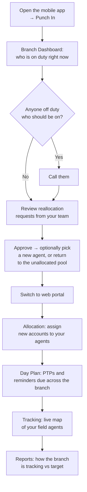

### 7.4 Everything you can do

**On the web portal**

| Page | What you do there |
|---|---|
| **Dashboard** | Full performance dashboard, scoped to your branch |
| **Agent Daily Activity** | Day-by-day action log of what your agents did |
| **Reports** | Breakdown by product, bucket, team, agent — exportable |
| **Allocation** | Assign unallocated accounts; reallocate with a reason |
| **Reallocation Requests** | Approve or reject requests from your agents |
| **Correction Requests** | Approve or reject record corrections from your agents |
| **Customers** | Browse your branch's book; open the full Customer 360 view |
| **Employees** | View your branch's staff; add new ones |
| **Branches / Teams** | Create and rename teams within your branch |
| **Org Chart** | Reporting-line tree |
| **Tracking** | Live map and route replay for your agents |
| **Day Plan / Attendance** | Daily summary and the full attendance log |
| **My Worklist** | Your own accounts, if you carry an agent type |

**On the mobile app** — your bottom tabs are **My Worklist**, **Branch
Dashboard**, **My Performance**, and **Account**. The Branch Dashboard gives you:

- **Collections Today** split by Cash and Online
- **Attendance / GPS (Branch-wide)** — who is punched in, who is on duty
- **Teams in this Branch** — activity per team this month
- **Reallocation approvals** — Approve (optionally naming a new agent, or
  returning the customer to the unallocated pool) or Reject, right from the phone

Your **Account** tab also gains a Management section: All Customers, Employees,
Teams, Branches, Companies, and Catalog (products, buckets, dispositions) — all
read-only lookups, all branch-scoped.

### 7.5 What you cannot do, and why

You sit deliberately below the Operations Manager on three things:

- **You cannot edit or deactivate employees.** You can *add* staff to your
  branch, but changing someone's designation, or switching their account off, is
  an Ops-and-above action. Changing a designation changes what someone can see
  across the whole agency, so it sits above branch level.
- **You cannot manage agency-wide master data** — companies, buckets, field
  config, disposition codes, or imports. These are shared by every branch, so
  they are not a branch-level concern.
- **You cannot set targets, review imports, or mark deposits.** These are
  agency-wide operational controls.

If you need any of the above, ask an Operations Manager.

---

## 8. Telecaller

> **Where you work:** the mobile app, all day. The web portal is available and
> shows you a personal performance view and your own worklist.

### 8.1 Who you are

You work a book of overdue accounts by phone. You see only your own accounts and
only your own numbers.

### 8.2 Day one

1. Install the app (your admin gives you the APK, or adds you to the Play Store
   internal testing track).
2. Enter your **10-digit phone number** and the password your manager gave you,
   then **Sign In**.
3. **You will land on a "Punch In Required" screen.** This is not optional and
   not a bug — see below.

> ### The punch-in gate
>
> **You cannot reach any part of the mobile app until you punch in.** Not the
> worklist, not a customer, not your performance. Punching in starts your shift
> and starts location tracking, and the app treats that as the precondition for
> doing any work at all.
>
> Punching in needs a live connection *if the app has never seen your punch
> state before*. If you're offline, the app will queue the punch-in and open
> your shift locally, then reconcile with the server when you're back in range.
>
> While on duty you will see a **persistent notification** the entire time. That
> is required for location tracking to work reliably on Android — it is expected,
> and dismissing it is not possible while your shift is open.

The gear icon on the login screen is a technical "server address" setting. Leave
it alone unless your admin explicitly tells you otherwise.

### 8.3 A typical day

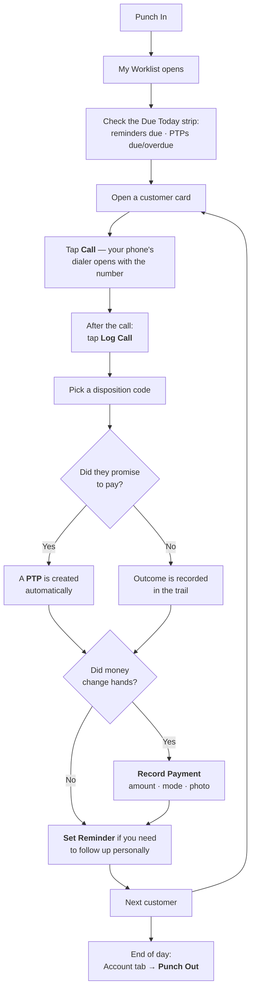

### 8.4 The screens you live in

**My Worklist** — your home base.
- A **duty banner** at the top showing you're on shift.
- A **sync banner**, which appears only when something you did offline is still
  waiting to reach the server. Tap **Sync now** to retry immediately.
- A **Due Today** strip: reminders due today (tap the checkmark to mark done) and
  PTPs due or overdue. Collapsible.
- **Search** by name, loan number, or mobile.
- **Customer cards** showing name, loan number, company, due amount, last call
  outcome, active PTP, and a "Normalized, pending lender confirmation" note where
  relevant.

Your worklist is ordered by **next action date**, so the most urgent work is at
the top. You do not need to hunt for it.

**Customer Detail** — everything about one account, with these actions:

| Action | What it does |
|---|---|
| **Call** | Opens your phone's dialer with the number filled in |
| **Log Call** | Records the outcome (see below) |
| **Record Payment** | Amount, mode, date, optional photo, and a "Mark customer as Closed" toggle |
| **View PTPs** | This customer's promises — and where you create, reschedule, or resolve them |
| **Field Visit** | Records an in-person visit (photo required) |
| **Navigate** | Opens your maps app to the customer's address, if one is on file |
| **Set Reminder** | A personal follow-up alert |
| **Send Reminder** | Sends the customer a reminder via **SMS** or **WhatsApp** |
| **⋮ → Request Reallocation** | Asks your manager to move this customer off you, with a required reason |

Below the buttons: Loan Details, Last Disposition, Active PTP, Additional Fields
(extra data from the original import), Documents, and a **History** timeline
merging every call, payment, visit, PTP, and document into one feed.

**Log Call** — pick a **disposition code**, and the screen reveals exactly the
fields that code requires (Amount, Date, Time, Mode, Reason, Name/Relation) and
nothing more. A live preview shows the exact remark that will be saved. Works
offline.

**PTPs** — you can **Create PTP**, **Reschedule / Update** an existing one, and
mark one **Kept** or **Broken**. After saving, you can **Confirm via SMS** or
**Confirm on WhatsApp** to send the customer their commitment in writing.

**My Performance** — your own scorecard: collection vs target with a progress
bar and "amount needed per day to hit target", calls made today with a connected
rate, PTPs created / kept / broken this month, and per-metric breakdowns.

**Your Dashboard tab** shows Daily Target vs Achievement, Total Calls,
RPC/Connected rate, PTP Created / Kept / Broken, pending PTP value, and
escalation cases.

### 8.5 Working offline

Almost everything you do works without a signal:

| Action | Works offline? |
|---|---|
| Log a call | ✓ Queued and synced |
| Record a payment (incl. photo) | ✓ Queued and synced |
| Record a field visit | ✓ Queued and synced |
| Punch in | ✓ Queued (opens your shift locally) |
| Upload a photo document | ✓ Queued |
| Create a reminder | ✓ Fires on time regardless |
| Location pings during your shift | ✓ Batched and sent when you're back in range |
| Punch out | ✗ Needs a connection |
| Mark a reminder done | ✗ Needs a connection |
| Upload a **PDF** document | ✗ Needs a connection |

Queued work is stored on your phone, survives closing the app, and is never
duplicated on the server even if a sync is interrupted halfway. If an item fails
repeatedly it becomes a **dead letter** — it stops retrying automatically but
stays visible so you (or your manager) can deal with it. Nothing is ever
silently discarded.

### 8.6 What you cannot do, and why

- **You cannot edit a saved payment, call log, or PTP detail.** Raise a
  **Correction Request** instead — your manager approves it. This keeps the trail
  honest.
- **You cannot reallocate a customer yourself.** Raise a **Reallocation
  Request**; a manager decides.
- **You cannot change a bucket.** Buckets come from the lender's file and are
  authoritative. If one looks wrong, note it in a call remark and tell your
  manager.
- **You cannot see other agents' customers or numbers.**

---

## 9. Field Agent

> **Where you work:** the mobile app, in the field.

Everything in the Telecaller chapter (§8) applies to you — the punch-in gate,
the worklist, logging calls, recording payments, PTPs, reminders, offline
behaviour, correction and reallocation requests. This chapter covers only what
is *different*.

### 9.1 What's different

**Field visits are your primary activity.** From Customer Detail → **Field
Visit**: a **photo is required** (camera or gallery), a remark is optional, and
your GPS location is captured automatically in the background when you save —
there is no separate location button. Works offline.

**Navigation.** The **Navigate** button opens your maps app pointed at the
customer's address, when one is on file.

**Your dashboard is visit-shaped, not call-shaped.** Where a telecaller's
dashboard leads with call counts, yours shows:

- **Daily Target vs Achievement** and Collected MTD
- **Attendance / GPS** — your on-duty status, punch-in time, and GPS ping count
- **Visits Planned**, and visits recorded With Photo
- **Receipts Generated** — receipts and documents captured
- **PTP Created / Kept / Broken** this month
- **Customer Location**

**Location tracking matters more for you.** While you're punched in, your
location is sent automatically every couple of minutes. If signal drops, pings
are saved on your phone and sent in a batch once you're back in range — nothing
is lost. Your manager can see your live position on the Tracking map and replay
your day's route afterwards.

### 9.2 A typical field day

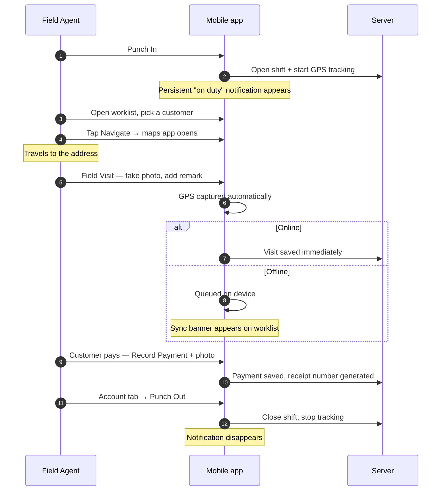

### 9.3 A note on battery

Continuous GPS is demanding. Two honest points:

- Keep the persistent notification — killing it stops tracking, and your route
  and attendance will be incomplete.
- **Punch out at the end of your shift.** There is currently no automatic
  punch-out and no reminder to do it. Leaving a shift open overnight keeps GPS
  running and will drain your battery badly.

---

## 10. People who hold more than one role

The apps do not force you into a single role. They assemble what you see from
**everything you're allowed to do**.

The common case is a **Branch Manager who also works accounts** — they have the
Branch Manager designation *and* an agent type (telecaller or field agent).

| | What they get |
|---|---|
| **Web portal** | The full manager nav (Allocation, approvals, Reports, Tracking…) **plus** a **My Worklist** page with their own properly-scoped book |
| **Mobile app** | Tabs: My Worklist · Branch Dashboard · My Performance · Account |

A few details that follow from this:

- **My Worklist appears for anyone who logs calls**, not just individual
  contributors. A manager with an agent type gets their own book rather than
  being stuck on the org-wide Customers list.
- **The Customers page is hidden from plain telecallers and field agents** —
  for them it is a strictly less useful version of My Worklist (no last-call or
  PTP context). Managers still see it, because for them it is the agency- or
  branch-wide view.
- **A single "My work only" switch** in the portal header controls every
  my-work-versus-team view at once, so you don't have to reconcile separate
  toggles on different pages.
- On mobile, exactly **one** management-tier dashboard tab appears. If you
  somehow hold several capabilities, the widest one wins: Branch Manager, then
  Telecaller, then Field Agent. Agency Admins and Operations Managers see the
  Branch Dashboard tab, scoped agency-wide.

---
---

# Part III — Work that crosses roles

## 11. Cross-role workflows

These are the flows where work passes between people. Each diagram shows who
acts at each step.

### 11.1 Bringing in a new loan book

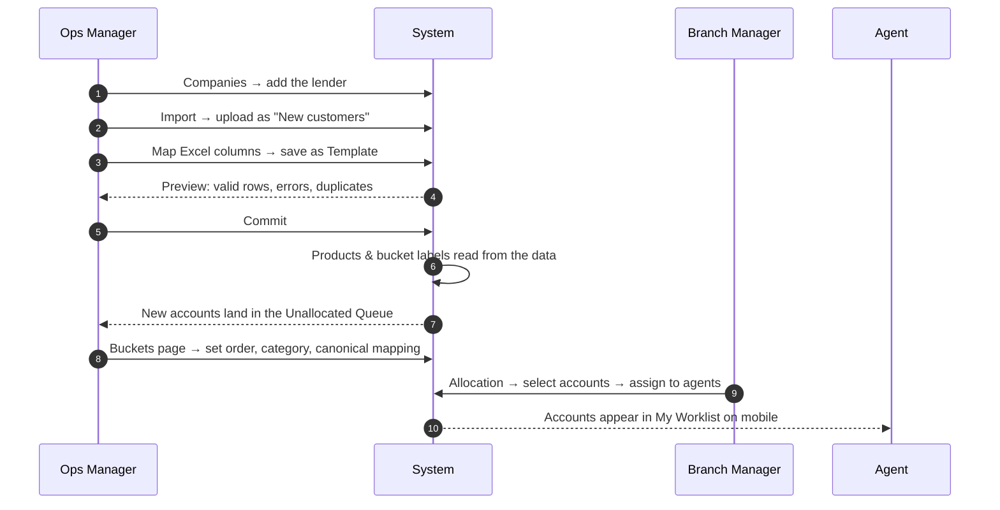

### 11.2 The monthly refresh and the review queue

This is the flow people most often expect to be automatic. It isn't, deliberately.

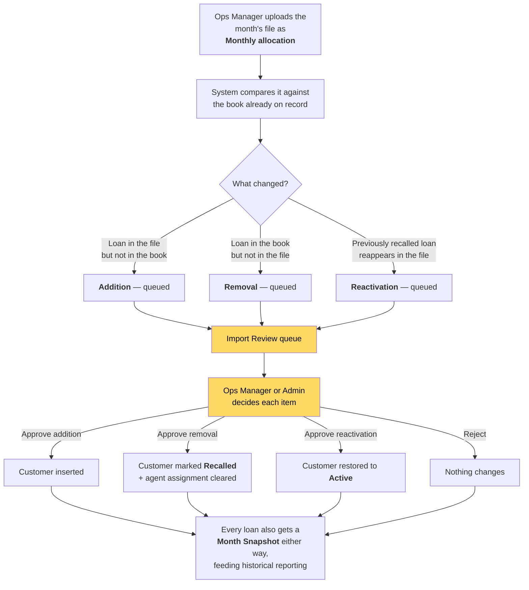

### 11.3 From allocation to banked cash

The full money path, and every role that touches it.

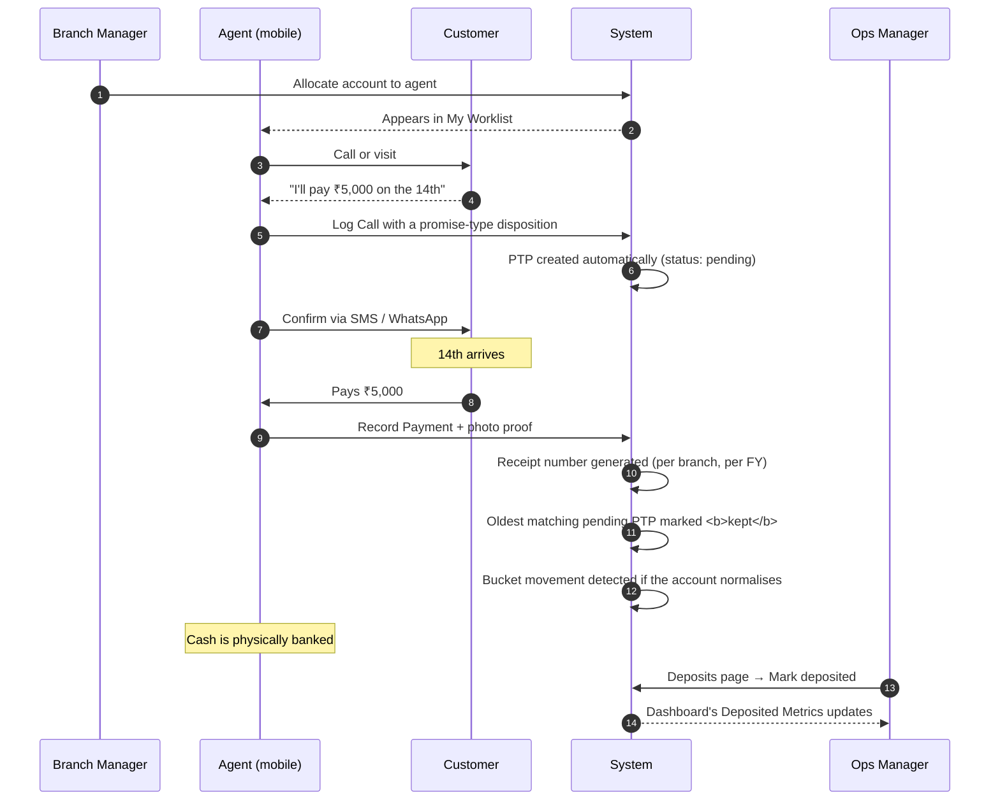

### 11.4 The PTP lifecycle

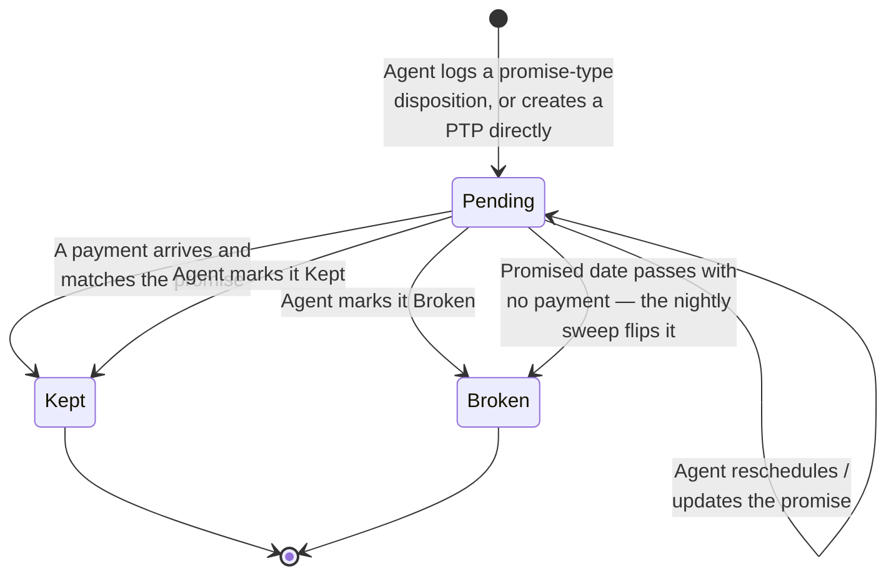

A PTP that is never matched by a payment does not sit at "pending" forever — a
job runs every night and marks overdue promises **broken**, so your kept/broken
ratio stays honest without anyone having to tidy up manually.

### 11.5 Reallocation request

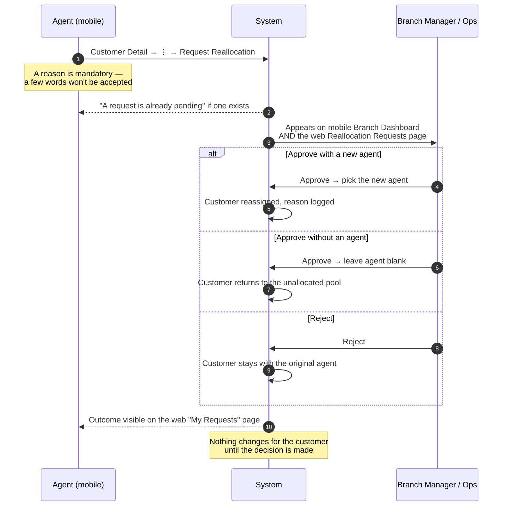

### 11.6 Correction request

Agents cannot edit their own saved records. This is how a genuine mistake gets fixed.

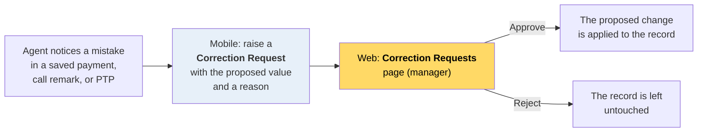

Only a narrow, safe list of fields can ever be corrected this way. **Never**
correctable: the customer the record belongs to, the collecting agent, or any
timestamp. Those are the fields an audit depends on.

### 11.7 A day with no signal

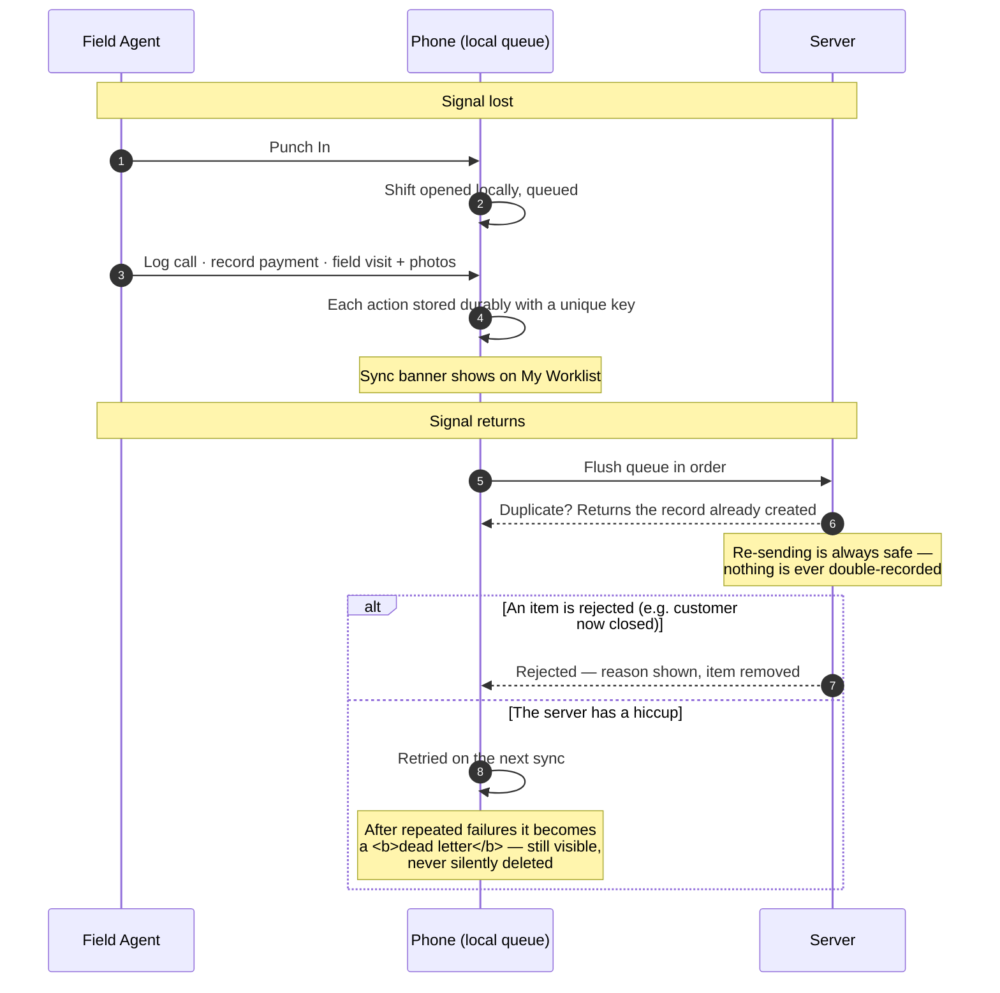

---
---

# Part IV — Reference

## 12. Web portal — page by page

The left-hand menu shows only pages you have permission to open. Each entry
below names the permission that unlocks it.

Every page has a **sun/moon icon** in the header for light/dark mode. Your choice
is remembered on that device and follows your operating system's setting the
first time. On a narrow screen, use the header button to open and close the
navigation menu.

### Dashboard *(everyone)*
Your home page. What you see depends on whether you hold `reports.view`:

**With `reports.view`** (Admin, Ops Manager, Branch Manager) — a full Performance
Dashboard:
- Product tabs, a month picker, filters (Company / Branch / Team / Agent /
  Bucket / Status, according to your scope), and an Amount/Count toggle
- Collection MTD vs target, with a "days left in month" indicator
- A circular gauge and metric cards for **Resolution**, **Roll Back**,
  **Normalization**, and **Recovery**
- Deposited Metrics (collected vs deposited vs pending)
- Trail Uploaded Metrics — how much of the book has actually been worked
- **Recalled This Month** tile, clickable for the list and reasons
- **Bucket Movements This Month** — payment-detected vs lender-confirmed
- **Bucket Mismatches (DPD Cross-Check)** — a "worth a second look" list where
  the EMI due date suggests a different bucket than the lender's label.
  Informational only; it never overrides the lender's data
- **Exception Payments** and **PTP kept/broken** counts
- A **Breakdown** table sliceable by Company / Product / Bucket / Branch / Team / Agent
- **Trail Analytics** — call outcomes over a date range, PTP conversion %
- A **Setup Checklist** on a new agency, and a **Pending Approvals** alert when
  any queue needs you
- An **Export** button producing an Excel workbook
- A **Customize** control to choose which widgets appear

**Without `reports.view`** (Telecaller, Field Agent) — a simpler *"My
Performance"* view: your own numbers, no filters.

> For exactly how every number is calculated, see `docs/metrics-formulas.md`.

### Agent Daily Activity *(`reports.view`)*
A granular, action-by-action log of what your agents did on a specific day.
Filter by customer branch, bucket, company, product, agent, agent type, action
type (Call/Payment/PTP/Field Visit), disposition code, PTP status, or customer
name/loan/phone number. Each row shows the time, agent, action, customer detail
(name, branch, bucket, company, product), amount (for payments), disposition, and
PTP status. Download the full activity log as Excel with customer detail columns
for offline analysis. **URL-synced filters** — so a report can be bookmarked or
pasted to a colleague and they see exactly what you see. **Perfect for supervision:**
"What did my team do yesterday?" or "How many calls did Rahul make in the NPA bucket
yesterday?"

### Reports *(`reports.view`)*
A dedicated home for the reporting engine: a free dimension selector, an
exportable breakdown table, trail analytics, exception payments, and
**URL-synced filters** — so a report can be bookmarked or pasted to a colleague
and they see exactly what you see. Export to CSV, or print.

*Not included here by design:* saved report definitions (a separate feature) and
Deposits (which has its own page).

### My Worklist *(`calls.log`)*
Your own book of accounts in the browser — the web counterpart of the mobile
worklist, for anyone who personally works accounts, managers included. Shows
reminders and PTPs due, bucket severity colouring, and lets you log a call,
record a payment, or raise a correction without leaving the page.

### My Requests *(individual contributors)*
"What happened to the reallocation requests I submitted?" — filter by
Pending / Approved / Rejected. Self-scoped to your own submissions.

### Organization *(submenu — appears if you hold any of its children)*

- **Companies** *(`companies.manage`)* — create or rename the lenders whose books
  you collect. Data sources, not org structure.
- **Branches** *(`branches.manage`)* — create or rename your offices. No delete.
- **Teams** *(`teams.manage`)* — create or rename teams; each belongs to one branch.
- **Employees** *(`employees.view`)* — your staff directory. Search by name or
  phone; add an employee (name, phone, email, initial password, branch, team,
  designation, agent type); edit, deactivate, or reset a password *if you hold
  `employees.update`*. Only the Agency Admin can grant the Operations Manager
  designation. The Agency Admin's own account cannot be edited here.
- **Org Chart** *(`employees.view`)* — a reporting-line tree. Each employee can
  optionally have a **Manager** (any other employee), purely for "who reports to
  whom" visibility — separate from Branch and Team structure. Anyone whose
  manager isn't visible in your scope appears as a root with a "reports to X" note.

### Buckets *(`companies.manage`)*
Pick a company, then configure its delinquency buckets: reorder them (least to
most overdue), mark one as "Current" (needed for the Normalization metric),
categorise each as Normal or NPA (drives Recovery), and map each to a canonical
0–20 DPD number so different lenders compare on one scale. **Bucket labels
themselves arrive from imports** — you configure behaviour, you never type a label.

### Field Config *(`companies.manage`)*
Controls what columns the Import wizard can map to. Lists every **Field
Definition**: core fields every company must have (Loan Number, Customer Name,
Due Amount…) which can be disabled per company but never deleted, plus custom
fields your agency has added, which become mappable the moment they're enabled
for a company.

### Import *(`imports.manage`)*
A four-step wizard:
1. **Select & Upload** — pick the Company, choose **New customers** or **Monthly
   allocation** (and the month), upload the `.xlsx` (max 15 MB).
2. **Map Columns** — match each Excel column to a system field (Loan Number,
   Customer Name, Mobile, Product, Bucket, Due Amount, POS, EMI, EMI Due Date,
   Agent Phone). Save as a **Template** for reuse. Unmapped columns become custom
   fields automatically.
3. **Preview & Validate** — counts (valid rows, errors, duplicates, new vs
   existing), a row-level error list, and a warning if reactivations were detected.
4. **Done** — inserted / updated / skipped counts, and a link to Import Review if
   anything needs a decision.

There is also an **Import History** tab per company, with rollback for a run.

### Import Review *(`imports.review`)*
The discrepancy queue. Filter by Company / Status / Type, select rows singly or
in bulk, then Approve or Reject. See §11.2 for what each type does. Expand a row
to see the customer's last remark, pending PTP, and amount paid this month before
deciding.

### Customers *(`customers.view` — hidden from plain agents)*
Browse and search the whole book (filter by Company / Product / Bucket / Status,
or search by name, loan number, or mobile), with **URL-synced filters** and CSV
export. Click any row for the **Customer 360** side panel:
- Identity, due amount, POS, EMI, DPD, due date
- Extra "detail fields" captured at import
- **Trail History** — every call, oldest to newest
- **Promises to Pay** — with status
- **Payments** — amount, mode, date, receipt number, deposited status
- **Bucket Movements** — the history of delinquency changes
- **Allocation History** — every reassignment, with reason
- **Documents** — upload and download supporting files (photo or PDF, max 10 MB)
- **Month Snapshots** — the customer's state at each monthly import

### Allocation *(`customers.allocate`)*
- **Unallocated Queue** — filter, multi-select, pick an agent, **Assign**.
- **Allocated** — see who has what; multi-select and **Reallocate…** (reason
  mandatory, logged); **History** on any row for the full timeline.

### Reallocation Requests *(`customers.allocate`)*
Approve or reject agents' requests to be taken off a customer. Approving
optionally names a new agent; leaving it blank returns the customer to the
unallocated pool. Rejecting leaves things as they are.

### Correction Requests *(`customers.allocate`)*
Approve or reject agents' proposed fixes to their own saved records. See §11.6.

### Dispositions *(`dispositions.manage`)*
The master list of call-outcome codes. Add or edit a code: Action Code, Result
Code, Category, Description, a **Remark template** (which auto-composes the saved
remark), and checkboxes for which fields it requires (Amount, Date, Time, Mode,
Reason, Name/Relation). Codes are never deleted — only **Retired**, and they can
be restored.

### Tracking *(`tracking.view`)*
- **Live Map** — every on-duty agent in your scope as a coloured dot: green
  Moving, red Stationary, orange No Signal, grey Awaiting First Ping. Auto-refreshes
  every 30 seconds, with an alert banner if anyone is flagged.
- **Route Replay** — pick an employee and a date (up to 60 days back — the
  location retention window) to see the full day's path and total distance.

A bell icon in the header polls the same live data from anywhere in the app and
pops a toast if someone goes stationary or loses signal.

### Day Plan *(`tracking.view`)*
For any date, one row per agent: attendance status, PTPs due (count and ₹),
reminders due, calls made, payments collected. Expand a row for the actual
customer list behind those counts.

### Attendance *(`tracking.view`)*
The full, filterable, exportable attendance log — every punch-in/punch-out with
duration, filterable by date range, branch, team, agent, or "on-duty only". Where
Day Plan is the at-a-glance summary, this is the audit record behind it.

### Targets *(`targets.manage`)*
Set monthly targets. Choose the scope (Per agent / Per team / Per branch / Whole
agency), edit numbers directly in the table across the five metrics, or bulk-import
from Excel. **Save changes** enables only once you've edited something; clearing a
cell removes that target.

If no manual Collection target exists at any level, the dashboard falls back to
the book's own EMI schedule as a computed default. This applies only to
Collection.

### Deposits *(`payments.deposit`)*
Reconcile field-collected cash. Filter by month / status / company, multi-select
**Pending** payments, **Mark deposited**. Already-deposited rows cannot be
unchecked here.

---

## 13. Mobile app — screen by screen

### Login
Phone (10 digits) + password, then **Sign In**. Error messages distinguish wrong
credentials, a locked account, and a server-connection problem. The gear icon is
a technical server-address setting — leave it alone.

### Punch In Required — the gate
Shown immediately after login if your shift isn't open. **No other screen is
reachable until you punch in.** Punching in requests location and notification
permissions, takes a GPS fix, opens your shift, and starts the background
tracking service with its persistent notification.

### Bottom tabs

Everyone gets **My Worklist**, **My Performance**, and **Account**. Between the
first two, exactly one role-specific dashboard appears:

| Your role | Middle tab |
|---|---|
| Agency Admin / Operations Manager | **Branch Dashboard** (agency-wide) |
| Branch Manager | **Branch Dashboard** (your branch) |
| Telecaller | **Dashboard** (call-shaped) |
| Field Agent | **Dashboard** (visit-shaped) |

### My Worklist
Duty banner, sync banner (only when something is queued), a collapsible **Due
Today** strip (reminders due — tap the checkmark to mark done; PTPs due or
overdue), search by name / loan number / mobile, and customer cards. Ordered by
next action date.

### Customer Detail
See §8.4 for the full action list. Cards below the actions: Loan Details, Last
Disposition, Active PTP, Additional Fields, Documents, and a merged **History**
timeline.

### Log Call
Pick a disposition code; only the fields that code needs appear. Live preview of
the remark that will be saved. Works offline.

### Record Payment
Amount (required), Mode, Date (defaults to today), optional photo (camera or
gallery), and a **Mark customer as Closed** toggle if this settles the account.
Generates a receipt number. Works offline.

### PTPs
This customer's promises, with **Create PTP**, **Reschedule / Update PTP**, **Mark
Kept**, and **Mark Broken**. Overdue pending promises are flagged in red. After
saving you can **Confirm via SMS** or **Confirm on WhatsApp**. Modes available:
Cash, NEFT, RTGS, UPI, Cheque, DD.

### Field Visit
A **photo is required**; a remark is optional; GPS is captured automatically on
save. Works offline.

### Set Reminder / Send Reminder
**Set Reminder** schedules a notification on your own phone for a chosen date and
time — it fires even if the app is closed and even with no network. **Send
Reminder** messages the *customer* via SMS or WhatsApp.

### Documents
Upload a photo (camera or gallery) or a PDF (file picker) against a customer.
Photos queue offline; **PDFs need an active connection**.

### Correction Request
Raised from a saved record you need fixed. Provide the proposed value and a
reason — the app will ask you to explain properly if the reason is too short.

### My Performance
Your own read-only scorecard for the month, shaped to your role — see §8.4 and §9.1.

### Account
Your profile, the **Punch Out** control with your on-duty status, and — for
Agency Admins, Operations Managers, and Branch Managers — a **Management**
section with read-only lookups: All Customers, Employees, Teams, Branches,
Companies, and Catalog (products, buckets, dispositions).

---

## 14. Best practices for agents

These are working guidelines, not features — how to use the tools well.

**Call cadence by bucket.** As a rough guide: Current accounts — a monthly touch
about the upcoming EMI. Early buckets (30–60 DPD) — weekly. Later buckets (60–90
DPD and NPA) — weekly or more. If a customer is responsive, call more often while
momentum is with you. If a customer stops responding after 3–5 attempts, raise it
with your manager rather than calling indefinitely.

**When a customer says they can't pay.** Don't argue — look for a smaller
commitment: "Can you manage a partial amount instead of the full EMI?" or "Can
you commit to a date when you'll have funds?" Log whatever is agreed, and escalate
genuine hardship to your manager.

**When a customer says they already paid.** Don't argue on the call — check the
**Payments** history on Customer Detail first. If it's there, acknowledge it and
move on. If it isn't, say you'll verify and call back — don't pretend to check
something you haven't — then flag it to your manager with the amount and date
claimed. It may be in transit, or a real discrepancy worth investigating.

**Make promises realistic.** Only money actually received counts toward your
Collection number — a pending PTP doesn't. A kept promise for a smaller,
realistic amount is worth more to your numbers, and to the account's history,
than an ambitious one that gets logged as broken.

**Confirm promises in writing.** After creating a PTP, use **Confirm via SMS** or
**Confirm on WhatsApp**. A customer who has the commitment in writing keeps it
more often.

**Keep the trail honest.** If a promise changes, reschedule the PTP rather than
letting it lapse. If you make a genuine mistake in a saved record, raise a
correction request — don't work around it with a misleading second entry.

**If a customer keeps breaking promises.** Three or more broken PTPs from the
same customer is worth raising with your manager. They may reallocate the account
or escalate it, rather than you continuing to take promises that don't hold.

**A "Recalled" customer means stop working it.** The lender has pulled the account
back. It will leave your active worklist. If it returns in a future import as a
reactivation, it will be reallocated and you'll see it again if it comes to you.

**Never try to "fix" a bucket yourself.** A bucket always comes from the lender's
file, and there is deliberately no way to edit it. If one looks wrong, note your
concern in a call remark and tell your manager, who can escalate to Operations
and on to the lender.

**Tracking your own pace.** Your My Performance screen shows your target and your
collection so far. `remaining target ÷ days left in the month` tells you roughly
what you need per day — the same "required per day" figure the app already
calculates for you.

**Punch out at the end of your shift.** There is no automatic punch-out. Leaving a
shift open keeps GPS running overnight and drains your battery.

---

## 15. Troubleshooting & FAQ

**I can't get past the "Punch In Required" screen.**
That screen is the app's front door — you must punch in to use anything. If
punch-in itself is failing, check that you granted location and notification
permissions, and that GPS is switched on. If you're offline and the app has never
seen your punch state, it will queue the punch-in and let you through.

**"Cannot reach server" on mobile login.**
Check your internet connection first. If it persists on a working connection, the
app may be pointed at the wrong server address — ask your admin (the gear icon on
the login screen).

**I logged in before but got signed out after restarting the app.**
This shouldn't normally happen — the app keeps you signed in across restarts even
without a network, and only signs you out on a real authentication failure (your
password was reset, or your account was deactivated). If it keeps happening,
contact your admin.

**My account is locked.**
Too many wrong password attempts in a row locks an account temporarily. Contact
your manager.

**I forgot my password.**
> **Password reset by SMS does not currently work.** The system has an OTP reset
> flow built, but no SMS provider has been connected yet, so the code never
> reaches your phone. Until that is set up, ask an Operations Manager or the
> Agency Admin to set a new password for you directly from the Employees page.

**A photo or document I uploaded says "will sync automatically" — is it saved?**
Yes. It is stored on your phone and will upload as soon as you have a connection,
or when you tap **Sync now**. You can close the app.

**A PDF upload failed while I was offline.**
Unlike photos, PDFs need an active connection — they are not queued. Try again
once you're back online.

**Something has been stuck in my sync queue for days.**
After repeated failures an item becomes a **dead letter**: it stops retrying on
its own but stays visible and is never deleted. Try **Sync now** on a good
connection. If it still won't go, show it to your manager — it may be a record
the server is legitimately rejecting (for example, a payment against a customer
who has since been closed).

**Why can't I see the Customers page?**
If you're a telecaller or field agent, it is hidden on purpose — **My Worklist**
shows the same accounts with more useful context (last call, active PTP). Nothing
is being kept from you.

**I'm a Branch Manager and every screen is empty.**
You have the designation, but nobody has assigned you as the manager of an actual
branch yet. The system shows nothing rather than risk showing another branch's
data. Ask an Operations Manager to complete the assignment.

**I'm a Branch Manager and I can't edit an employee.**
Correct — you can add staff to your branch but not edit or deactivate them. That
is an Operations Manager action. See §7.5.

**Why does a customer say "Normalized this month, pending lender confirmation"?**
A payment has brought the account back to current, but the lender hasn't confirmed
it in their own file yet. It doesn't change what you should do — keep working the
account normally.

**What's the difference between Closed and Recalled?**
**Closed** means the account was fully resolved and marked closed from the app.
**Recalled** means the *lender* pulled it back — not something an agent does, and
it does not mean the debt was resolved.

**I can't edit a payment I entered wrongly.**
By design. Raise a **Correction Request** and your manager will approve it.

**I set a reminder but didn't get the notification.**
Check that notifications are allowed for the app in your phone's settings.
Reminders are rescheduled automatically each time you open the app while online,
so restarting the app or phone shouldn't lose them.

**The app is draining my battery.**
Continuous GPS while on duty is demanding. Make sure you **punch out** at the end
of every shift — there is currently no automatic punch-out, so an unclosed shift
keeps tracking running overnight.

**Where do I see my own performance?**
The **My Performance** tab on mobile, or the Dashboard page on web (which shows a
personal scorecard if you don't have manager-level report access).

---

## 16. Appendices

### Appendix A — Permission quick reference

The full matrix is in [§3](#3-the-five-roles-at-a-glance). The short version:

| If you want to… | You need to be at least a… |
|---|---|
| Work a book of accounts | Telecaller or Field Agent |
| Allocate work, approve requests, see team reports | Branch Manager |
| Import files, review discrepancies, set targets, mark deposits, edit employees, manage master data | Operations Manager |
| Add another Operations Manager, access billing | Agency Admin |

### Appendix B — Disposition codes

Disposition codes are configured by your agency on the **Dispositions** page, so
your exact list is yours. Each code declares which extra fields it needs, and the
Log Call screen shows only those. Common categories include Promise to Pay,
Refuse to Pay, Dispute, Settlement, and Legal Proceedings. Codes are retired
rather than deleted, so historical trail entries never lose their meaning.

### Appendix C — Where the numbers come from

For the exact definition and formula behind every metric on the dashboards —
Collection, Resolution, Roll Back, Normalization, Recovery, and the deposited and
trail-uploaded figures — see **`docs/metrics-formulas.md`**.

### Appendix D — Related documents

| Document | What it covers |
|---|---|
| `docs/TECHNICAL_DOCUMENTATION.md` | Architecture, data model, and the full record of design decisions |
| `docs/metrics-formulas.md` | Exact formula behind every dashboard number |
| `docs/TESTING_GUIDE.md` | Manual test scenarios by role |
| `docs/DEPLOYMENT.md` | How the system is deployed |
| `docs/deferred-work.md` | Known gaps and work explicitly scoped out |
| `SETUP_GUIDE.md` | Local development setup |

### Appendix E — Known limitations at the time of writing

Stated plainly, so nobody wastes time hunting for something that isn't there:

- **Password reset by SMS does not work.** No SMS provider is connected. An
  admin must set passwords directly.
- **The app is English only.** There is no Marathi or Hindi interface yet.
- **No automatic punch-out and no reminder to punch out.** Shifts stay open until
  you close them.
- **One phone number per customer.** No co-borrower or guarantor records.
- **Very large import files (roughly 20,000 rows or more) can time out.** Split
  them if you hit this.
- **Some dashboard chart types are not built yet** — the "Coming Soon" strip on
  the Agent Daily Activity page shows accurate detail about what was done and by whom.

For the complete and current list, see `docs/deferred-work.md`.
